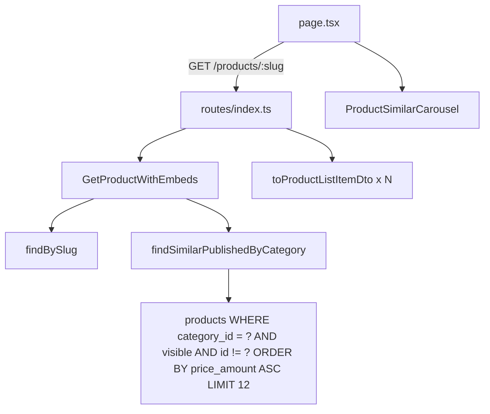

# Carrossel de Produtos Similares (Padrão Gold)

## Contexto

A página [`apps/web/src/app/produtos/[slug]/page.tsx`](apps/web/src/app/produtos/[slug]/page.tsx) já renderiza hero, análise editorial, ficha técnica e descrição longa. Falta recirculação de catálogo no rodapé.

Hoje `GET /products/:slug` usa [`GetProductBySlug`](packages/application/src/use-cases/product/GetProductBySlug.ts) e monta `category` no controller — **sem** produtos relacionados.

A relação categoria ↔ produto **já existe** no schema Drizzle; nenhuma migration nova é necessária:

```123:138:packages/infrastructure/src/persistence/drizzle/schema/index.ts
    categoryId: uuid('category_id').references(() => categories.id, { onDelete: 'set null' }),
    ...
    index('products_category_id_idx').on(table.categoryId),
```

[`findPublished`](packages/infrastructure/src/persistence/repositories/drizzle-product.repository.ts) já filtra por `categoryIds` e suporta `ProductSortField.PRICE_ASC`, mas não exclui o produto atual nem é otimizado para o caso “top N similares”. Um método dedicado no port evita paginação + filtro em memória.

## Fluxo alvo



## 1. Validação schema (sem migration)

Confirmar em [`product.mapper.ts`](packages/infrastructure/src/persistence/mappers/product.mapper.ts) que `categoryId` mapeia bidirecionalmente. Índice `products_category_id_idx` cobre a query. Produtos com `category_id = null` → `similarProducts: []`.

## 2. Domain port — novo método no repositório

**Arquivo:** [`packages/domain/src/repositories/ProductRepository.ts`](packages/domain/src/repositories/ProductRepository.ts)

Adicionar tipo e método:

```typescript
export type SimilarProductsCriteria = {
  categoryId: string;
  excludeProductId: string;
  limit?: number; // default 12
};

findSimilarPublishedByCategory(criteria: SimilarProductsCriteria): Promise<Product[]>;
```

**Regras de negócio na query:**
- `category_id = criteria.categoryId`
- `visible = true`
- `id != excludeProductId`
- `ORDER BY price_amount ASC`
- `LIMIT` (default **12**)

Não filtrar por preço fresh/stale — cards já tratam stale via `PriceDisplay` (conformidade 24h).

## 3. Implementação Drizzle

**Arquivo:** [`packages/infrastructure/src/persistence/repositories/drizzle-product.repository.ts`](packages/infrastructure/src/persistence/repositories/drizzle-product.repository.ts)

```typescript
async findSimilarPublishedByCategory({ categoryId, excludeProductId, limit = 12 }) {
  const rows = await this.db
    .select()
    .from(schema.products)
    .where(and(
      eq(schema.products.categoryId, categoryId),
      eq(schema.products.visible, true),
      ne(schema.products.id, excludeProductId),
    ))
    .orderBy(asc(schema.products.priceAmount))
    .limit(limit);
  return rows.map(mapProductRowToDomain);
}
```

Importar `ne` de `drizzle-orm`.

## 4. Use case `GetProductWithEmbeds`

**Criar:** [`packages/application/src/use-cases/product/GetProductWithEmbeds.ts`](packages/application/src/use-cases/product/GetProductWithEmbeds.ts)

Espelhar padrão de [`GetArticleWithEmbeds`](packages/application/src/use-cases/content/GetArticleWithEmbeds.ts):

```typescript
export type ProductWithEmbedsResult = {
  product: Product;
  similarProducts: Product[];
};
```

Lógica:
1. `findBySlug(slug)` → `null` se não encontrado
2. Aplicar `PriceComplianceService` no produto principal (mesmo de `GetProductBySlug`)
3. Se `product.categoryId`: buscar similares via `findSimilarPublishedByCategory`
4. Aplicar compliance em cada similar
5. Retornar `{ product, similarProducts }`

**Teste unitário:** [`GetProductWithEmbeds.test.ts`](packages/application/src/use-cases/product/GetProductWithEmbeds.test.ts) com `createMockProductRepository` — cenários: sem categoria, com similares, produto excluído da lista.

**DI:** registrar em [`packages/infrastructure/src/di/api-container.ts`](packages/infrastructure/src/di/api-container.ts), exportar em [`packages/application/src/index.ts`](packages/application/src/index.ts).

**Mock factory:** adicionar `findSimilarPublishedByCategory: vi.fn()` em [`mock-factories.ts`](packages/application/src/test/mock-factories.ts).

`GetProductBySlug` permanece para outros consumidores; a rota pública passa a usar `GetProductWithEmbeds`.

## 5. API + Zod schema

**Schema shared:** [`packages/shared/src/admin/product-schemas.ts`](packages/shared/src/admin/product-schemas.ts)

Estender `productPublicDetailSchema`:

```typescript
similarProducts: z.array(productPublicListItemSchema).default([]),
```

**Presenter:** [`apps/api/src/adapters/presenters/product.presenter.ts`](apps/api/src/adapters/presenters/product.presenter.ts)

Função auxiliar ou overload:

```typescript
toProductDetailWithEmbedsDto(product: Product, similarProducts: Product[]): ProductDetailDto & { similarProducts: ProductListItemDto[] }
```

Mapear similares com `toProductListItemDto` (payload leve para cards).

**Rota:** [`apps/api/src/adapters/http/routes/index.ts`](apps/api/src/adapters/http/routes/index.ts)

Substituir chamada a `getProductBySlug` por `getProductWithEmbeds`. Manter enriquecimento de `category` existente; adicionar `similarProducts` ao JSON de resposta.

**Web schema:** [`apps/web/src/lib/api/schemas.ts`](apps/web/src/lib/api/schemas.ts) herda automaticamente via `productDetailSchema = productPublicDetailSchema`.

## 6. UI — `ProductSimilarCarousel`

**Criar:** [`apps/web/src/components/product/ProductSimilarCarousel.tsx`](apps/web/src/components/product/ProductSimilarCarousel.tsx)

Componente **novo** (não reutilizar [`ProductCarousel`](apps/web/src/components/product/ProductCarousel.tsx) com Embla — requisito explícito de `snap-x` nativo para mobile):

- Retorna `null` se `products.length === 0`
- Seção: `mt-8` (alinhado ao espaçamento reduzido atual), `h2` **"Produtos similares"**
- Link opcional para categoria (`/categorias/{slug}`) quando `categorySlug` disponível
- Container scroll: `flex gap-4 overflow-x-auto snap-x snap-mandatory pb-2 -mx-4 px-4 md:mx-0 md:px-0`
- Slides: `snap-start shrink-0 w-[72%] sm:w-[48%] md:w-[calc(33.333%-0.75rem)] lg:w-[calc(25%-0.75rem)]`
- Reutilizar [`ProductCard`](apps/web/src/components/product/ProductCard.tsx) com `clickOrigin="listagem"` e `blockId="product-similar"`
- Hint mobile: "Arraste para ver mais produtos" (padrão do carrossel existente)
- Desktop: scroll horizontal sem setas (leve, sem Embla) ou grid estático `md:grid md:grid-cols-4 md:overflow-visible` — preferir **scroll horizontal contínuo** em todos breakpoints para consistência com “carrossel”

## 7. Integração na página

**Arquivo:** [`apps/web/src/app/produtos/[slug]/page.tsx`](apps/web/src/app/produtos/[slug]/page.tsx)

Ordem final de seções (confirmado pelo usuário):

1. Hero
2. Análise do Especialista
3. Ficha técnica
4. Descrição longa
5. **`ProductSimilarCarousel`** ← novo
6. Disclaimer legal

```tsx
<ProductSimilarCarousel
  products={product.similarProducts}
  categorySlug={product.category?.slug}
  categoryLabel={product.category?.label}
/>
```

## 8. Documentação

Atualizar [`docs/product-detail-page.md`](docs/product-detail-page.md):
- Campo `similarProducts` no contrato
- Regras de query (categoria, visível, preço ASC, exclui atual)
- Posicionamento no rodapé
- Comando de teste manual

## Verificação

```bash
pnpm --filter @ecommerce-amazon/application test GetProductWithEmbeds
pnpm --filter @ecommerce-amazon/web lint
pnpm --filter @ecommerce-amazon/web build
```

**Teste manual:**
- Produto com `category_id` e ≥2 similares visíveis → carrossel renderiza, produto atual ausente
- Produto sem categoria → seção omitida
- Único produto na categoria → seção omitida
- Mobile: snap ao deslizar; cards linkam para `/produtos/{slug}`

## Arquivos tocados (resumo)

| Ação | Arquivo |
|------|---------|
| Editar | `packages/domain/src/repositories/ProductRepository.ts` |
| Editar | `packages/infrastructure/.../drizzle-product.repository.ts` |
| Criar | `packages/application/src/use-cases/product/GetProductWithEmbeds.ts` |
| Criar | `packages/application/src/use-cases/product/GetProductWithEmbeds.test.ts` |
| Editar | `packages/application/src/index.ts`, `mock-factories.ts`, `api-container.ts` |
| Editar | `packages/shared/src/admin/product-schemas.ts` |
| Editar | `apps/api/.../product.presenter.ts`, `routes/index.ts` |
| Criar | `apps/web/src/components/product/ProductSimilarCarousel.tsx` |
| Editar | `apps/web/src/app/produtos/[slug]/page.tsx` |
| Editar | `docs/product-detail-page.md` |
