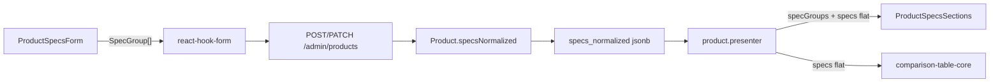

# Specs em blocos dinâmicos (admin + API + vitrine)

## Contexto atual

- Coluna [`specs_normalized`](packages/infrastructure/src/persistence/drizzle/schema/index.ts) tipada como `Record<string, string>` (default `{}`).
- Admin: [`ProductSpecsForm.tsx`](apps/admin/src/components/products/ProductSpecsForm.tsx) — template flat por categoria + atributos customizados.
- API: Zod em [`product-schemas.ts`](packages/shared/src/admin/product-schemas.ts) valida `z.record(z.string(), z.string())`.
- Vitrine: [`ProductSpecsTable.tsx`](apps/web/src/components/product/ProductSpecsTable.tsx) renderiza tabela plana única.
- Comparador: [`comparison-table-core.tsx`](apps/web/src/components/comparison/comparison-table-core.tsx) usa `product.specs` flat — **não muda nesta entrega**; o presenter continuará expondo `specs` achatado.



---

## Invariantes críticos (incorporados)

| #   | Risco                                   | Solução no plano                                                                          |
| --- | --------------------------------------- | ----------------------------------------------------------------------------------------- |
| 1   | `group_id` deduplicado globalmente      | `Set` local em `normalizeSpecsGroups` — escopo **apenas** do array do produto             |
| 2   | Migration SQL quebra tipos legados      | `jsonb_each_text` + subquery relacional (SQL exato na Seção 2)                            |
| 3   | Perda de foco no admin a cada keystroke | Estado local no `onChange`; `form.setValue` só em `onBlur`, mudanças estruturais e submit |
| 4   | SEO/a11y do `<details>`                 | `<summary>` obrigatório + tabela dentro de `<div>`; conteúdo indexável mesmo fechado      |
| 5   | Blocos fantasmas na vitrine             | Filtro `properties.length > 0` no presenter **e** em `ProductSpecsSections`               |

---

Criar [`packages/shared/src/product/spec-groups.ts`](packages/shared/src/product/spec-groups.ts):

```typescript
export type SpecProperty = { key: string; value: string };
export type SpecGroup = {
  group_id: string;
  group_title: string;
  is_collapsed_default: boolean;
  properties: SpecProperty[];
};
export type SpecsNormalized = SpecGroup[];
```

**Zod + sanitização (fonte única de verdade):**

- `specPropertySchema`, `specGroupSchema`, `specsNormalizedSchema`
- `normalizeSpecsGroups(input)` — regras do PRD:
  - trim em keys/values
  - descarta linhas com key **e** value vazios
  - descarta linhas com value preenchido e key vazia (via `superRefine` ou filter + issue)
  - descarta blocos sem `group_title` ou sem nenhuma property válida
  - regenera `group_id` ausente via [`slugifyTitle`](packages/shared/src/marketplace/slugify-title.ts) + sufixo `-2`, `-3` se colidir **dentro do array do produto**

**Desduplicação de `group_id` — escopo estritamente local (obrigatório):**

- A validação e o incremento de sufixo ocorrem **somente** durante a iteração do array recebido por `normalizeSpecsGroups` — nunca consultar o banco nem IDs de outros produtos.
- Implementação: acumulador `Set<string>` local, reiniciado a cada chamada:

```typescript
function ensureUniqueGroupIdInScope(baseId: string, usedIds: Set<string>): string {
  let candidate = baseId;
  let suffix = 2;
  while (usedIds.has(candidate)) {
    candidate = `${baseId}-${suffix}`;
    suffix += 1;
  }
  usedIds.add(candidate);
  return candidate;
}

// Dentro de normalizeSpecsGroups:
const usedGroupIds = new Set<string>();
for (const group of sanitizedGroups) {
  const baseId = group.group_id || slugifyTitle(group.group_title);
  group.group_id = ensureUniqueGroupIdInScope(baseId, usedGroupIds);
}
```

- **Por quê:** se a deduplicação fosse global, o produto B receberia `detalhes-produto-2` só porque o produto A já usa `detalhes-produto`, quebrando consistência de CSS/ancoragem na vitrine (`#detalhes-produto`).
- Teste unitário explícito: dois blocos com mesmo título no **mesmo** produto → `-2`; dois produtos distintos com bloco `"Detalhes do Produto"` → ambos mantêm `detalhes-produto`.
- `flattenSpecGroups(groups)` → `Record<string, string>` (última ocorrência vence em colisão de key)
- `legacyRecordToSpecGroups(record)` → um bloco `"Detalhes do Produto"` (`group_id: detalhes_produto`) — usado na migração e na hidratação defensiva no mapper

Exportar em [`packages/shared/src/product/index.ts`](packages/shared/src/product/index.ts).

Atualizar [`product-schemas.ts`](packages/shared/src/admin/product-schemas.ts):

- `specsNormalized: specsNormalizedSchema.default([])`
- `adminProductDetailSchema` e `productPublicDetailSchema`:
  - `specGroups: specsNormalizedSchema` (nome público amigável)
  - `specs: z.record(z.string(), z.string())` mantido como **campo derivado** no presenter (não enviado pelo admin)

---

## 2. Domain + infra + migração

| Arquivo                                                                                  | Mudança                                                                        |
| ---------------------------------------------------------------------------------------- | ------------------------------------------------------------------------------ |
| [`Product.ts`](packages/domain/src/entities/Product.ts)                                  | `specsNormalized: SpecGroup[]`                                                 |
| [`schema/index.ts`](packages/infrastructure/src/persistence/drizzle/schema/index.ts)     | `$type<SpecGroup[]>().default([])`                                             |
| [`product.mapper.ts`](packages/infrastructure/src/persistence/mappers/product.mapper.ts) | Se `jsonb` legado for object → `legacyRecordToSpecGroups`                      |
| Nova migration `0024_specs_normalized_groups.sql`                                        | Converte `{}` → `[]`; object com pares → bloco único; altera default da coluna |

SQL de migração — **usar `jsonb_each_text` para iterar chaves do legado** (não `jsonb_build_array(...)` genérico, que enfiaria o objeto inteiro numa property ou quebraria tipos):

```sql
-- Passo 1: objetos vazios → array vazio
UPDATE products
SET specs_normalized = '[]'::jsonb
WHERE specs_normalized = '{}'::jsonb OR specs_normalized IS NULL;

-- Passo 2: Record<string,string> legado → bloco único "Detalhes do Produto"
UPDATE products
SET specs_normalized = (
  SELECT jsonb_agg(
    jsonb_build_object(
      'group_id', 'detalhes_produto',
      'group_title', 'Detalhes do Produto',
      'is_collapsed_default', false,
      'properties', json_properties
    )
  )
  FROM (
    SELECT jsonb_agg(jsonb_build_object('key', key, 'value', value)) AS json_properties
    FROM jsonb_each_text(specs_normalized)
  ) _
)
WHERE jsonb_typeof(specs_normalized) = 'object'
  AND specs_normalized != '{}'::jsonb;

-- Passo 3: alterar default da coluna (separado ou no mesmo arquivo)
ALTER TABLE products ALTER COLUMN specs_normalized SET DEFAULT '[]'::jsonb;
```

- Registros já no formato array (pós-deploy parcial) não são tocados pelo Passo 2 (`jsonb_typeof = 'object'`).
- Mapper defensivo (`legacyRecordToSpecGroups`) permanece como fallback em runtime para linhas não migradas.

Atualizar seed/tests que usam `{}` → `[]`.

[`ComparisonSpecMatcher`](packages/domain/src/services/index.ts): aceitar `SpecGroup[]` internamente via `flattenSpecGroups` (comparador inalterado na UI).

---

## 3. API presenter

[`product.presenter.ts`](apps/api/src/adapters/presenters/product.presenter.ts):

```typescript
const normalized = normalizeSpecsGroups(product.specsNormalized);
const activeGroups = normalized.filter((g) => g.properties.length > 0);

specGroups: activeGroups,
specs: flattenSpecGroups(activeGroups),
```

- **Filtro defensivo de blocos fantasmas:** grupos com `properties.length === 0` são removidos no presenter **público** antes de serializar.
- **Admin:** retorna `specsNormalized` pós-`normalizeSpecsGroups` (blocos vazios já descartados no save via Zod); operador não vê cabeçalhos órfãos persistidos.
- Camada dupla na vitrine: componente também filtra, protegendo contra dados stale ou bypass do presenter.

Ajustar testes em [`UpdateProduct.test.ts`](packages/application/src/use-cases/product/UpdateProduct.test.ts), [`CreateProduct.test.ts`](packages/application/src/use-cases/product/CreateProduct.test.ts), [`comparison.presenter.test.ts`](apps/api/src/adapters/presenters/comparison.presenter.test.ts).

---

## 4. Admin — editor de blocos (entrega principal)

### Arquitetura de estado

Seguir o padrão já usado em [`ProductSpecsForm.tsx`](apps/admin/src/components/products/ProductSpecsForm.tsx) (IDs estáveis para keys React), inspirado em reordenação de [`CMSBlockOrderManager.tsx`](apps/admin/src/components/cms/CMSBlockOrderManager.tsx) (setas ↑↓, sem nova dependência DnD).

**Regra crítica de foco — não sincronizar RHF a cada keystroke:**

| Evento                               | Comportamento                                                                                 |
| ------------------------------------ | --------------------------------------------------------------------------------------------- |
| `onChange` em inputs de key/value    | Atualiza **apenas** estado local (`useState` / reducer no bloco) — **sem** `form.setValue`    |
| `onBlur` em inputs de key/value      | Dispara `syncToForm()` → `form.setValue('specsNormalized', uiStateToSpecsNormalized(blocks))` |
| Adicionar/remover linha ou bloco     | Sync imediato (mudança estrutural)                                                            |
| Reordenar blocos (setas ↑↓)          | Sync imediato                                                                                 |
| Toggle `is_collapsed_default`        | Sync imediato                                                                                 |
| Submit do formulário (`ProductForm`) | Sync final obrigatório antes do POST/PATCH (garante último campo ainda focado)                |

- **Por quê:** `form.setValue` no `onChange` do elemento raiz força re-render da lista inteira de blocos e **perde o foco do cursor a cada caractere**, tornando o admin inutilizável.
- `ProductSpecPropertyRow` recebe `value`/`onChange` do estado local do pai; expõe `onBlur` que propaga sync.

Novo módulo [`apps/admin/src/lib/product-specs-form-state.ts`](apps/admin/src/lib/product-specs-form-state.ts):

```typescript
type SpecPropertyRowState = { id: string; key: string; value: string };
type SpecBlockState = {
  id: string;           // UI only (crypto/random)
  group_id: string;
  group_title: string;
  is_collapsed_default: boolean;
  properties: SpecPropertyRowState[];
};

createEmptyBlock(): SpecBlockState
createEmptyPropertyRow(): SpecPropertyRowState
specsNormalizedToUiState(groups: SpecGroup[]): SpecBlockState[]
uiStateToSpecsNormalized(blocks: SpecBlockState[]): SpecGroup[]  // delega normalizeSpecsGroups
ensureUniqueGroupId(title, existingIds): string
buildSuggestedBlockFromTemplate(templateKeys, existingSpecs): SpecBlockState
```

### Componentes

| Componente                                                                        | Responsabilidade                                                                                                                          |
| --------------------------------------------------------------------------------- | ----------------------------------------------------------------------------------------------------------------------------------------- |
| [`ProductSpecsForm.tsx`](apps/admin/src/components/products/ProductSpecsForm.tsx) | Orquestrador; lista de blocos; botão **Adicionar novo bloco**; botão **Adicionar bloco sugerido da categoria** (substitui templates flat) |
| `ProductSpecBlockEditor.tsx`                                                      | Título do bloco, checkbox _Iniciar recolhido na vitrine_, setas reordenar, excluir bloco (`AlertDialog`), lista de properties             |
| `ProductSpecPropertyRow.tsx`                                                      | Input key + Textarea value (valores longos) + lixeira; botão **+ Adicionar atributo** no rodapé do bloco                                  |

**UX alinhada às regras admin** ([`11-admin-floating-panels.mdc`](.cursor/rules/11-admin-floating-panels.mdc)):

- Manter `CmsFormSection title="Especificações do Produto"` dentro da aba existente em [`ProductForm.tsx`](apps/admin/src/components/products/ProductForm.tsx)
- Cards por bloco: `cms-block-card cms-block-card--plain`
- Confirmação de exclusão via [`alert-dialog.tsx`](apps/admin/src/components/ui/alert-dialog.tsx)
- Checkbox `is_collapsed_default` com [`Switch`](apps/admin/src/components/ui/switch.tsx) ou checkbox nativo

**Templates por categoria** ([`spec-templates.ts`](packages/shared/src/product/spec-templates.ts)):

- Remover seção "Especificações sugeridas" flat
- Se `resolveSpecTemplateForSlugChain` retornar keys e ainda não existir bloco sugerido → mostrar botão **Adicionar bloco sugerido da categoria** que cria bloco `"Especificações sugeridas"` com properties vazias (keys = labels do template), hidratando valores de blocos existentes quando key coincidir

**Integração RHF:**

- [`product-form-values.ts`](apps/admin/src/lib/product-form-values.ts): default `specsNormalized: []`
- [`ProductForm.tsx`](apps/admin/src/components/products/ProductForm.tsx): default `[]`; expor callback `onBeforeSubmit` ou chamar `syncSpecsToForm()` no handler de save existente
- Estado local (`blocks`) é a fonte de verdade durante digitação; RHF recebe snapshot normalizado em `onBlur` + eventos estruturais + submit

**Prompts LLM:** atualizar [`product-llm-prompt.ts`](apps/admin/src/lib/product-llm-prompt.ts) para formatar blocos agrupados (até N properties).

**Hints:** revisar [`product-form-hints.ts`](apps/admin/src/lib/product-form-hints.ts) (`specsTemplate` → hint de bloco sugerido; `specsCustom` → blocos manuais).

---

## 5. Vitrine web — ficha técnica colapsável

Substituir [`ProductSpecsTable.tsx`](apps/web/src/components/product/ProductSpecsTable.tsx) por `ProductSpecsSections.tsx` (ou evoluir o arquivo existente):

- Props: `specGroups: SpecGroup[]` (fallback: se array vazio após filtro → `null`)
- **Filtro defensivo no componente** (camada dupla além do presenter): `groups.filter(g => g.properties.length > 0)` — blocos sem propriedades ativas não renderizam
- Cada bloco: `<details>` + `<summary>` nativos (sem Radix — web não usa) — estrutura semântica obrigatória para SSR, acessibilidade e SEO (Googlebot indexa conteúdo dentro de `<details>` fechados)
- `open={!group.is_collapsed_default}` no SSR inicial
- `id={group.group_id}` no `<details>` para ancoragem consistente com deduplicação local por produto

Estrutura HTML de referência:

```tsx
{
  activeGroups.map((group) => (
    <details
      key={group.group_id}
      id={group.group_id}
      open={!group.is_collapsed_default}
      className="group border-b border-gray-100"
    >
      <summary className="flex cursor-pointer list-none items-center justify-between py-4 font-semibold text-neutral-900 [&::-webkit-details-marker]:hidden">
        {group.group_title}
        <span aria-hidden className="transition-transform group-open:rotate-180">
          ▼
        </span>
      </summary>
      <div className="pb-4">
        <table className="w-full border-collapse text-left text-sm">
          <tbody>
            {group.properties.map(({ key, value }) => (
              <tr key={key} className="border-b border-gray-100 even:bg-gray-50/50 last:border-b-0">
                <th scope="row" className="w-[40%] px-4 py-3 font-medium text-neutral-600">
                  {key}
                </th>
                <td className="px-4 py-3 text-neutral-800">{value}</td>
              </tr>
            ))}
          </tbody>
        </table>
      </div>
    </details>
  ));
}
```

- Manter `formatSpecKey` apenas se necessário; keys já são labels legíveis do admin

Atualizar [`apps/web/src/app/produtos/[slug]/page.tsx`](apps/web/src/app/produtos/[slug]/page.tsx):

```tsx
<ProductSpecsSections specGroups={product.specGroups} />
```

Atualizar contrato em [`apps/web/src/lib/api/api-contracts.test.ts`](apps/web/src/lib/api/api-contracts.test.ts).

Comparador/embeds: **sem mudança** — continuam consumindo `specs` flat do presenter.

---

## 6. Testes

| Área                               | O que testar                                                                                                |
| ---------------------------------- | ----------------------------------------------------------------------------------------------------------- |
| `spec-groups.test.ts`              | normalize, flatten, legacy convert, `group_id` dedup **escopo local** (mesmo produto vs produtos distintos) |
| `product-specs-form-state.test.ts` | round-trip UI ↔ JSON, descarte blocos vazios                                                                |
| Admin (manual ou RTL)              | digitar em input de value sem perder foco entre caracteres                                                  |
| Use cases produto                  | persistência array de blocos                                                                                |
| `product-llm-prompt.test.ts`       | formatação agrupada                                                                                         |

---

## 7. Documentação

Atualizar [`docs/admin-products-phase1.md`](docs/admin-products-phase1.md) e [`docs/product-detail-page.md`](docs/product-detail-page.md) com novo schema, fluxo admin e vitrine colapsável. Índice em [`docs/README.md`](docs/README.md) se necessário.

---

## Ordem de implementação sugerida

1. Shared types + normalize/flatten + testes
2. Domain, Drizzle, migration SQL, mapper defensivo
3. Zod admin/public + presenter + use case tests
4. Admin lib state + componentes + integração RHF
5. Vitrine `ProductSpecsSections`
6. Docs + lint nos pacotes alterados

## Fora de escopo (confirmado)

- Drag-and-drop com biblioteca externa (usar setas ↑↓)
- Refatorar comparador para colunas por bloco
- Worker/hygiene pipeline de specs (permanece como está)
