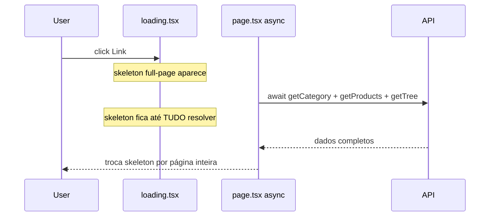

# Transição instantânea com Streaming e Suspense — vitrine web

## Diagnóstico atual

A **Abordagem 1** já está entregue ([`docs/web-loading-skeletons.md`](docs/web-loading-skeletons.md), plano [`web_instant_navigation_ux_b96daa6b.plan.md`](.cursor/plans/web_instant_navigation_ux_b96daa6b.plan.md)):

- 7 arquivos `loading.tsx` nas rotas principais
- [`layout.tsx`](apps/web/src/app/layout.tsx) com `SiteHeaderShell` em `<Suspense fallback={<HeaderSkeleton />}>`
- `NavigationPendingBar` + `cached-fetchers.ts` com `React.cache()`

**Por que ainda congela:**



1. **Páginas async bloqueantes** — ex.: [`categorias/[slug]/page.tsx`](apps/web/src/app/categorias/[slug]/page.tsx) faz `Promise.all([getCategory, getCategoryProducts, fetchCategoryTree])` antes de qualquer JSX. O `loading.tsx` só some quando **todos** os fetches terminam.
2. **Home em duas fases** — [`ProductGridBlock`](apps/web/src/components/blocks/ProductGridBlock.tsx) e [`FeaturedProductBlock`](apps/web/src/components/blocks/FeaturedProductBlock.tsx) são `'use client'` com React Query: layout CMS chega do servidor, grids aparecem só após hidratação + fetch client.
3. **Header re-suspende** — [`SiteHeaderShell`](apps/web/src/components/layout/SiteHeaderShell.tsx) chama `fetchCategoryNavTree()` a cada navegação RSC; sem cache persistente, pode piscar `HeaderSkeleton`.
4. **Coleção/produto** — API retorna metadados + itens num único round-trip (`getCollection`, `getProduct`); `loading.tsx` continua correto, mas podemos enxugar o skeleton.

## Arquitetura alvo (Abordagem 2)

Regra central do Next.js App Router: **`page.tsx` síncrono** retorna JSX com boundaries `<Suspense>`; fetches lentos ficam em **Server Components filhos async**.

```mermaid
sequenceDiagram
  participant User
  participant Page as page.tsx sync
  participant Shell as CategoryShell async
  participant Grid as CategoryProductsGrid async
  participant API

  User->>Page: click Link
  Page-->>User: layout + fallbacks imediatos
  par Shell fetch rápido
    Shell->>API: getCategory
  and Grid fetch lento
    Grid->>API: getCategoryProducts
  Shell-->>User: breadcrumb + h1 + pills
  Grid-->>User: ProductCards
```

---

## Fase A — Padrão reutilizável

Criar componentes async por rota em `apps/web/src/components/listing/` (ou subpastas por domínio):

| Componente | Fetch | Fallback |
|------------|-------|----------|
| `CategoryShell` | `getCategory(slug)` | `CategoryHeaderSkeleton` (novo, leve) |
| `CategoryProductsGrid` | `getCategoryProducts(slug, page)` | `ProductGridSkeleton` |
| `CategorySidebar` | `fetchCategoryTree()` | trecho já existente em `CategoryPageSkeleton` |
| `ArticleListingGridAsync` | `fetchPublishedArticles(...)` | `ArticleCardSkeleton` grid |
| `ArticleAutoLinksSection` | `getAutoLinks()` | `null` ou strip mínimo |

Extrair helpers de fetch que hoje estão inline em `page.tsx` (ex.: `getCategoryProducts` em categorias) para módulos compartilhados com `page.tsx` e os async children.

**JSON-LD** que depende de produtos move para dentro de `CategoryProductsGrid` (ou componente irmão async).

---

## Fase B — Categorias (maior impacto)

Refatorar [`categorias/[slug]/page.tsx`](apps/web/src/app/categorias/[slug]/page.tsx):

```tsx
// page.tsx — SÍNCRONO
export default function CategoryPage({ params, searchParams }) {
  return (
    <main className="mx-auto max-w-7xl px-4 py-8">
      <div className="lg:grid lg:grid-cols-[240px_minmax(0,1fr)] lg:gap-10">
        <Suspense fallback={<CategorySidebarSkeleton />}>
          <CategorySidebar params={params} />
        </Suspense>
        <div className="min-w-0">
          <Suspense fallback={<CategoryHeaderSkeleton />}>
            <CategoryShell params={params} searchParams={searchParams} />
          </Suspense>
          <Suspense fallback={<ProductGridSkeleton count={8} />}>
            <CategoryProductsGrid params={params} searchParams={searchParams} />
          </Suspense>
        </div>
      </div>
    </main>
  );
}
```

- `CategoryShell` renderiza breadcrumb, `<h1>`, pills de subcategorias, contagem via `category.productCount` (não espera grid).
- `CategoryProductsGrid` renderiza grid + `ListingPagination` (pagination pode ficar fora em `<Suspense fallback={null}>` como hoje).
- `generateMetadata` continua usando `getCategory` via [`cached-fetchers.ts`](apps/web/src/lib/api/cached-fetchers.ts) — deduplicado no mesmo request.

Atualizar [`categorias/[slug]/loading.tsx`](apps/web/src/app/categorias/[slug]/loading.tsx) para skeleton **leve** (só grid + header mínimo) ou reutilizar composição dos novos fallbacks — evita duplicar o skeleton full-page quando o shell já streamou.

---

## Fase C — Artigos

### Listagem [`artigos/page.tsx`](apps/web/src/app/artigos/page.tsx)

- `page.tsx` síncrono com shell (`<main>`, `<h1>` condicional genérico ou via `Suspense`).
- `Suspense` + `ArticleListingToolbar` (categories via fetch rápido em `ArticleListingCategoriesAsync`).
- `Suspense` + `ArticleListingGridAsync` com `fetchPublishedArticles`.
- Manter [`ArticleListingPendingProvider`](apps/web/src/components/articles/ArticleListingPendingContext.tsx) para filtros client (`router.replace`) — grid client já mostra skeleton em `useTransition`; garantir que o server child não bloqueie a toolbar.

### Detalhe [`artigos/[slug]/page.tsx`](apps/web/src/app/artigos/[slug]/page.tsx)

- `page.tsx` síncrono; `Suspense` com `ArticleDetailHero` (await `getArticle` — necessário para `notFound()`).
- Corpo editorial (`ArticleBody`) no mesmo boundary (dados já vêm com o artigo).
- `Suspense fallback={null}` para `getAutoLinks()` + injeção de auto-links (fetch separado, cache 1h).
- Carousel relacionado / cluster: boundaries opcionais se fetches forem extraídos.

---

## Fase D — Home (eliminar flash pós-hidratação)

Blocos que hoje client-fetch:

- [`ProductGridBlock.tsx`](apps/web/src/components/blocks/ProductGridBlock.tsx)
- [`FeaturedProductBlock.tsx`](apps/web/src/components/blocks/FeaturedProductBlock.tsx)

**Padrão híbrido** (preserva pills interativos via `CategoryFilterContext`):

1. Novo `ProductGridBlockServer.tsx` (RSC): fetch inicial com mesmos query params default; passa `initialProducts` para versão client presentacional.
2. `useQuery` em `ProductGridBlock` ganha `initialData` / `placeholderData` do servidor — zero skeleton na primeira paint.
3. Mudança de categoria via pills continua refetch client (comportamento atual).
4. Mesmo para `FeaturedProductBlock`: server prefetch por `productSlug`, client só para wishlist interativo.

Alternativa se o CMS já entregar `renderedData` (como [`DynamicProductGridBlock`](apps/web/src/components/blocks/DynamicProductGridBlock.tsx)): avaliar se o worker/API pode pré-renderizar esses blocos na entrega do layout — fora do escopo mínimo; o prefetch server no render basta.

[`page.tsx`](apps/web/src/app/page.tsx) home: opcionalmente envolver `PageRenderer` em `Suspense` com `HomePageSkeleton` apenas se `getHomeLayout()` for lento; hoje o gargalo é pós-hidratação, não o layout fetch.

---

## Fase E — Coleções e produto

API única (`getCollection`, `getProduct`) — **sem split de fetch** sem mudança de contrato REST.

Ações:

- Manter `loading.tsx` como boundary principal.
- Enxugar [`CollectionPageSkeleton`](apps/web/src/components/loading/CollectionPageSkeleton.tsx) e [`ProductDetailSkeleton`](apps/web/src/components/loading/ProductDetailSkeleton.tsx) se necessário (menos blocos redundantes com header estável).
- Produto: opcional `Suspense` só em `ProductSimilarCarousel` se similar vier de fetch futuro; hoje `similarProducts` já vem em `getProduct` — **não refatorar** sem ganho.

---

## Fase F — Header estável

Em [`categories.ts`](apps/web/src/lib/api/categories.ts) ou wrapper dedicado:

```ts
import { unstable_cache } from 'next/cache';

export const getCachedCategoryNavTree = unstable_cache(
  fetchCategoryNavTree,
  ['category-nav-tree'],
  { revalidate: 600 },
);
```

[`SiteHeaderShell`](apps/web/src/components/layout/SiteHeaderShell.tsx) passa a usar `getCachedCategoryNavTree` — evita re-suspense e flash de `HeaderSkeleton` entre navegações.

Avaliar `unstable_cache` também para `fetchCategoryTree` usado na sidebar de categorias (dedupe com header).

---

## Fase G — loading.tsx alinhados

| Rota | Ajuste |
|------|--------|
| `categorias/[slug]` | Skeleton leve (header parcial + grid) — shell real substitui header rapidamente |
| `artigos` | Toolbar skeleton + grid (não página inteira opaca) |
| `artigos/[slug]` | Hero skeleton + corpo (não full page duplicado) |
| Root `loading.tsx` | Manter `HomePageSkeleton` (home ainda async no layout fetch) |
| `colecoes`, `produtos` | Revisão cosmética apenas |

---

## Documentação

Atualizar [`docs/web-loading-skeletons.md`](docs/web-loading-skeletons.md):

- Marcar Fase 4 (streaming granular) como implementada.
- Diagrama do fluxo shell + Suspense.
- Tabela rota → boundaries Suspense.
- Nota: coleção/produto permanecem com `loading.tsx` por limitação de API monolítica.

---

## Validação

1. `npm run dev` — API + web; navegar home → categoria → produto → coleção → artigos.
2. **Critério:** no clique, header/footer estáveis; área de conteúdo mostra estrutura (breadcrumb/título) **antes** do grid; sem página anterior congelada.
3. Home: blocos de produto sem segundo skeleton pós-hidratação na primeira visita.
4. `/artigos`: filtro por categoria — grid skeleton via `useTransition` (já existe) + server não bloqueia toolbar.
5. `npm run lint --workspace=apps/web`

## Riscos / invariantes

- `notFound()` deve continuar no boundary que faz o fetch de entidade (categoria/artigo/produto).
- `generateMetadata` inalterado em contrato SEO; `cache()` já deduplica.
- Regra de negócio: requests de visitante só leem catálogo local — nenhum fetch Amazon/Shopee no render.
- Código em inglês; copy UI em pt-BR.
