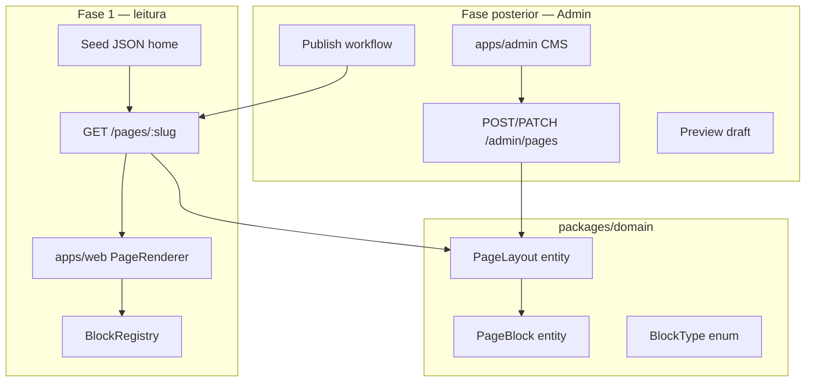

# Planejamento UI/UX — Home CMS-driven (fase 1 + Admin futuro)

## Princípio central

A **Home não é uma página hardcoded**. É uma **`PageLayout` publicada** composta por **blocos ordenados**, cada um com:

- `type` — identificador do componente (ex.: `hero_carousel`, `product_grid`)
- `sortOrder` — posição na página (0, 1, 2…)
- `props` — configuração JSON validada por schema Zod **por tipo de bloco**
- `visibility` — opcional: `desktop | mobile | all`

O **Admin CMS** (fase posterior) permitirá criar, reordenar, configurar e publicar blocos. Na **fase 1**, o front consome `GET /pages/home` com layout seed que replica a referência ESTORE.

Referência visual: layout minimalista ESTORE (hero assimétrico, grid, pills). Regras de afiliação: [`.cursor/rules/06-ux-conversion.mdc`](.cursor/rules/06-ux-conversion.mdc).

---

## Arquitetura CMS (visão geral)



---

## Modelo de dados (domínio + persistência)

### Entidades novas (`packages/domain`)

**PageLayout**

- `id`, `slug` (ex.: `home`), `title`, `status` (`draft` | `published`)
- `publishedAt`, `updatedAt`
- Regra: apenas 1 layout `published` por slug

**PageBlock**

- `id`, `pageId`, `type: BlockType`, `sortOrder: number`
- `props: Record<string, unknown>` — validado na borda por schema do tipo
- `visibility: 'all' | 'desktop' | 'mobile'` (default `all`)

### BlockType — catálogo inicial (extensível)

| BlockType            | Descrição UI                                 | Props principais                                                                                             |
| -------------------- | -------------------------------------------- | ------------------------------------------------------------------------------------------------------------ |
| `hero_carousel`      | Carrossel editorial (coluna esquerda ESTORE) | `slides[]`: `{ imageUrl, title, subtitle, ctaLabel, ctaHref, linkedProductSlug? }`, `autoplay`, `intervalMs` |
| `featured_product`   | Card destaque (coluna direita ESTORE)        | `productSlug` **ou** `productId`, `showMarketplaceBadge`, `ctaLabel`                                         |
| `product_grid`       | Grid "Produtos populares"                    | `title`, `categorySlug?`, `marketplace?`, `sort`, `pageSize`, `columns: 2\|4`                                |
| `category_pills`     | Pills de filtro acima do grid                | `title?`, `categorySlugs[]`, `linkedBlockId?` (sync com grid vizinho)                                        |
| `hero_split`         | Container 2 colunas (carrossel + featured)   | `leftBlockId`, `rightBlockId`, `ratio: '2/1' \| '1/1'`                                                       |
| `curated_collection` | Destaque de coleção social                   | `collectionSlug`, `layout: 'carousel' \| 'grid'`                                                             |
| `coupon_strip`       | Faixa de cupons ativos                       | `marketplace?`, `maxItems`                                                                                   |
| `rich_text`          | Bloco editorial HTML/markdown                | `html`, `align`                                                                                              |
| `banner`             | Imagem full-width + link                     | `imageUrl`, `href`, `alt`                                                                                    |
| `spacer`             | Espaçamento vertical                         | `size: 'sm' \| 'md' \| 'lg'`                                                                                 |

Novos tipos = novo enum + schema Zod + componente React registrado — **sem alterar o PageRenderer**.

### Tabela Drizzle (fase 1)

```sql
-- pages
id, slug UNIQUE, title, status, published_at, updated_at

-- page_blocks
id, page_id FK, type, sort_order, props JSONB, visibility
```

Migration + seed: layout `home` publicado replicando wireframe ESTORE (ver seção Seed).

---

## Contrato API

### Fase 1 — leitura pública

**`GET /pages/:slug`**

Response (DTO):

```typescript
type PageLayoutDto = {
  slug: string;
  title: string;
  blocks: PageBlockDto[];
};

type PageBlockDto = {
  id: string;
  type: BlockType;
  sortOrder: number;
  visibility: 'all' | 'desktop' | 'mobile';
  props: unknown; // validado no use case por type
};
```

- Retorna 404 se slug inexistente ou sem versão `published`
- Cache Redis: `vitrine:page:slug:{slug}:v{version}` TTL 5 min
- Invalidação ao publicar (fase Admin)

### Fase posterior — Admin (escopo documentado, não implementar agora)

| Método | Rota                                | Ação                     |
| ------ | ----------------------------------- | ------------------------ |
| GET    | `/admin/pages`                      | Listar páginas           |
| GET    | `/admin/pages/:slug`                | Layout draft + published |
| POST   | `/admin/pages/:slug/blocks`         | Adicionar bloco          |
| PATCH  | `/admin/pages/:slug/blocks/reorder` | `{ blockIds: string[] }` |
| PATCH  | `/admin/pages/:slug/blocks/:id`     | Atualizar props          |
| DELETE | `/admin/pages/:slug/blocks/:id`     | Remover bloco            |
| POST   | `/admin/pages/:slug/publish`        | Draft → published        |
| GET    | `/admin/pages/:slug/preview?token=` | Preview draft            |

Auth: JWT/session operador (fora do escopo MVP visitante). App: `apps/admin` (Next.js ou React SPA).

---

## Front-end — PageRenderer (fase 1)

### Padrão Block Registry

```
apps/web/src/
  app/page.tsx                    # fetch GET /pages/home → PageRenderer
  components/
    cms/PageRenderer.tsx          # map blocks → components by type
    cms/BlockRegistry.ts          # Record<BlockType, Component>
    blocks/HeroCarouselBlock.tsx
    blocks/FeaturedProductBlock.tsx
    blocks/ProductGridBlock.tsx
    blocks/CategoryPillsBlock.tsx
    blocks/HeroSplitBlock.tsx      # compõe filhos por ID ou inline
    ...
    layout/SiteHeader.tsx         # fixo (fora do CMS na fase 1; CMS na fase 3)
    product/ProductCard.tsx
    wishlist/WishlistDrawer.tsx
  lib/
    api/pages.ts                  # getPageLayout(slug)
    cms/block-schemas.ts          # Zod schemas espelhando domain
    cms/resolve-block-data.ts     # blocos que precisam fetch adicional (produtos)
```

**PageRenderer** (pseudo):

```typescript
export function PageRenderer({ layout }: { layout: PageLayoutDto }) {
  const sorted = [...layout.blocks].sort((a, b) => a.sortOrder - b.sortOrder);
  return (
    <main>
      {sorted.map((block) => {
        const Block = BlockRegistry[block.type];
        if (!Block) return null;
        return <Block key={block.id} block={block} />;
      })}
    </main>
  );
}
```

Cada bloco recebe `props` já validadas pelo API; re-valida com Zod no client (defesa em profundidade).

### Resolução de dados dinâmicos

Blocos como `product_grid` e `featured_product` **não duplicam catálogo no CMS** — props guardam **referências** (`productSlug`, `categorySlug`, `sort`). O componente bloco chama hooks/API existentes:

- `featured_product` → `GET /products/:slug`
- `product_grid` → `GET /products?category=&sort=&pageSize=`
- `category_pills` → `GET /categories`
- `curated_collection` → `GET /collections/:slug`

CMS configura **o quê mostrar**; API de catálogo fornece **dados vivos** (preço, stale, rating).

### Wireframe ESTORE como seed CMS (não hardcode no React)

Ordem `sortOrder` do seed `home`:

| Order | type               | props resumidas                                                                   |
| ----- | ------------------ | --------------------------------------------------------------------------------- |
| 0     | `hero_split`       | ratio `2/1`, compõe blocos 1 e 2                                                  |
| 1     | `hero_carousel`    | slides da coleção `setup-gamer-iniciante`                                         |
| 2     | `featured_product` | `productSlug: cadeira-ergonomica-home-office`                                     |
| 3     | `category_pills`   | `["home-office", "games", "eletronicos"]`                                         |
| 4     | `product_grid`     | `title: "Produtos populares"`, `categorySlug: null`, `columns: 4`, `pageSize: 12` |

Alterar a Home = alterar JSON no banco (Admin futuro) ou seed — **zero deploy** após CMS ativo.

---

## Design system (inalterado na estética, aplicado nos blocos)

Tokens ESTORE: fundo `#F7F7F7`, radius `1rem`, primary `#111111`. Componentes primitivos (`ProductCard`, `PriceDisplay`, `MarketplaceBadge`) são **usados dentro dos blocos**, não substituídos por eles.

Regras UX por bloco:

- `product_grid` / `featured_product`: cenários A/B de clique ([`06-ux-conversion.mdc`](.cursor/rules/06-ux-conversion.mdc))
- Preço stale: `PriceDisplay` oculta valor
- CTAs: copy pt-BR ("Ver na Amazon", "Ver na Shopee")

---

## Gaps de API (fase 1)

Além do CMS:

1. **`GET /pages/:slug`** + entidades + seed (prioridade)
2. **`GET /categories`** — pills configuráveis no Admin
3. **`GET /wishlist`** enriquecido — drawer global
4. **`GET /products?sort=`** — grids configuráveis
5. **`CORS_ORIGINS`** — web + futuro admin

---

## Fases de entrega

### Fase 1 — Vitrine renderiza CMS (sem Admin UI)

- Domain + migration + seed layout `home`
- `GET /pages/home`
- `apps/web` com `PageRenderer` + blocos ESTORE
- Wishlist, session, click tracking
- Header fixo (nav links estáticos ok)

**Aceite:** trocar ordem/título de bloco no seed JSON reflete na Home após migrate/seed; grid e hero funcionam com API real.

### Fase 2 — Páginas de produto e conteúdo

- `/produtos/[slug]`, `/artigos/[slug]`, `/c/[slug]`, etc.
- Mesmo padrão CMS **opcional** para landing pages; home já prova o modelo

### Fase 3 — Admin CMS (`apps/admin`)

- CRUD páginas e blocos
- Drag-and-drop reorder (`@dnd-kit` ou similar)
- Formulário dinâmico por `BlockType` (fields from Zod schema metadata)
- Draft / Preview / Publish
- Validação: bloco `product_grid` exige `pageSize` 4–24; `hero_carousel` exige ≥1 slide
- Auditoria: `updatedBy`, histórico de publicação (opcional)

**Fora do escopo Admin MVP:** multi-tenant, A/B test nativo, versionamento rollback (fase 4).

---

## SEO e performance

- Home SSR/ISR: `revalidate: 60`; invalidação quando layout publicado muda
- Blocos above-the-fold (`hero_*`) com `priority` images
- Metadata da página: campos `seoTitle`, `seoDescription` em `PageLayout` (Admin fase 3; seed fase 1)

---

## Critérios de aceite (fase 1)

- Home renderiza exclusivamente via `GET /pages/home` + `PageRenderer`
- Seed reproduz layout ESTORE (hero split + grid + pills)
- Reordenar blocos no seed altera a Home sem mudança de código React
- Adicionar bloco `banner` ou `rich_text` no seed renderiza sem novo deploy
- Blocos de produto respeitam stale price e tracking de clique
- Tipagem forte: `BlockType` enum + Zod por props; zero `as`
- Admin **não** implementado — contrato `/admin/*` documentado para fase 3

---

## Referência cruzada

- Arquitetura: [`arquitetura_tecnica_node.plan.md`](arquitetura_tecnica_node.plan.md) — `Admin_CMS` já previsto no diagrama
- PRD Core §2.4 — componentes de card/detelhe permanecem válidos **dentro** dos blocos
- Copy pt-BR / código inglês: [`09-code-standards.mdc`](.cursor/rules/09-code-standards.mdc)
