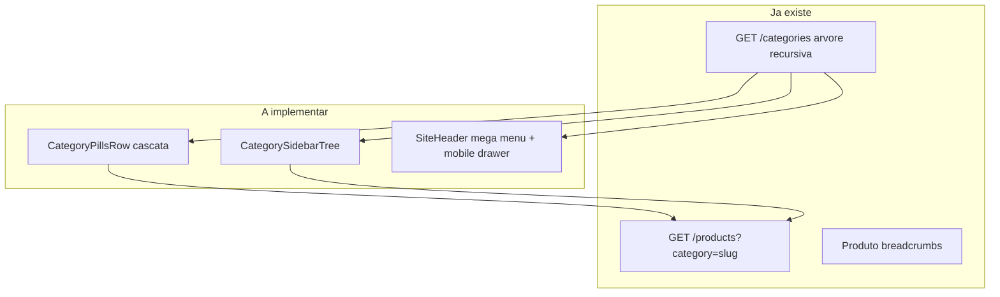

# Vitrine: subcategorias nos 3 pontos estratégicos

## Estado atual (o que já funciona)

| Ponto | Status |
|-------|--------|
| Breadcrumb no produto | Feito em [`apps/web/src/app/produtos/[slug]/page.tsx`](apps/web/src/app/produtos/[slug]/page.tsx) |
| Dropdown simples no header (1 nível) | Feito em [`SiteHeader.tsx`](apps/web/src/components/layout/SiteHeader.tsx) via [`getCategoryNavItems`](apps/web/src/lib/api/categories.ts) |
| Página `/categorias/[slug]` | SSR + chips horizontais de subcategorias |
| Filtro de produtos por subárvore | `GET /products?category={slug}` já usa `getDescendantIds` em [`ListProducts.ts`](packages/application/src/use-cases/product/ListProducts.ts) |

**Gaps:** pills flat na Home, sem sidebar na listagem, header sem mega menu e **sem menu de categorias no mobile** (`hidden md:flex`).



---

## Fase 1 — Pills em cascata na Home

### Comportamento alvo

```
Linha 1: [Todos] [Home Office] [Games] [Eletrônicos]
Linha 2 (se pai com filhos): [Todas de Home Office] [Office Desk] [Organizadores]
```

- Clique no **pai** → `categorySlug = pai` → grade mostra subárvore inteira (comportamento API atual).
- Clique na **subcategoria** → `categorySlug = filho` → grade estreita para o nicho.
- **"Todas de {pai}"** → equivalente ao slug do pai (mesmo filtro da linha 1).
- Ao trocar de pai, limpar seleção de filho automaticamente.
- Pais **sem filhos** → só linha 1, sem segunda fileira.

### Arquivos

| Arquivo | Mudança |
|---------|---------|
| [`packages/shared/src/cms/block-schemas.ts`](packages/shared/src/cms/block-schemas.ts) | Adicionar `mode: 'filter' \| 'link'` (default `filter`) e `showSubcategories: boolean` (default `true`) em `categoryPillsPropsSchema` |
| **Novo** `packages/shared/src/category/category-tree-nav.ts` | Helpers puros: `findCategoryNodeBySlug`, `getDirectChildren`, `getAncestorSlugs` — reutilizados por pills, sidebar e header |
| [`CategoryPillsRow.tsx`](apps/web/src/components/blocks/CategoryPillsRow.tsx) | Duas fileiras; derivar filhos da árvore `GET /categories` (hoje só usa labels); modo `link` renderiza `<Link href="/categorias/{slug}">` |
| [`CategoryFilterContext.tsx`](apps/web/src/components/cms/CategoryFilterContext.tsx) | Sem mudança obrigatória — um único `categorySlug` basta; lógica de “pai ativo para UI” derivada da árvore |
| [`ProductGridBlock.tsx`](apps/web/src/components/blocks/ProductGridBlock.tsx) | Ajuste de layout: pills em coluna (`flex-col`) quando houver segunda fileira |
| [`CategoryPillsForm.tsx`](apps/admin/src/components/cms/props-forms/CategoryPillsForm.tsx) | Campos `mode` e `showSubcategories`; hint de que `categorySlugs` devem ser categorias **raiz** para cascata |
| [`block-form-registry.ts`](apps/admin/src/components/cms/props-forms/block-form-registry.ts) | Defaults para blocos existentes no seed |

### Sem mudança de API

O filtro já aceita qualquer slug da árvore; não é necessário passar `category_id` — slug resolve no use case.

---

## Fase 2 — Sidebar em árvore em `/categorias/[slug]`

### Layout alvo

```
┌─────────────────┬──────────────────────────┐
│ Sidebar (tree)  │ Breadcrumb + H1 + grid     │
│ 📁 Home Office  │                          │
│   └ Office Desk │                          │
│   └ Cadeiras    │                          │
└─────────────────┴──────────────────────────┘
```

### Arquivos

| Arquivo | Mudança |
|---------|---------|
| **Novo** `apps/web/src/components/category/CategorySidebarTree.tsx` | Árvore recursiva com linhas de conexão; nó atual destacado; ancestrais expandidos; links para `/categorias/{slug}` |
| [`categorias/[slug]/page.tsx`](apps/web/src/app/categorias/[slug]/page.tsx) | Layout `lg:grid-cols-[240px_1fr]`; buscar árvore via `fetchCategoryTree()` em paralelo ao detalhe; renderizar sidebar |
| CSS em [`apps/web/src/app/globals.css`](apps/web/src/app/globals.css) | Estilos `.category-sidebar-tree*` (espelhar padrão visual do admin, adaptado à vitrine) |

### Decisão de UX

- Manter os **chips horizontais** de subcategorias no conteúdo principal como atalhos rápidos (complementam a sidebar, não competem).
- Sidebar oculta em mobile (`hidden lg:block`); chips horizontais permanecem como navegação primária em telas pequenas.

### Dados

`GET /categories/:slug` já traz `breadcrumbs` + `children`. A sidebar usa a **árvore completa** de `GET /categories` para mostrar irmãos e contexto — sem alteração de endpoint.

---

## Fase 3 — Mega menu no header + mobile

### Desktop — painel flutuante

Ao hover/focus em categoria raiz (ex.: **Home Office**):

- Painel largo (`min-w-[32rem]`, grid multi-coluna).
- **Colunas** = filhos diretos do root; cada coluna com título linkável + links dos netos (3º nível).
- Exibir `icon` quando presente (emoji/texto do admin).
- Link “Ver tudo em {root}” no topo do painel → `/categorias/{rootSlug}`.

### Arquivos

| Arquivo | Mudança |
|---------|---------|
| [`categories.ts`](apps/web/src/lib/api/categories.ts) | Substituir `getCategoryNavItems` por tipo que preserva árvore aninhada (`icon`, `subcategories` recursivo) |
| [`SiteHeaderShell.tsx`](apps/web/src/components/layout/SiteHeaderShell.tsx) | Passar árvore completa (raízes visíveis) ao header |
| [`SiteHeader.tsx`](apps/web/src/components/layout/SiteHeader.tsx) | Extrair `CategoryMegaMenu` (desktop) + `MobileNavDrawer` (novo) |
| **Novo** `apps/web/src/components/layout/CategoryMegaMenu.tsx` | Painel multi-coluna com acessibilidade (`aria-expanded`, teclado Esc) |
| **Novo** `apps/web/src/components/layout/MobileNavDrawer.tsx` | Botão menu (`md:hidden`) + painel slide-in com acordeão de categorias (2 níveis visíveis, link “ver mais” para página da categoria) |

### Mobile (gap crítico hoje)

Nav de categorias está `hidden md:flex` — no escopo “full”, o drawer mobile é **obrigatório** para paridade de navegação.

Implementação leve: drawer com CSS + `useState` (sem adicionar Radix Sheet ao `apps/web` nesta fase, a menos que já exista padrão reutilizável).

---

## Fase 4 — Testes e documentação

| Item | Onde |
|------|------|
| Testes unitários dos helpers de árvore | `packages/shared/src/category/category-tree-nav.test.ts` |
| Atualizar doc de hierarquia | [`docs/categories-hierarchy.md`](docs/categories-hierarchy.md) — remover “mega-menu fora de escopo”, documentar os 3 pontos de exposição |
| Atualizar doc CMS Home | [`docs/cms-home-phase1.md`](docs/cms-home-phase1.md) — props novas das pills |
| Build/lint | `npm run build -w @ecommerce-amazon/web` |

### Checklist manual

1. Home: selecionar **Games** → segunda fileira com subcategorias; clicar **Periféricos** → grade filtra só esse nicho.
2. `/categorias/home-office`: sidebar mostra árvore; nó atual destacado; links funcionam.
3. Header desktop: hover em raiz abre mega menu com colunas e ícones.
4. Mobile: drawer abre e navega para subcategorias.
5. Produto: breadcrumb continua `Home > … > categoria > produto`.

---

## Ordem de implementação sugerida

1. Helpers compartilhados (`category-tree-nav.ts`) + testes
2. Pills em cascata (impacto imediato na Home, pedido explícito)
3. Sidebar na página de categoria
4. Mega menu + drawer mobile
5. Docs

## Fora de escopo desta entrega

- Paginação/filtros avançados na página de categoria (sort, marketplace)
- Imagens no mega menu (só `icon` textual/emoji já no schema)
- Worker de auto-mapeamento `amazon_browse_node`
- JSON-LD breadcrumb na página de produto (breadcrumb visual já existe)
