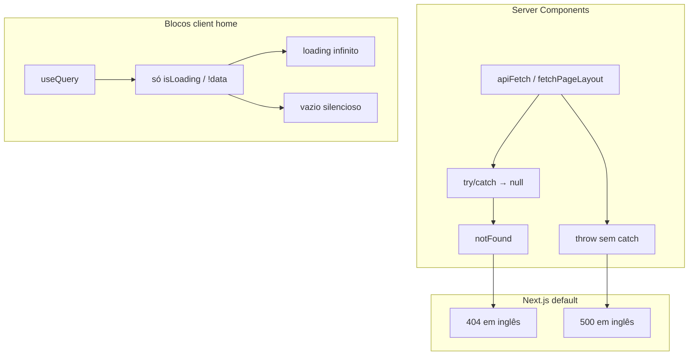
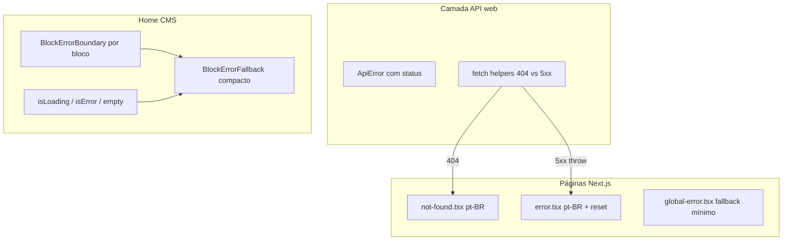

# Tratativa de erros na vitrine (`apps/web`)

## Diagnóstico atual



**Arquivos-chave hoje:**
- Layout raiz: [`apps/web/src/app/layout.tsx`](apps/web/src/app/layout.tsx) — sem `error.tsx` / `not-found.tsx`
- Home CMS: [`apps/web/src/app/page.tsx`](apps/web/src/app/page.tsx) → [`PageRenderer.tsx`](apps/web/src/components/cms/PageRenderer.tsx)
- Cliente API: [`apps/web/src/lib/api/client.ts`](apps/web/src/lib/api/client.ts) — `throw new Error('API error …')` sem código HTTP tipado
- Blocos problemáticos: [`FeaturedProductBlock.tsx`](apps/web/src/components/blocks/FeaturedProductBlock.tsx) (loading infinito), [`ProductGridBlock.tsx`](apps/web/src/components/blocks/ProductGridBlock.tsx) (vazio silencioso), [`BentoHubMixGrid.tsx`](apps/web/src/components/blocks/BentoHubMixGrid.tsx) (skeleton permanente em slot vazio)

---

## Arquitetura proposta



---

## 1. Fundação: tipos de erro e componentes reutilizáveis

### `ApiError` em [`apps/web/src/lib/api/client.ts`](apps/web/src/lib/api/client.ts)

- Criar classe `ApiError extends Error` com `status: number` e `path: string`
- Substituir `throw new Error(...)` por `throw new ApiError(status, path)` em `apiFetch` e `fetchPageLayout`
- Adicionar helper `isNotFoundError(error): boolean` (status 404)

### Helper de fetch seguro para páginas de detalhe

Novo arquivo [`apps/web/src/lib/api/safe-fetch.ts`](apps/web/src/lib/api/safe-fetch.ts):

```ts
// 404 → null (caller chama notFound())
// 5xx / rede → rethrow (aciona error.tsx)
export async function fetchOrNotFound<T>(path, schema): Promise<T | null>
```

Atualizar helpers em:
- [`produtos/[slug]/page.tsx`](apps/web/src/app/produtos/[slug]/page.tsx)
- [`artigos/[slug]/page.tsx`](apps/web/src/app/artigos/[slug]/page.tsx)
- [`colecoes/[slug]/page.tsx`](apps/web/src/app/colecoes/[slug]/page.tsx)
- [`categorias/[slug]/page.tsx`](apps/web/src/app/categorias/[slug]/page.tsx) — `getCategory` e `getCategoryProducts` (hoje `getCategoryProducts` não tem try/catch)

### Componentes UI compartilhados (novos em `apps/web/src/components/errors/`)

| Componente | Uso |
|------------|-----|
| `ErrorPageLayout` | Layout centralizado para 404/500 (título, descrição, ações) |
| `NotFoundContent` | Copy pt-BR: "Página não encontrada" + link para home e busca de categorias |
| `ServerErrorContent` | Copy pt-BR: "Algo deu errado" + botão "Tentar novamente" (`reset` do `error.tsx`) |
| `BlockErrorFallback` | Fallback compacto para blocos CMS: ícone + "Não foi possível carregar esta seção" + retry opcional |
| `BlockUnavailableFallback` | Slot sem conteúdo (dados SSR ausentes): "Conteúdo indisponível" — sem skeleton |
| `BlockErrorBoundary` | Class component client (`componentDidCatch`) que renderiza `BlockErrorFallback` |

Estilo: reutilizar tokens existentes (`--primary`, `--radius`), [`Button`](apps/web/src/components/ui/button.tsx) e padrão tipográfico da vitrine (neutral-600, títulos bold).

---

## 2. Páginas de erro Next.js App Router

Criar em [`apps/web/src/app/`](apps/web/src/app/):

### [`not-found.tsx`](apps/web/src/app/not-found.tsx) (Server Component)
- Renderiza `ErrorPageLayout` + `NotFoundContent`
- Metadata: `title: 'Página não encontrada | Vitrine'`
- Cobre todos os `notFound()` já existentes em 4 rotas de detalhe

### [`error.tsx`](apps/web/src/app/error.tsx) (Client Component — obrigatório)
- Props: `{ error, reset }` do Next.js
- Renderiza `ServerErrorContent` com `reset()` no botão
- `useEffect` opcional: `console.error` em dev (sem Sentry no MVP)

### [`global-error.tsx`](apps/web/src/app/global-error.tsx) (Client Component)
- Fallback quando o próprio `layout.tsx` quebra
- HTML/body inline mínimo + mensagem pt-BR + botão recarregar (`reset`)
- Não depende de `globals.css` nem de `Providers`

---

## 3. Blocos CMS na home — sem loading infinito

### [`PageRenderer.tsx`](apps/web/src/components/cms/PageRenderer.tsx)

- Tornar `collectHiddenBlockIds` defensivo com `safeParse` (falha de props não derruba a home inteira)
- Envolver cada bloco do map em:

```tsx
<BlockErrorBoundary blockId={block.id} blockType={block.type}>
  <Component ... />
</BlockErrorBoundary>
```

### Blocos client com React Query

| Bloco | Mudança |
|-------|---------|
| **`FeaturedProductBlock`** | Separar `isLoading` → skeleton; `isError` → `BlockErrorFallback` com `refetch`; `!slug` / produto invisível → `null` ou unavailable |
| **`ProductGridBlock`** | `isError` → mensagem abaixo do título ("Não foi possível carregar os produtos") + retry; manter título/CTA visíveis |
| **`CategoryPillsRow`** | `isError` → manter pill "Todos" + texto discreto "Categorias indisponíveis" (não bloqueia o grid) |

### Bloco SSR com skeleton enganoso

| Bloco | Mudança |
|-------|---------|
| **`BentoHubMixGrid`** | Trocar `BentoHubMixSkeleton` por `BlockUnavailableFallback` quando `slotN` é `null` — dados já vêm hidratados no SSR; null = conteúdo ausente, não loading |

### React Query defaults em [`providers.tsx`](apps/web/src/app/providers.tsx)

```ts
new QueryClient({
  defaultOptions: {
    queries: { retry: 1, refetchOnWindowFocus: false },
  },
})
```

Evita retries longos que prolongam estados de loading nos blocos.

---

## 4. Outras rotas server desprotegidas

| Rota | Problema | Correção |
|------|----------|----------|
| [`artigos/page.tsx`](apps/web/src/app/artigos/page.tsx) | `Promise.all` sem catch → 500 genérico | Deixar throw para `error.tsx` (comportamento correto após criar a página) ou, se preferir degradação parcial, catch só em categorias |
| [`categorias/[slug]/page.tsx`](apps/web/src/app/categorias/[slug]/page.tsx) | `getCategoryProducts` sem try/catch | Usar `fetchOrNotFound` / try-catch: categoria existe mas produtos falham → renderizar categoria com `BlockErrorFallback` inline na grade |

A home ([`page.tsx`](apps/web/src/app/page.tsx)) mantém fallback atual para layout ausente (mensagem de seed), mas passa a usar `ApiError` se quisermos distinguir 5xx (throw) de layout inexistente (404 → fallback atual).

---

## 5. Testes e validação manual

Não há testes unitários em `apps/web` hoje. Validar manualmente:

1. **404**: acessar `/produtos/slug-inexistente` → página pt-BR branded
2. **500**: derrubar API e acessar `/artigos` → `error.tsx` com retry
3. **404 vs 5xx detalhe**: API retorna 404 no produto → 404; API offline → 500
4. **Home blocos**: simular falha em `/products` (dev tools ou API down) → `ProductGridBlock` mostra mensagem, não skeleton eterno
5. **Bento slot vazio**: seed com entidade removida → "Conteúdo indisponível", não pulse
6. **Bloco com props inválidas**: boundary isola, resto da home renderiza
7. `npm run lint` e `npm run build` em `apps/web`

---

## 6. Documentação

Criar [`docs/web-error-handling.md`](docs/web-error-handling.md) com:
- Fluxo 404/500/blocos
- Arquivos-chave
- Como testar localmente

Atualizar [`docs/README.md`](docs/README.md) com entrada no índice.

---

## Escopo explícito fora desta entrega

- Wishlist error states (falhas silenciosas em `WishlistProvider`)
- `loading.tsx` por rota (skeletons de navegação)
- Observabilidade (Sentry/Datadog)
- Páginas de erro no `apps/admin`

Esses itens podem ser fase 2 se desejado.
