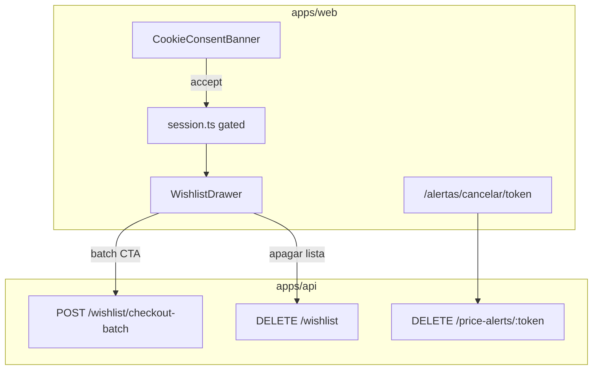

# Batch checkout, LGPD alertas e banner de cookies

## Contexto

| Peça                            | Estado atual                                                                                                                                                                                                             |
| ------------------------------- | ------------------------------------------------------------------------------------------------------------------------------------------------------------------------------------------------------------------------ |
| `POST /wishlist/checkout-batch` | Implementado em [`apps/api/src/adapters/http/routes/index.ts`](apps/api/src/adapters/http/routes/index.ts) via [`BuildBatchCheckoutRedirect`](packages/application/src/use-cases/wishlist/BuildBatchCheckoutRedirect.ts) |
| Drawer wishlist                 | [`WishlistDrawer.tsx`](apps/web/src/components/wishlist/WishlistDrawer.tsx) — só CTA individual via `AffiliateGoLink`; sem batch                                                                                         |
| Sessão anônima                  | [`session.ts`](apps/web/src/lib/session.ts) grava `vitrine_session` **sem consentimento**                                                                                                                                |
| Alertas LGPD                    | `POST /price-alerts` + confirm existem; **`DELETE /price-alerts/:token` ausente**                                                                                                                                        |
| Política legal                  | [`packages/shared/src/legal/legal-content.ts`](packages/shared/src/legal/legal-content.ts) já documenta cookie `vitrine_session` e cancelamento por e-mail — falta mecanismo                                             |



---

## Fase 1 — API e domínio (LGPD + hardening batch)

### 1.1 Cancelar alerta por token

- Adicionar `PriceAlert.cancel()` na entidade → status `AlertStatus.EXPIRED` ([`packages/domain/src/entities/PriceAlert.ts`](packages/domain/src/entities/PriceAlert.ts)).
- Novo use case `CancelPriceAlert` em `packages/application/src/use-cases/alert/`:
  - `findByConfirmToken(token)` → se não existe, `ValidationError`
  - se já `expired`/`triggered`, idempotente → 204
  - senão `save(alert.cancel())`
- Rota `DELETE /price-alerts/:token` em [`index.ts`](apps/api/src/adapters/http/routes/index.ts) + `CancelPriceAlertParamsSchema` em [`schemas.ts`](apps/api/src/adapters/dtos/request/schemas.ts) → **204**.
- Registrar no DI [`api-container.ts`](packages/infrastructure/src/di/api-container.ts) e export em [`packages/application/src/index.ts`](packages/application/src/index.ts).
- Testes Vitest: use case + `api.test.ts` (token inválido → 400; token válido → 204).

### 1.2 Limpar wishlist da sessão

- Estender `WishlistRepository` com `removeAllBySessionId(sessionId: string): Promise<void>`.
- Implementar em [`drizzle-alert.repository.ts`](packages/infrastructure/src/persistence/repositories/drizzle-alert.repository.ts) (`DrizzleWishlistRepository`).
- Use case `ClearWishlist` em `packages/application/src/use-cases/wishlist/`.
- Rota `DELETE /wishlist` (header `x-session-id` obrigatório) → **204**.

### 1.3 Gate afiliado no batch checkout

[`BuildBatchCheckoutRedirect`](packages/application/src/use-cases/wishlist/BuildBatchCheckoutRedirect.ts) hoje **não** valida conta afiliado (diferente de [`ResolveAffiliateRedirect`](packages/application/src/use-cases/affiliate/ResolveAffiliateRedirect.ts)).

- Injetar `AffiliateAccountRepository`; se status `pending_manual_validation` ou `suspended` → `ValidationError` (400).
- Se `filtered.length === 0` → `ValidationError` (“Nenhum item neste marketplace”).
- Teste unitário com conta pending.

### 1.4 Link de cancelamento nos e-mails

Atualizar HTML em [`ProcessTriggeredAlerts.ts`](packages/application/src/use-cases/alert/ProcessTriggeredAlerts.ts):

```text
${brand.url}/alertas/cancelar/${alert.confirmToken}
```

Texto pt-BR: “Cancelar este alerta”. Mesmo padrão ficará pronto para e-mail de confirmação (fila `email_delivery` ainda só loga — fora deste escopo).

---

## Fase 2 — Banner de cookies e sessão condicionada

### 2.1 Constantes compartilhadas

Em [`packages/shared/src/legal/`](packages/shared/src/legal/):

- `CONSENT_COOKIE_NAME = 'vitrine_cookie_consent'`
- `CONSENT_VALUE = 'accepted'`
- Reexportar `SESSION_COOKIE_NAME` (já existe) para uso único no web.

### 2.2 Lógica de consentimento (web)

Refatorar [`apps/web/src/lib/session.ts`](apps/web/src/lib/session.ts):

| Função                      | Comportamento                                                                       |
| --------------------------- | ----------------------------------------------------------------------------------- |
| `hasFunctionalConsent()`    | lê `CONSENT_COOKIE_NAME`                                                            |
| `acceptFunctionalConsent()` | grava cookie consent (12 meses, `SameSite=Lax`)                                     |
| `getOrCreateSessionId()`    | **só grava** `vitrine_session` se consentimento aceito; caso contrário retorna `''` |
| `clearSessionCookie()`      | remove `vitrine_session` (usado ao apagar lista)                                    |

### 2.3 Componente `CookieConsentBanner`

Novo [`apps/web/src/components/legal/CookieConsentBanner.tsx`](apps/web/src/components/legal/CookieConsentBanner.tsx):

- Fixo no rodapé; copy pt-BR curta (cookie funcional para lista + link [`/legal#cookies`](/legal)).
- Botões: **Aceitar** (chama `acceptFunctionalConsent()` + dispara evento para `WishlistProvider` reinicializar sessão).
- Montar em [`layout.tsx`](apps/web/src/app/layout.tsx) dentro de `Providers`.
- Não exibir se `hasFunctionalConsent()` já true.

### 2.4 `WishlistProvider` integrado

[`WishlistProvider.tsx`](apps/web/src/components/wishlist/WishlistProvider.tsx):

- Estado `consentGranted`; só chama `getOrCreateSessionId()` e `refresh()` após consentimento.
- `addItem`: se sem consentimento → abrir banner (callback/context `requestConsent()`) em vez de falhar silenciosamente.
- Novo `clearAll()`: `DELETE /wishlist` + `clearSessionCookie()` + reset items.

---

## Fase 3 — Batch checkout no drawer

### 3.1 Client API

Em [`apps/web/src/lib/api/schemas.ts`](apps/web/src/lib/api/schemas.ts):

```typescript
batchCheckoutResponseSchema = z.object({ url: z.string(), itemCount: z.number() });
```

Helper `checkoutBatch(sessionId, marketplace)` em novo arquivo ou [`client.ts`](apps/web/src/lib/api/client.ts).

### 3.2 UI no [`WishlistDrawer.tsx`](apps/web/src/components/wishlist/WishlistDrawer.tsx)

Por grupo de marketplace (já agrupado):

- Botão primário: **“Finalizar na {Amazon/Shopee} ({N} itens)”** — desabilitado se `N === 0` ou sem consentimento.
- Microcópia PRD: _“Abriremos a {marketplace} com seus itens. Compras finalizadas lá.”_
- **Amazon:** `window.open(url, '_blank', 'noopener,noreferrer')`.
- **Shopee/ML:** `url` vem pipe-separated ([`buildBatchCheckout`](packages/infrastructure/src/affiliate/default-affiliate-link.builder.ts)) → abrir cada URL em nova aba com `setTimeout` 500ms entre abas + modal/toast explicativo antes.
- Loading + tratamento de erro 400 (conta afiliado pending → mensagem amigável).
- Rodapé do drawer: link **“Apagar minha lista”** (confirmação inline) → `clearAll()`.

Origem de clique: batch abre URL direta do marketplace (sem `/go/`). Telemetria por item fica como melhoria futura; não bloqueia MVP.

---

## Fase 4 — Página de cancelamento de alerta

Nova rota [`apps/web/src/app/alertas/cancelar/[token]/page.tsx`](apps/web/src/app/alertas/cancelar/[token]/page.tsx):

- Server Component chama API interna `DELETE /price-alerts/:token` (via `API_INTERNAL_URL`).
- Estados: sucesso (“Alerta cancelado”), token inválido (404 amigável).
- `noindex` em metadata.
- Página leve, sem shell especial.

Opcional simétrico (não obrigatório neste pacote): `/alertas/confirmar/[token]` chamando `POST /price-alerts/confirm/:token` — útil quando e-mail de confirmação for ligado.

---

## Fase 5 — Documentação

Criar [`docs/wishlist-retention-lgpd.md`](docs/wishlist-retention-lgpd.md) com:

- Fluxo batch checkout (Amazon vs Shopee)
- Consentimento de cookies + `DELETE /wishlist`
- Cancelamento de alertas (`DELETE /price-alerts/:token` + URL pública)
- Como testar localmente

Atualizar:

- [`docs/api-rest.md`](docs/api-rest.md) — rotas `DELETE /price-alerts/:token` e `DELETE /wishlist`; remover da lista “planejadas”
- [`docs/llm-context-03-implemented-features.md`](docs/llm-context-03-implemented-features.md) — marcar itens como entregues
- [`docs/README.md`](docs/README.md) — indexar doc nova

---

## Testes e verificação

| Área                         | Teste                                        |
| ---------------------------- | -------------------------------------------- |
| `CancelPriceAlert`           | token válido → expired; token inválido → err |
| `ClearWishlist`              | remove todos os itens da sessão              |
| `BuildBatchCheckoutRedirect` | gate pending; lista vazia                    |
| API                          | DELETE alert 204; DELETE wishlist 204        |
| Web                          | lint/build `apps/web` + `apps/api`           |

**Smoke manual:**

1. Visitar site → banner aparece; coração pede consentimento.
2. Aceitar → adicionar 2 produtos Amazon → “Finalizar na Amazon (2)” abre carrinho afiliado.
3. “Apagar minha lista” → drawer vazio.
4. `curl -X DELETE /price-alerts/{token}` → 204; página `/alertas/cancelar/{token}` confirma.

---

## Fora de escopo (explícito)

- Formulário de criação de alerta na vitrine
- Envio real de e-mail de confirmação (worker `email_delivery` ainda só loga)
- GA4 / Consent Mode analítico
- Rastrear cliques batch via `/go/`
- Itens `delisted` cinza no drawer (melhoria separada)
