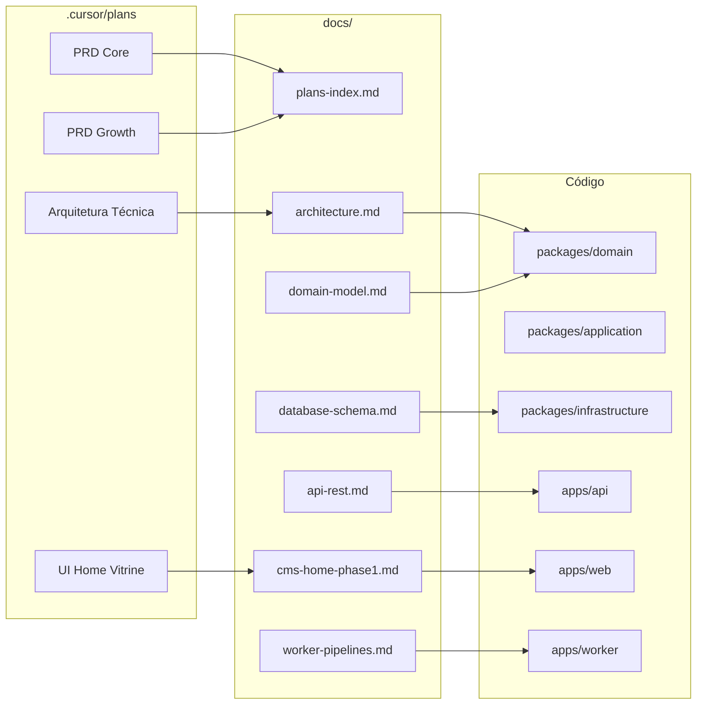

# Documentação — ecommerce-amazon

Documentação do **código implementado**. Especificação, roadmap e decisões de produto permanecem em [`.cursor/plans/`](../.cursor/plans/).

## Índice

### Setup e operação

| Documento | Conteúdo |
|-----------|----------|
| [dev-setup.md](./dev-setup.md) | Ambiente local, PostgreSQL, Redis, Docker/Podman, env, troubleshooting |

### Arquitetura e modelo

| Documento | Conteúdo |
|-----------|----------|
| [architecture.md](./architecture.md) | Clean Architecture, monorepo, camadas, fluxo de dependências, cache |
| [cache-invalidation.md](./cache-invalidation.md) | Invalidação Redis + revalidação Next.js após admin/worker |
| [domain-model.md](./domain-model.md) | Entidades, value objects, enums, ports (repositórios/gateways), eventos |
| [database-schema.md](./database-schema.md) | Tabelas Drizzle, enums PostgreSQL, índices, migrations |
| [api-rest.md](./api-rest.md) | Contrato REST completo: rotas, query/body Zod, DTOs de resposta |
| [worker-pipelines.md](./worker-pipelines.md) | Filas BullMQ, schedulers, pipelines A/B/C/D, rate limit |

### Features implementadas

| Documento | Conteúdo |
|-----------|----------|
| [cms-home-phase1.md](./cms-home-phase1.md) | Home CMS-driven: blocos, schemas Zod, seed, `apps/web`, wishlist, tracking |
| [web-error-handling.md](./web-error-handling.md) | Erros 404/500 pt-BR, boundaries de blocos CMS, `ApiError` |
| [web-loading-skeletons.md](./web-loading-skeletons.md) | Skeletons de rota (`loading.tsx`) na vitrine — feedback de navegação |
| [cms-category-bento-grid.md](./cms-category-bento-grid.md) | Bloco `category_bento_grid`: grade bento de categorias |
| [cms-dynamic-blocks-phase2.md](./cms-dynamic-blocks-phase2.md) | Bloco `dynamic_product_grid`, Admin use cases, BFF `renderedData` |
| [cms-flash-deals-home.md](./cms-flash-deals-home.md) | Layout Home: Ofertas Relâmpago, carrossel de descontos, remoção hero split |
| [cms-bento-hub-mix.md](./cms-bento-hub-mix.md) | Bloco `bento_hub_mix`: grid assimétrico 3 slots, BFF hydration, admin preview |
| [go-redirect-seo.md](./go-redirect-seo.md) | Redirect `/go`, JSON-LD produto, interlinkagem SEO |
| [product-detail-page.md](./product-detail-page.md) | Detalhe `/produtos/[slug]`: galeria, análise editorial, ficha técnica |
| [admin-app-phase1.md](./admin-app-phase1.md) | Painel CMS: login JWT, shell, rotas stub |
| [admin-products-phase1.md](./admin-products-phase1.md) | Gestão manual de produtos, parser de URL, API admin |
| [categories-hierarchy.md](./categories-hierarchy.md) | Árvore de categorias, SEO, admin e vitrine |
| [curated-collections.md](./curated-collections.md) | Coleções curadas: CRUD admin, landing `/colecoes/[slug]`, bloco CMS |
| [admin-articles-phase1.md](./admin-articles-phase1.md) | CRUD artigos editoriais, TipTap, shortcodes `[[product:slug]]` |
| [articles-taxonomy-phase2.md](./articles-taxonomy-phase2.md) | Categorias de artigos, perfil de autor, relacionados na vitrine |
| [articles-public-rendering.md](./articles-public-rendering.md) | Vitrine `/artigos/[slug]`, auto-linking, ProductCard embed |
| [content-clusters-hub-spoke.md](./content-clusters-hub-spoke.md) | Clusters Hub & Spoke — SEO Anchor, carousel, CRUD admin |
| [auto-links-admin.md](./auto-links-admin.md) | CRUD admin auto-links (API + UI), parser SEO, cache Redis |
| [admin-profile-phase1.md](./admin-profile-phase1.md) | Perfil do operador, upload de avatar, storage plugável |
| [remote-image-handling.md](./remote-image-handling.md) | `RemoteImage` vitrine, fallbacks admin, `remotePatterns` |
| [admin-dashboard-phase1.md](./admin-dashboard-phase1.md) | Dashboard analítico: cliques, catálogo, GA4 Data API |
| [admin-dashboard-attribution-phase2.md](./admin-dashboard-attribution-phase2.md) | Atribuição por componente, funil editorial, engajamento |
| [telemetry-redis-buffer.md](./telemetry-redis-buffer.md) | Buffer Redis para telemetria: staging, bulk flush, dashboard híbrido |
| [admin-cms-blocks-phase2.md](./admin-cms-blocks-phase2.md) | Editor de blocos: CRUD, reorder, modais |

### Contexto para LLMs (síntese)

Documentação condensada para análise e contexto de outra LLM — cobre arquitetura, domínio, features implementadas e planos executados.

| Documento | Conteúdo |
|-----------|----------|
| [llm-context-01-project-architecture.md](./llm-context-01-project-architecture.md) | Visão, monorepo, Clean Architecture, invariantes de negócio, cache, worker |
| [llm-context-02-domain-schema-interfaces.md](./llm-context-02-domain-schema-interfaces.md) | Entidades, enums, ports, tabelas DB, BlockType, DTOs, schemas shared |
| [llm-context-03-implemented-features.md](./llm-context-03-implemented-features.md) | CMS/admin/artigos/categorias/SEO implementados, API REST, planos completed, gaps MVP |

### Planos e especificação (fonte)

| Documento | Conteúdo |
|-----------|----------|
| [plans-index.md](./plans-index.md) | Índice dos planos em `.cursor/plans/` com escopo, status e links |

## Apps do monorepo

| App / pacote | Função | Doc principal |
|--------------|--------|---------------|
| `apps/api` | REST read-heavy (Fastify) | [api-rest.md](./api-rest.md) |
| `apps/web` | Vitrine Next.js 15 — Home via PageRenderer | [cms-home-phase1.md](./cms-home-phase1.md) |
| `apps/admin` | Painel CMS operador (login + editor de blocos) | [admin-app-phase1.md](./admin-app-phase1.md), [admin-cms-blocks-phase2.md](./admin-cms-blocks-phase2.md) |
| `apps/worker` | Filas BullMQ, sync marketplace | [worker-pipelines.md](./worker-pipelines.md) |
| `packages/domain` | Entidades, enums, ports | [domain-model.md](./domain-model.md) |
| `packages/application` | Use cases | [architecture.md](./architecture.md) |
| `packages/infrastructure` | Drizzle, Redis, repositórios | [database-schema.md](./database-schema.md) |
| `packages/shared` | Env, Zod CMS schemas, CORS | [cms-home-phase1.md](./cms-home-phase1.md), [api-rest.md](./api-rest.md) |

## Mapa rápido: plano → código



## Comandos rápidos

```bash
npm run infra:up      # Postgres + Redis (Podman rootless)
npm run db:setup      # migrate + seed
npm run dev:api       # API :3000
npm run dev:web       # Web :3001
npm run dev:worker    # Worker BullMQ
npm run build         # build completo
npm run test          # Vitest
```

## Regras para agentes

Ver [AGENTS.md](../AGENTS.md) e [`.cursor/rules/`](../.cursor/rules/) — incluindo `10-documentation.mdc` (documentar toda entrega nova em `docs/`).

## O que está fora de `docs/`

| Local | Propósito |
|-------|-----------|
| `.cursor/plans/` | Especificação e roadmap — **não** reflete necessariamente o que já foi codificado |
| `.cursor/rules/` | Regras ativas para agentes (negócio, arquitetura, UX) |
| `AGENTS.md` | Guia rápido para agentes Cursor |
