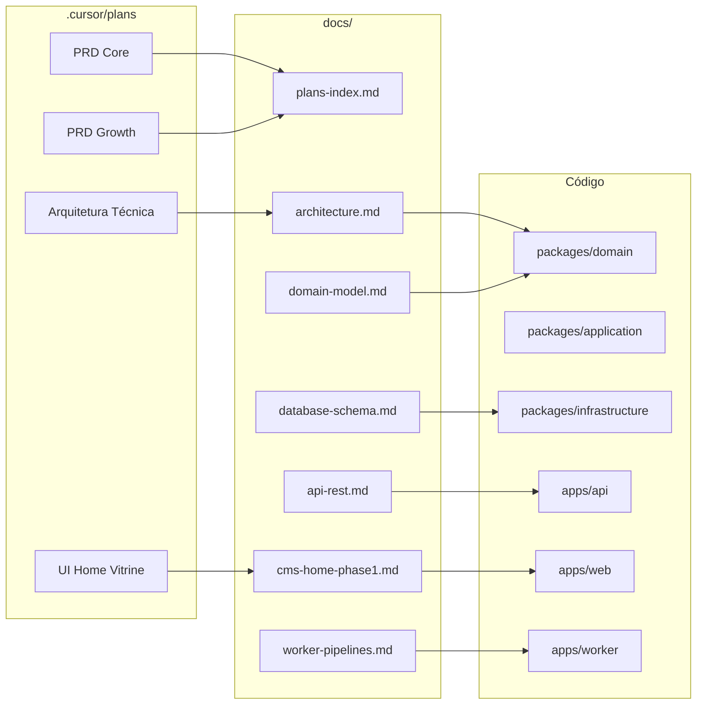

# Documentação — ecommerce-amazon

Documentação do **código implementado**. Especificação, roadmap e decisões de produto permanecem em [`.cursor/plans/`](../.cursor/plans/).

## Índice

### Setup e operação

| Documento | Conteúdo |
|-----------|----------|
| [dev-setup.md](./dev-setup.md) | Ambiente local, PostgreSQL, Redis, Docker/Podman, env, troubleshooting |

### Arquitetura e modelo

| Documento | Conteúdo |
|-----------|----------|
| [architecture.md](./architecture.md) | Clean Architecture, monorepo, camadas, fluxo de dependências, cache |
| [domain-model.md](./domain-model.md) | Entidades, value objects, enums, ports (repositórios/gateways), eventos |
| [database-schema.md](./database-schema.md) | Tabelas Drizzle, enums PostgreSQL, índices, migrations |
| [api-rest.md](./api-rest.md) | Contrato REST completo: rotas, query/body Zod, DTOs de resposta |
| [worker-pipelines.md](./worker-pipelines.md) | Filas BullMQ, schedulers, pipelines A/B/C/D, rate limit |

### Features implementadas

| Documento | Conteúdo |
|-----------|----------|
| [cms-home-phase1.md](./cms-home-phase1.md) | Home CMS-driven: blocos, schemas Zod, seed, `apps/web`, wishlist, tracking |
| [cms-dynamic-blocks-phase2.md](./cms-dynamic-blocks-phase2.md) | Bloco `dynamic_product_grid`, Admin use cases, BFF `renderedData` |
| [go-redirect-seo.md](./go-redirect-seo.md) | Redirect `/go`, JSON-LD produto, interlinkagem SEO |

### Planos e especificação (fonte)

| Documento | Conteúdo |
|-----------|----------|
| [plans-index.md](./plans-index.md) | Índice dos planos em `.cursor/plans/` com escopo, status e links |

## Apps do monorepo

| App / pacote | Função | Doc principal |
|--------------|--------|---------------|
| `apps/api` | REST read-heavy (Fastify) | [api-rest.md](./api-rest.md) |
| `apps/web` | Vitrine Next.js 15 — Home via PageRenderer | [cms-home-phase1.md](./cms-home-phase1.md) |
| `apps/worker` | Filas BullMQ, sync marketplace | [worker-pipelines.md](./worker-pipelines.md) |
| `packages/domain` | Entidades, enums, ports | [domain-model.md](./domain-model.md) |
| `packages/application` | Use cases | [architecture.md](./architecture.md) |
| `packages/infrastructure` | Drizzle, Redis, repositórios | [database-schema.md](./database-schema.md) |
| `packages/shared` | Env, Zod CMS schemas, CORS | [cms-home-phase1.md](./cms-home-phase1.md), [api-rest.md](./api-rest.md) |

## Mapa rápido: plano → código



## Comandos rápidos

```bash
npm run infra:up      # Postgres + Redis (Podman rootless)
npm run db:setup      # migrate + seed
npm run dev:api       # API :3000
npm run dev:web       # Web :3001
npm run dev:worker    # Worker BullMQ
npm run build         # build completo
npm run test          # Vitest
```

## Regras para agentes

Ver [AGENTS.md](../AGENTS.md) e [`.cursor/rules/`](../.cursor/rules/) — incluindo `10-documentation.mdc` (documentar toda entrega nova em `docs/`).

## O que está fora de `docs/`

| Local | Propósito |
|-------|-----------|
| `.cursor/plans/` | Especificação e roadmap — **não** reflete necessariamente o que já foi codificado |
| `.cursor/rules/` | Regras ativas para agentes (negócio, arquitetura, UX) |
| `AGENTS.md` | Guia rápido para agentes Cursor |
