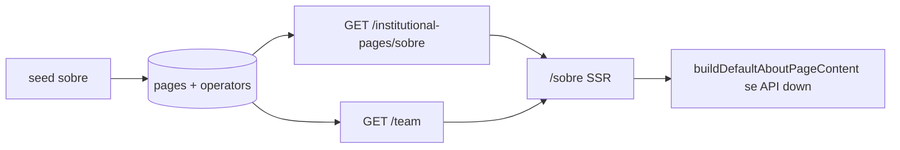

# Páginas Sobre e Contato (E-E-A-T e CRO)

Páginas institucionais `/sobre` e `/contato` na vitrine pública, com conteúdo da Sobre persistido no CMS (contrato Zod + API), equipe dinâmica via operadores e requisitos de confiança/SEO do brief de afiliados.

## Por quê

- Header já expunha link **Sobre** (morto); rodapé precisava de navegação institucional completa.
- Google E-E-A-T exige transparência de entidade (quem somos, afiliados, contato).
- Usuários qualificados que leem a Sobre precisam de próximo passo editorial (artigos), não beco sem saída.

## O que foi entregue

| Rota | Fonte de conteúdo |
|------|-------------------|
| `/sobre` | CMS (`pages` slug `sobre`, `page_kind=institutional`) + equipe via `GET /team` |
| `/contato` | `BrandConfig` + `shared/contact` (estático) |
| `/legal` | Inalterado — texto em código (`shared/legal`) |

### Seções da Sobre

| Âncora | Conteúdo |
|--------|----------|
| `#proposta` | Gancho orientado ao usuário |
| `#metodo` | Curadoria Amazon + Shopee |
| `#afiliados` | Callout de disclosure + link `/legal#afiliados` |
| `#equipe` | Cards de operadores (`show_on_team=true`) |
| `#proximos-passos` | Link suave para `/artigos` |

### API pública

| Método | Rota | Resposta |
|--------|------|----------|
| GET | `/institutional-pages/:slug` | `{ layout, content: AboutPageContent }` |
| GET | `/team` | `{ members: PublicTeamMember[] }` |
| GET | `/admin/institutional-pages/:slug` | Mesmo + `status`, `pageKind` (JWT) |

### Operadores — perfil público

Novos campos em `operators` (editáveis em Admin `/perfil`):

- `job_title`, `social_links`, `show_on_team`, `team_sort_order`, `team_public_role`

## Arquivos-chave

| Artefato | Path |
|----------|------|
| Contrato CMS + defaults | [`packages/shared/src/about/`](../packages/shared/src/about/) |
| Contato estático | [`packages/shared/src/contact/`](../packages/shared/src/contact/) |
| Sanitização HTML | [`sanitize-institutional-html.ts`](../packages/shared/src/about/sanitize-institutional-html.ts) |
| JSON-LD About/Contact | [`packages/shared/src/seo/site-json-ld.ts`](../packages/shared/src/seo/site-json-ld.ts) |
| Use cases | [`GetInstitutionalPage.ts`](../packages/application/src/use-cases/institutional/GetInstitutionalPage.ts), [`GetPublicTeamMembers.ts`](../packages/application/src/use-cases/team/GetPublicTeamMembers.ts) |
| Rotas API | [`institutional-routes.ts`](../apps/api/src/adapters/http/routes/institutional-routes.ts) |
| Web Sobre | [`apps/web/src/app/sobre/page.tsx`](../apps/web/src/app/sobre/page.tsx) |
| Web Contato | [`apps/web/src/app/contato/page.tsx`](../apps/web/src/app/contato/page.tsx) |
| UI Sobre | [`AboutPageContent.tsx`](../apps/web/src/components/about/AboutPageContent.tsx) |
| Admin perfil | [`ProfileForm.tsx`](../apps/admin/src/components/profile/ProfileForm.tsx) |
| Migrations | `0017_operator_public_profile.sql`, `0018_institutional_pages.sql` |
| Seed | [`seed.ts`](../packages/infrastructure/src/persistence/drizzle/seed.ts) — `seedAboutPage`, operador demo |

## Fluxo `/sobre`



## Segurança (XSS)

- `sanitizeInstitutionalHtml` via `isomorphic-dompurify` (allowlist restrita).
- `SafeInstitutionalHtml` re-sanitiza no render.
- `parseAboutPageContent` sanitiza no save Admin (fase futura).

## JSON-LD

`buildAboutPageJsonLd`: `AboutPage` → `Organization` com `founder`/`employee` referenciando `Person` com `worksFor` e `sameAs` (redes do operador).

## Como testar

```bash
npm run db:migrate && npm run db:seed
npm run build -w @ecommerce-amazon/shared
npm test -w @ecommerce-amazon/shared -- src/about src/seo/site-json-ld.test.ts
npm test -w @ecommerce-amazon/application -- UpdateOperatorProfile AuthenticateOperator

# Com API (:3000) e web (:3001):
curl -s http://localhost:3000/institutional-pages/sobre | jq '.content.heroTitle'
curl -s http://localhost:3000/team | jq
curl -sI http://localhost:3001/sobre | head
curl -sI http://localhost:3001/contato | head
```

Admin: `/perfil` → ativar **Exibir na página Sobre** → revisar `/sobre`.

## Fora de escopo (próxima fase)

- **AboutPageEditor** em `/paginas/sobre` (PATCH admin + preview draft)
- `/contato` editável via CMS
- Página individual `/autores/[slug]`
- Formulário de contato com backend

## Próximos passos

1. Implementar editor CMS da Sobre no Admin (fase 5 do plano).
2. Entregar rota `/cupons` na vitrine (quando existir, operador pode adicionar link via CMS futuro).
3. Revisão jurídica humana do copy default antes de go-live.
