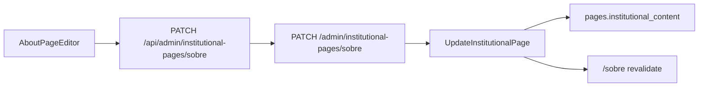

# Admin — editor da página Sobre

Editor CMS da página institucional `/sobre` no painel operador. Fase 5 do plano [about_contact_pages](../.cursor/plans/about_contact_pages_d59258c4.plan.md).

## O quê

- Rota Admin **`/paginas/sobre`** com `AboutPageEditor` (painéis flutuantes)
- **`PATCH /admin/institutional-pages/:slug`** — salvar conteúdo, SEO e status
- Toggle **Salvar rascunho** / **Publicar** (sem preview draft na vitrine)
- Revalidação ISR de `/sobre` após save via `PublicWebRevalidator`

## Fora de escopo

- Preview `?preview=draft` na vitrine
- Edição dos cards de equipe (vêm de `/perfil` → `show_on_team`)
- `/contato` editável via CMS

## Fluxo



## Painéis do editor

| Painel | Campos |
|--------|--------|
| Contexto | Status, link vitrine, Salvar rascunho / Publicar |
| SEO | `seoTitle`, `seoDescription` |
| Hero | `heroTitle`, `heroIntro` |
| Seções fixas | `proposta`, `metodo`, `afiliados`, `equipe` — título, parágrafos, listas |
| Equipe | `teamSectionIntro` + aviso sobre `/perfil` |
| Próximos passos | `trafficDirection` (título, intro, 1–3 links internos) |
| Meta | `lastUpdated` (auto no save) |

## API

| Método | Rota | Body |
|--------|------|------|
| GET | `/admin/institutional-pages/:slug` | — |
| PATCH | `/admin/institutional-pages/:slug` | `{ content, seoTitle?, seoDescription?, status? }` |

`content` validado por `aboutPageContentSchema`; save passa por `parseAboutPageContent` (sanitização XSS).

## Arquivos-chave

| Artefato | Path |
|----------|------|
| Editor principal | [`AboutPageEditor.tsx`](../apps/admin/src/components/about/AboutPageEditor.tsx) |
| Rota Admin | [`paginas/[slug]/page.tsx`](../apps/admin/src/app/(dashboard)/paginas/[slug]/page.tsx) |
| BFF | [`api/admin/institutional-pages/[slug]/route.ts`](../apps/admin/src/app/api/admin/institutional-pages/[slug]/route.ts) |
| Client API | [`institutional-pages-client.ts`](../apps/admin/src/lib/api/institutional-pages-client.ts) |
| Use case | [`GetInstitutionalPage.ts`](../packages/application/src/use-cases/institutional/GetInstitutionalPage.ts) |
| Schemas | [`about-content.schema.ts`](../packages/shared/src/about/about-content.schema.ts) |

## Como testar

```bash
npm run dev:api    # :3000
npm run dev:admin  # :3002
npm run dev:web    # :3001

# Admin: /paginas → "Editar conteúdo" na Sobre → alterar hero → Publicar
# Vitrine: /sobre reflete após revalidate

npx vitest run packages/application/src/use-cases/institutional/UpdateInstitutionalPage.test.ts
```

Com JWT (após login):

```bash
curl -s -X PATCH http://localhost:3000/admin/institutional-pages/sobre \
  -H "Authorization: Bearer $TOKEN" \
  -H "Content-Type: application/json" \
  -d '{"content": {...}, "status": "published"}' | jq '.content.heroTitle'
```

Rascunho: `GET /institutional-pages/sobre` retorna 404 → vitrine usa `buildDefaultAboutPageContent`.

## Próximos passos

- Preview de rascunho na vitrine (alinhado ao publish/draft da home CMS)
- Picker de URLs internas para links de recirculação (hoje: input `/...` validado)
