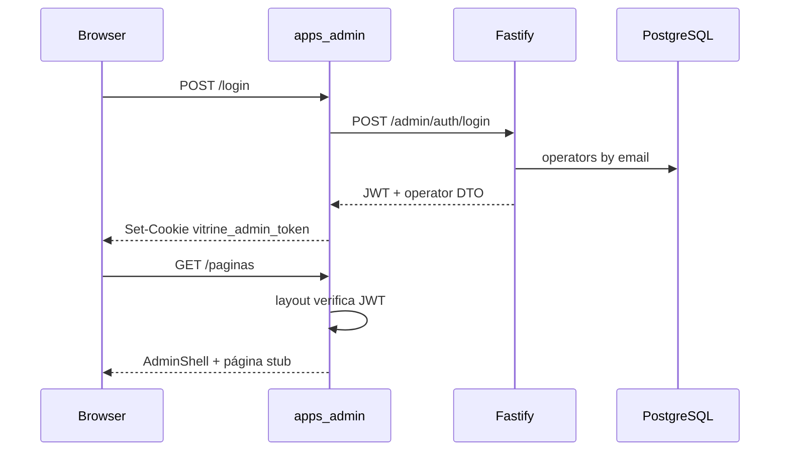

# Admin CMS — fase 1 (estrutura inicial)

Painel operador separado da vitrine pública: login com JWT, shell de navegação e páginas placeholder para os módulos CMS previstos no MVP.

Plano de referência: [`.cursor/plans/ui_home_vitrine.plan.md`](../.cursor/plans/ui_home_vitrine.plan.md) (Fase 3). UI inspirada no painel IPMA ([php-app `UI_UX_ADMIN.md`](../../php-app/docs/UI_UX_ADMIN.md)).

## O quê foi entregue

- App **`apps/admin`** (Next.js 15, porta 3002)
- Auth completa: tabela `operators`, `POST /admin/auth/login`, `GET /admin/auth/me`, JWT HS256
- Login com card centrado + gradiente azul (padrão php-app)
- Shell autenticado: sidebar colapsável, header com breadcrumbs, menu do operador, footer
- Rotas stub: Painel, Páginas, Produtos, Artigos, Coleções, Cupons, Configurações

## Fora de escopo (fase seguinte)

- CRUD HTTP de páginas/blocos (`/admin/pages/*`)
- Editor drag-and-drop
- Gestão de operadores além do seed dev

## Fluxo de autenticação



1. Formulário em `/login` chama `POST /api/auth/login` (Route Handler Next.js).
2. Handler repassa credenciais para a API e grava cookie **`vitrine_admin_token`** (`httpOnly`, `SameSite=Lax`, 8h).
3. Layout `(dashboard)` valida JWT com `JWT_SECRET` compartilhado.
4. Logout via `POST /api/auth/logout` limpa o cookie.

## Variáveis de ambiente

| Variável | Default | Uso |
|----------|---------|-----|
| `ADMIN_PORT` | `3002` | Porta do painel |
| `JWT_SECRET` | (dev placeholder) | Assinatura JWT — **obrigatório alterar em produção**; deve ser **o mesmo** na API e no admin (`next.config.ts` carrega `.env` da raiz do monorepo) |
| `JWT_EXPIRES_IN` | `8h` | Expiração do token |
| `ADMIN_SEED_EMAIL` | `admin@vitrine.local` | Operador criado no seed |
| `ADMIN_SEED_PASSWORD` | `vitrine-admin` | Senha do operador seed |
| `API_INTERNAL_URL` | `http://localhost:3000` | Proxy de login server-side |
| `CORS_ORIGINS` | inclui `:3002` | Origem admin na API |

## Como rodar

```bash
npm run db:migrate && npm run db:seed   # cria operador seed
npm run dev:api                          # :3000
npm run dev:admin                        # :3002
```

Abrir http://localhost:3002/login — credenciais padrão do seed acima.

## Rotas do admin

| Rota | Conteúdo |
|------|----------|
| `/login` | Tela de login |
| `/` | Dashboard com KPIs placeholder |
| `/paginas` | Empty state — editor CMS |
| `/produtos` | Empty state — catálogo |
| `/artigos` | Empty state — hub de conteúdo |
| `/colecoes` | Empty state — coleções curadas |
| `/cupons` | Empty state — central de cupons |
| `/configuracoes` | Empty state — settings |

## Arquivos-chave

| Área | Path |
|------|------|
| App Next.js | `apps/admin/` |
| Login + shell | `apps/admin/src/components/admin/`, `apps/admin/src/components/auth/` |
| Auth API | `apps/api/src/adapters/http/routes/admin-routes.ts` |
| Use case | `packages/application/src/use-cases/admin-auth/AuthenticateOperator.ts` |
| Migration | `packages/infrastructure/src/persistence/drizzle/migrations/0004_operators.sql` |
| Seed operador | `packages/infrastructure/src/persistence/drizzle/seed.ts` |

## Próximos passos

1. Rotas REST `/admin/pages/*` + editor de blocos
2. Preview draft com token
3. `PublishPage` use case + botão publicar
4. Gestão de operadores (convite, desativar)
