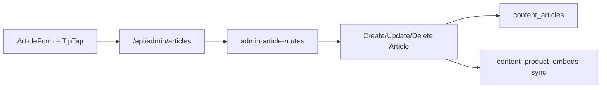

# Artigos editoriais — Admin (fase 1)

## O quê

CRUD completo de artigos editoriais no painel admin, com editor TipTap, comando `/produto` para inserir shortcodes `[[product:slug]]`, e metadados SEO/capa/autor.

**Listagem admin (`/artigos`):** grid de cards no padrão da vitrine web, busca por título/resumo/slug, paginação com contadores (12 por página).

**Fora desta fase:** listagem pública `/artigos`, CRUD de `auto_links`, `contentJson` TipTap.

## Por quê

Entrega o hub de conteúdo previsto no [PRD Core](../.cursor/plans/prd_plataforma_afiliação_de44933f.plan.md) e no plano [Artigos Editoriais MVP](../.cursor/plans/artigos_editoriais_mvp_af1cc080.plan.md).

## Como funciona



1. Operador cria/edita em `/artigos`, `/artigos/novo`, `/artigos/[id]`.
2. Formulário em **layout two-pane** (estilo php-app/notícias): painel principal (título, slug, resumo, editor) + sidebar sticky (Publicar, Capa, SEO, Metadados).
3. Editor TipTap serializa embeds como `[[product:slug]]` no campo `body`.
4. **Capa:** upload com recorte 16:9 via `POST /admin/media/images` (mesmo fluxo de coleções) ou URL externa no campo de texto; valor gravado em `coverImageUrl`.
5. Ao salvar, o repositório extrai shortcodes e sincroniza `content_product_embeds`.
6. `authorId` é definido server-side a partir do JWT (`adminOperator.id`).

## Editor de conteúdo

- **Toolbar:** H2/H3, negrito, itálico, riscado, listas e botão Produto; estados ativos refletem a formatação no cursor.
- **Modo Visual:** TipTap WYSIWYG com chips de embed e comando `/produto` (somente neste modo).
- **Modo Código HTML:** textarea monoespaçada com HTML e shortcodes `[[product:slug]]`; toolbar desabilitada.
- **SEO na sidebar:** contadores dinâmicos `N / 60` (título) e `N / 160` (descrição), com aviso quando excede o limite visível no Google.
- **Prompt IA (✨):** modal com prompt para LLM externa; a resposta JSON (`title`, `excerpt`, `seoTitle`, `seoDescription`, `coverImageUrl`, `body`) é parseada por `parseArticleEditorialLlmResponse` e aplicada no formulário — mesmo padrão do SEO de produtos (`ProductSeoLlmPromptHelper`).
- **Sincronização:** ao alternar abas, Visual → `serializeArticleBody(getHTML())`; HTML → Visual usa `preprocessBodyForEditor` + `setContent`.
- Contrato de persistência em `ProductEmbedExtension.ts` (`serializeArticleBody` / `preprocessBodyForEditor`).

## Arquivos-chave

| Camada                     | Path                                                                                                                   |
| -------------------------- | ---------------------------------------------------------------------------------------------------------------------- |
| UI listagem                | `ArticleListManager.tsx`, `ArticleListCard.tsx`, `AdminPagination.tsx`                                                 |
| UI formulário              | `apps/admin/src/components/articles/ArticleForm.tsx`, `ArticleCoverField.tsx`, `ArticleMetaBox.tsx`                    |
| Editor TipTap              | `apps/admin/src/components/articles/ArticleEditor.tsx`                                                                 |
| Toolbar + modo HTML        | `apps/admin/src/components/articles/ArticleEditorToolbar.tsx`, `ArticleEditorModeTabs.tsx`, `useEditorToolbarState.ts` |
| Extensão embed             | `apps/admin/src/components/articles/extensions/ProductEmbedExtension.ts`                                               |
| Dicas de campo + prompt IA | `ArticleFieldHint.tsx`, `ArticleLlmPromptHelper.tsx`, `lib/article-llm-prompt.ts`                                      |
| BFF                        | `apps/admin/src/app/api/admin/articles/**`                                                                             |
| API                        | `apps/api/src/adapters/http/routes/admin-article-routes.ts`                                                            |
| Use cases                  | `packages/application/src/use-cases/admin-article/`                                                                    |
| Schemas                    | `packages/shared/src/admin/article-schemas.ts`                                                                         |

## API admin

| Método | Rota                          | Descrição                                                                                    |
| ------ | ----------------------------- | -------------------------------------------------------------------------------------------- |
| GET    | `/admin/articles`             | Lista paginada (`page`, `pageSize`, `search`, `status`) → `{ items, total, page, pageSize }` |
| GET    | `/admin/articles?picker=true` | Resumo publicados (CMS picker)                                                               |
| GET    | `/admin/articles/:id`         | Detalhe completo                                                                             |
| POST   | `/admin/articles`             | Cria rascunho/publicado (201)                                                                |
| PATCH  | `/admin/articles/:id`         | Atualiza (204)                                                                               |
| DELETE | `/admin/articles/:id`         | Remove (204)                                                                                 |

## Como testar

```bash
npm run db:migrate && npm run db:seed
npm run dev -w @ecommerce-amazon/api
npm run dev -w @ecommerce-amazon/admin
```

1. Login em `http://localhost:3002/login`
2. Abrir `/artigos` → buscar, paginar e criar artigo
3. Na sidebar **Capa**: enviar arquivo (recortar 16:9) ou colar URL externa
4. No editor, digitar `/produto` ou usar o botão na toolbar → inserir produto
5. Alternar **Código HTML** → editar shortcodes manualmente → voltar **Visual** e conferir embed
6. Publicar e abrir na vitrine: `/artigos/{slug}`

## Listagem admin (`/artigos`)

| Recurso   | Detalhe                                                                                        |
| --------- | ---------------------------------------------------------------------------------------------- |
| Layout    | Grid alinhado à vitrine web (`ArticleCard`): capa 16:10, 1–3 colunas                           |
| Busca     | Debounce 300ms; query `search` (título, resumo ou slug)                                        |
| Paginação | 12 itens/página; `AdminPagination` com intervalo e números de página                           |
| Card      | Capa, status (Publicado/Rascunho), título, resumo, slug, data de atualização, Editar + Excluir |
| BFF       | `GET /api/admin/articles?page&pageSize&search&status`                                          |

## Próximos passos

- `GET /articles` hub público
- CRUD admin de `auto_links`
- Listagem `/artigos` na vitrine
