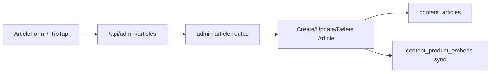

# Artigos editoriais — Admin (fase 1)

## O quê

CRUD completo de artigos editoriais no painel admin, com editor TipTap, comando `/produto` para inserir shortcodes `[[product:slug]]`, e metadados SEO/capa/autor.

**Fora desta fase:** listagem pública `/artigos`, CRUD de `auto_links`, `contentJson` TipTap.

## Por quê

Entrega o hub de conteúdo previsto no [PRD Core](../.cursor/plans/prd_plataforma_afiliação_de44933f.plan.md) e no plano [Artigos Editoriais MVP](../.cursor/plans/artigos_editoriais_mvp_af1cc080.plan.md).

## Como funciona



1. Operador cria/edita em `/artigos`, `/artigos/novo`, `/artigos/[id]`.
2. Editor TipTap serializa embeds como `[[product:slug]]` no campo `body`.
3. Ao salvar, o repositório extrai shortcodes e sincroniza `content_product_embeds`.
4. `authorId` é definido server-side a partir do JWT (`adminOperator.id`).

## Arquivos-chave

| Camada | Path |
|--------|------|
| UI listagem | `apps/admin/src/components/articles/ArticleListManager.tsx` |
| UI formulário | `apps/admin/src/components/articles/ArticleForm.tsx` |
| Editor TipTap | `apps/admin/src/components/articles/ArticleEditor.tsx` |
| Extensão embed | `apps/admin/src/components/articles/extensions/ProductEmbedExtension.ts` |
| Dicas de campo + prompt IA | `ArticleFieldHint.tsx`, `ArticleLlmPromptHelper.tsx`, `lib/article-llm-prompt.ts` |
| BFF | `apps/admin/src/app/api/admin/articles/**` |
| API | `apps/api/src/adapters/http/routes/admin-article-routes.ts` |
| Use cases | `packages/application/src/use-cases/admin-article/` |
| Schemas | `packages/shared/src/admin/article-schemas.ts` |

## API admin

| Método | Rota | Descrição |
|--------|------|-----------|
| GET | `/admin/articles` | Lista todos (query `?status=draft\|published`) |
| GET | `/admin/articles?picker=true` | Resumo publicados (CMS picker) |
| GET | `/admin/articles/:id` | Detalhe completo |
| POST | `/admin/articles` | Cria rascunho/publicado (201) |
| PATCH | `/admin/articles/:id` | Atualiza (204) |
| DELETE | `/admin/articles/:id` | Remove (204) |

## Como testar

```bash
npm run db:migrate && npm run db:seed
npm run dev -w @ecommerce-amazon/api
npm run dev -w @ecommerce-amazon/admin
```

1. Login em `http://localhost:3002/login`
2. Abrir `/artigos` → criar artigo
3. No editor, digitar `/produto` ou usar o botão → inserir produto
4. Publicar e abrir na vitrine: `/artigos/{slug}`

## Próximos passos

- `GET /articles` hub público
- CRUD admin de `auto_links`
- Listagem `/artigos` na vitrine
