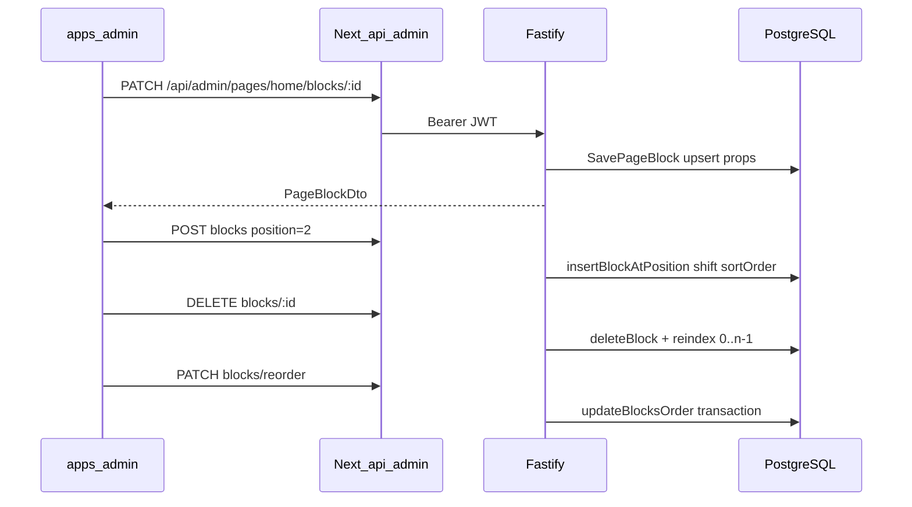

# Admin CMS — editor de blocos (fase 2 + forms fase 1)

Editor operacional de blocos CMS no painel admin: mutação de props via drawer lateral (Sheet), adição posicional e remoção com reindexação automática.

Planos de referência:

- [`.cursor/plans/cms_admin_block_editor_0d0aeef3.plan.md`](../.cursor/plans/cms_admin_block_editor_0d0aeef3.plan.md) — editor base (fase 2)
- [`.cursor/plans/cms_forms_fase_1_30663f90.plan.md`](../.cursor/plans/cms_forms_fase_1_30663f90.plan.md) — formulários amigáveis (fase 1)

## O quê foi entregue

### Editor base (fase 2)

- Rotas REST autenticadas `GET/POST/PATCH/DELETE /admin/pages/*`
- Use cases `GetAdminPageLayout`, `ListAdminPages` + insert com shift de `sortOrder`
- Proxy Next.js em `apps/admin/src/app/api/admin/pages/*`
- UI `CMSBlockOrderManager` em `/paginas/[slug]`
- Modais shadcn/Radix: escolher tipo, confirmar exclusão
- **Sheet lateral** (`BlockPropsSheet`) para configurar props de todos os tipos editáveis
- Listagem de páginas em `/paginas`

### Formulários amigáveis — fase 1

Blocos da home seed com edição visual leigo-friendly (sem alterar schemas Zod nem backend):

| Bloco                             | Componente            | Seções principais                                                              |
| --------------------------------- | --------------------- | ------------------------------------------------------------------------------ |
| `HERO_CAROUSEL`                   | `HeroCarouselForm`    | Slides repetíveis (imagem, título, destino do botão), autoplay e velocidade    |
| `CATEGORY_PILLS`                  | `CategoryPillsForm`   | Título, multi-select de categorias, vínculo opcional com grade abaixo          |
| `PRODUCT_GRID`                    | `ProductGridForm`     | Texto, filtros (categoria/marketplace), ordenação, layout (quantidade/colunas) |
| `FEATURED_PRODUCT`                | `FeaturedProductForm` | ProductPicker, badge marketplace, texto do botão                               |
| `DYNAMIC_PRODUCT_GRID`            | `DynamicGridForm`     | Texto, regras de seleção, layout (já existia)                                  |
| `BANNER` / `RICH_TEXT` / `SPACER` | `BlockPropsForm`      | Seções `CmsFormSection` com copy leigo                                         |

**Componentes compartilhados:** `ProductPicker`, `CategoryMultiSelect`, `PresetChipPicker`, `CmsHybridImageField` (upload + URL externa, como artigos/coleções), `block-form-registry.ts` (schemas editáveis, normalização e sanitização antes do parse Zod).

**Clientes de leitura:** `listCategoriesClient()` (`GET /categories`), `listProductsClient()` (`GET /products?pageSize=50`).

Tipos **fase 2** (`HERO_SPLIT`, `CURATED_COLLECTION`, `COUPON_STRIP`) exibem mensagem “Edição amigável em breve” — sem dump JSON.

## Fora de escopo

- Draft / preview / publish (`POST /admin/pages/:slug/publish`)
- Drag-and-drop (`@dnd-kit`)
- Formulários fase 2: `HERO_SPLIT`, `CURATED_COLLECTION`, `COUPON_STRIP`
- Editor WYSIWYG para Rich Text

## Fluxo operador



## Rotas API (Fastify)

Todas exigem `Authorization: Bearer <JWT>` (exceto login).

| Método   | Rota                                | Ação                                            |
| -------- | ----------------------------------- | ----------------------------------------------- |
| `GET`    | `/admin/pages`                      | Lista páginas (`id`, `slug`, `title`, `status`) |
| `GET`    | `/admin/pages/:slug`                | Layout + blocos (props crus)                    |
| `POST`   | `/admin/pages/:slug/blocks`         | Criar bloco na posição N (shift automático)     |
| `PATCH`  | `/admin/pages/:slug/blocks/:id`     | Atualizar props/tipo/visibility                 |
| `DELETE` | `/admin/pages/:slug/blocks/:id`     | Remover + reindexar                             |
| `PATCH`  | `/admin/pages/:slug/blocks/reorder` | `{ blocksOrder: [{ blockId, position }] }`      |

Contrato detalhado: [api-rest.md](./api-rest.md).

## UI admin

| Rota              | Componente                             |
| ----------------- | -------------------------------------- |
| `/paginas`        | Lista páginas com link "Editar blocos" |
| `/paginas/[slug]` | `CMSBlockOrderManager`                 |

### Ações no editor

- **Configurar** — drawer lateral (`BlockPropsSheet`) por `BlockType`; validação Zod em `@ecommerce-amazon/shared/cms`
- **+ Adicionar bloco** — escolha de tipo + posição (topo, entre blocos, final)
- **Excluir** — `AlertDialog`; backend reindexa índices
- **↑ ↓ / input numérico** — reorder local; botão **Salvar ordem** persiste via PATCH reorder

### Registry de formulários

[`block-form-registry.ts`](../apps/admin/src/components/cms/props-forms/block-form-registry.ts) centraliza:

- `EDITABLE_BLOCK_SCHEMAS` — mapa `BlockType → schema Zod | null`
- `normalizeFormValues` — valores iniciais (ex.: inferir `buttonMode` nos slides do carousel)
- `sanitizeFormValues` — limpeza antes do parse (remove campos UI-only, sentinels `__all__` / `__none__`)

### Hero Carousel

[`HeroCarouselForm.tsx`](../apps/admin/src/components/cms/props-forms/HeroCarouselForm.tsx):

- Slides: adicionar/remover, imagem (upload ou URL via `CmsHybridImageField`), título, subtítulo
- Destino do botão: sem botão / link / produto (`ProductPicker`)
- Comportamento: autoplay Sim/Não, velocidade 4s / 6s / 8s

### Pills de Categorias

[`CategoryPillsForm.tsx`](../apps/admin/src/components/cms/props-forms/CategoryPillsForm.tsx):

- Checkboxes ordenáveis via `CategoryMultiSelect`
- Vínculo opcional com bloco `PRODUCT_GRID` da mesma página (`linkedBlockId`)

### Grade de Produtos

[`ProductGridForm.tsx`](../apps/admin/src/components/cms/props-forms/ProductGridForm.tsx) — espelha padrão da Grade Dinâmica: filtros, ordenação, presets de quantidade e colunas.

### Produto em Destaque

[`FeaturedProductForm.tsx`](../apps/admin/src/components/cms/props-forms/FeaturedProductForm.tsx) — `ProductPicker` searchable, badge marketplace, CTA opcional.

## Arquivos-chave

| Área                       | Path                                                                              |
| -------------------------- | --------------------------------------------------------------------------------- |
| Use cases                  | `packages/application/src/use-cases/admin-cms/`                                   |
| Repositório (shift insert) | `packages/infrastructure/src/persistence/repositories/drizzle-page.repository.ts` |
| Rotas HTTP                 | `apps/api/src/adapters/http/routes/admin-cms-routes.ts`                           |
| Proxy admin                | `apps/admin/src/app/api/admin/pages/`                                             |
| Editor UI                  | `apps/admin/src/components/cms/CMSBlockOrderManager.tsx`                          |
| Props sheet                | `apps/admin/src/components/cms/BlockPropsSheet.tsx`                               |
| Registry + forms           | `apps/admin/src/components/cms/props-forms/`                                      |
| Forms simples              | `apps/admin/src/components/cms/forms/BlockPropsForm.tsx`                          |
| API client                 | `apps/admin/src/lib/api/cms-pages-client.ts`                                      |
| Schemas Zod                | `packages/shared/src/cms/block-schemas.ts`                                        |

## Como testar

```bash
npm run db:migrate && npm run db:seed
npm run dev:api    # :3000
npm run dev:admin  # :3002
```

1. Login em http://localhost:3002/login (credenciais do seed — ver [admin-app-phase1.md](./admin-app-phase1.md))
2. Abrir **Páginas** → **Editar blocos** na home
3. **Hero Carousel** — adicionar/remover slides, configurar destino do botão, salvar
4. **Pills de Categorias** — marcar categorias, opcionalmente vincular grade abaixo
5. **Grade de Produtos** — filtros, ordenação e layout; salvar
6. **Produto em Destaque** — escolher produto no picker; salvar
7. **Grade Dinâmica** — título, categoria, slider de desconto, preset de quantidade
8. Reordenar com setas → **Salvar ordem**; excluir bloco e verificar sequência após refresh

Após salvar no admin, a home reflete na próxima visita (sem cache ISR de 60s). A API invalida Redis via `PageCacheInvalidator.invalidateBySlug`.

Build e lint do admin:

```bash
npm run lint --workspace=@ecommerce-amazon/admin
npm run build --workspace=@ecommerce-amazon/admin
```

Testes unitários:

```bash
npm test -- --run admin-cms
```

## Próximos passos (fase 2 forms)

1. `HERO_SPLIT` — picker de blocos irmãos na mesma página
2. `CURATED_COLLECTION` — `GET /collections` + select de coleção
3. `COUPON_STRIP` — marketplace + quantidade máxima
4. Workflow draft/publish
5. Preview com token
6. Rich text WYSIWYG (TipTap/Quill) — opcional
