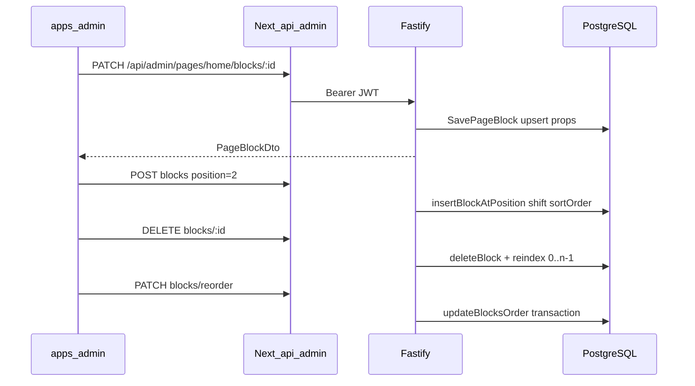

# Admin CMS — editor de blocos (fase 2)

Editor operacional de blocos CMS no painel admin: mutação de props via modal, adição posicional e remoção com reindexação automática.

Plano de referência: [`.cursor/plans/cms_admin_block_editor_0d0aeef3.plan.md`](../.cursor/plans/cms_admin_block_editor_0d0aeef3.plan.md)

## O quê foi entregue

- Rotas REST autenticadas `GET/POST/PATCH/DELETE /admin/pages/*`
- Use cases `GetAdminPageLayout`, `ListAdminPages` + insert com shift de `sortOrder`
- Proxy Next.js em `apps/admin/src/app/api/admin/pages/*`
- UI `CMSBlockOrderManager` em `/paginas/[slug]`
- Modais shadcn/Radix: configurar props, escolher tipo, confirmar exclusão
- Formulários v1: `DYNAMIC_PRODUCT_GRID`, `SPACER`, `BANNER`, `RICH_TEXT`
- Listagem de páginas em `/paginas`

## Fora de escopo

- Draft / preview / publish (`POST /admin/pages/:slug/publish`)
- Drag-and-drop (`@dnd-kit`)
- Formulários completos dos 7 tipos restantes (cartão + props read-only)

## Fluxo operador



## Rotas API (Fastify)

Todas exigem `Authorization: Bearer <JWT>` (exceto login).

| Método | Rota | Ação |
|--------|------|------|
| `GET` | `/admin/pages` | Lista páginas (`id`, `slug`, `title`, `status`) |
| `GET` | `/admin/pages/:slug` | Layout + blocos (props crus) |
| `POST` | `/admin/pages/:slug/blocks` | Criar bloco na posição N (shift automático) |
| `PATCH` | `/admin/pages/:slug/blocks/:id` | Atualizar props/tipo/visibility |
| `DELETE` | `/admin/pages/:slug/blocks/:id` | Remover + reindexar |
| `PATCH` | `/admin/pages/:slug/blocks/reorder` | `{ blocksOrder: [{ blockId, position }] }` |

Contrato detalhado: [api-rest.md](./api-rest.md).

## UI admin

| Rota | Componente |
|------|------------|
| `/paginas` | Lista páginas com link "Editar blocos" |
| `/paginas/[slug]` | `CMSBlockOrderManager` |

### Ações no editor

- **Configurar** — modal dinâmico por `BlockType` (Zod em `@ecommerce-amazon/shared/cms`)
- **+ Adicionar bloco** — escolha de tipo + posição (topo, entre blocos, final)
- **Excluir** — `AlertDialog`; backend reindexa índices
- **↑ ↓ / input numérico** — reorder local; botão **Salvar ordem** persiste via PATCH reorder

## Arquivos-chave

| Área | Path |
|------|------|
| Use cases | `packages/application/src/use-cases/admin-cms/` |
| Repositório (shift insert) | `packages/infrastructure/src/persistence/repositories/drizzle-page.repository.ts` |
| Rotas HTTP | `apps/api/src/adapters/http/routes/admin-cms-routes.ts` |
| Proxy admin | `apps/admin/src/app/api/admin/pages/` |
| Editor UI | `apps/admin/src/components/cms/CMSBlockOrderManager.tsx` |
| Forms | `apps/admin/src/components/cms/forms/BlockPropsForm.tsx` |
| Schemas Zod | `packages/shared/src/cms/block-schemas.ts` |

## Como testar

```bash
npm run db:migrate && npm run db:seed
npm run dev:api    # :3000
npm run dev:admin  # :3002
```

1. Login em http://localhost:3002/login (credenciais do seed — ver [admin-app-phase1.md](./admin-app-phase1.md))
2. Abrir **Páginas** → **Editar blocos** na home
3. Adicionar bloco `dynamic_product_grid` no meio da lista
4. Configurar título e categoria; salvar
5. Reordenar com setas → **Salvar ordem**
6. Excluir bloco e verificar sequência contígua após refresh

Após salvar no admin, a home reflete na próxima visita (sem cache ISR de 60s). A API invalida Redis via `PageCacheInvalidator.invalidateBySlug`.

Testes unitários:

```bash
npm test -- --run admin-cms
```

## Próximos passos

1. Formulários dos tipos complexos (`HERO_CAROUSEL`, `HERO_SPLIT`, etc.)
2. Workflow draft/publish
3. Preview com token
