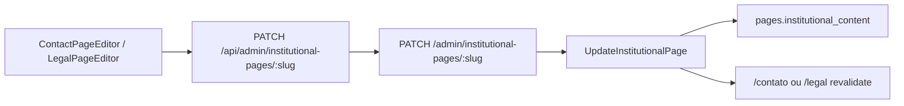

# Admin — páginas institucionais (Contato e Políticas legais)

Editores CMS para `/contato` e `/legal` no painel operador, no mesmo padrão da página Sobre.

## O quê

| Rota Admin         | Slug      | Vitrine                                                |
| ------------------ | --------- | ------------------------------------------------------ |
| `/paginas/contato` | `contato` | `/contato`                                             |
| `/paginas/legal`   | `legal`   | `/legal` (#privacidade, #termos, #afiliados, #cookies) |

- **`ContactPageEditor`** — título, intro, e-mail exibido, rótulos de links
- **`LegalPageEditor`** — intro + 4 seções legais com parágrafos, listas e subseções
- Toggle **Salvar rascunho** / **Publicar** (sem preview draft na vitrine)
- Revalidação ISR após save via `PublicWebRevalidator`
- Seed cria páginas `contato` e `legal` com `page_kind=institutional`

## Fora de escopo

- Preview `?preview=draft` na vitrine
- Formulário de contato com backend
- URLs separadas (`/legal/privacidade`) — hub único `/legal`

## Fluxo



## Painéis do editor Contato

| Painel             | Campos                                           |
| ------------------ | ------------------------------------------------ |
| Contexto           | Status, link vitrine, Salvar rascunho / Publicar |
| SEO                | `seoTitle`, `seoDescription`                     |
| Conteúdo principal | `title`, `intro`                                 |
| Canal de contato   | `emailLabel`, `email`, `socialHeading`           |
| Links de rodapé    | `aboutLinkLabel`, `legalLinkLabel`               |
| Meta               | `lastUpdated` (auto no save)                     |

Redes sociais (Instagram, Telegram) continuam vindo de `BrandConfig` / env.

## Painéis do editor Legal

| Painel     | Campos                                                                                  |
| ---------- | --------------------------------------------------------------------------------------- |
| Contexto   | Status, link vitrine, aviso de revisão jurídica                                         |
| SEO        | `seoTitle`, `seoDescription`                                                            |
| Introdução | `title`, `intro`                                                                        |
| Seções     | `privacidade`, `termos`, `afiliados`, `cookies` — título, parágrafos, listas, subseções |
| Meta       | `lastUpdated` (auto no save)                                                            |

## API

Mesmas rotas da Sobre, com validação por slug via `@ecommerce-amazon/shared/institutional`:

| Método | Rota                               | Body                                               |
| ------ | ---------------------------------- | -------------------------------------------------- |
| GET    | `/institutional-pages/:slug`       | — (público, só `published`)                        |
| GET    | `/admin/institutional-pages/:slug` | — (JWT)                                            |
| PATCH  | `/admin/institutional-pages/:slug` | `{ content, seoTitle?, seoDescription?, status? }` |

Slugs suportados: `sobre`, `contato`, `legal`.

## Arquivos-chave

| Artefato          | Path                                                                                                         |
| ----------------- | ------------------------------------------------------------------------------------------------------------ |
| Registry por slug | [`registry.ts`](../packages/shared/src/institutional/registry.ts)                                            |
| Schema contato    | [`contact-content.schema.ts`](../packages/shared/src/contact/contact-content.schema.ts)                      |
| Schema legal      | [`legal-content.schema.ts`](../packages/shared/src/legal/legal-content.schema.ts)                            |
| Editor contato    | [`ContactPageEditor.tsx`](../apps/admin/src/components/contact/ContactPageEditor.tsx)                        |
| Editor legal      | [`LegalPageEditor.tsx`](../apps/admin/src/components/legal/LegalPageEditor.tsx)                              |
| Roteamento        | [`paginas/[slug]/page.tsx`](<../apps/admin/src/app/(dashboard)/paginas/[slug]/page.tsx>)                     |
| Use case          | [`GetInstitutionalPage.ts`](../packages/application/src/use-cases/institutional/GetInstitutionalPage.ts)     |
| Seed              | [`seed.ts`](../packages/infrastructure/src/persistence/drizzle/seed.ts) — `seedContactPage`, `seedLegalPage` |

## Como testar

```bash
npm run db:migrate && npm run db:seed
npm run dev:api    # :3000
npm run dev:admin  # :3002
npm run dev:web    # :3001

# Admin: /paginas → Contato ou Políticas legais → Editar conteúdo → Publicar
# Vitrine: /contato e /legal refletem após revalidate

npx vitest run packages/application/src/use-cases/institutional/UpdateInstitutionalPage.test.ts
npx vitest run packages/shared/src/legal/legal-content.test.ts
```

## Próximos passos

- Preview de rascunho na vitrine (alinhado ao publish/draft da home CMS)
- Banner de cookies + Consent Mode quando GA4 for integrado
