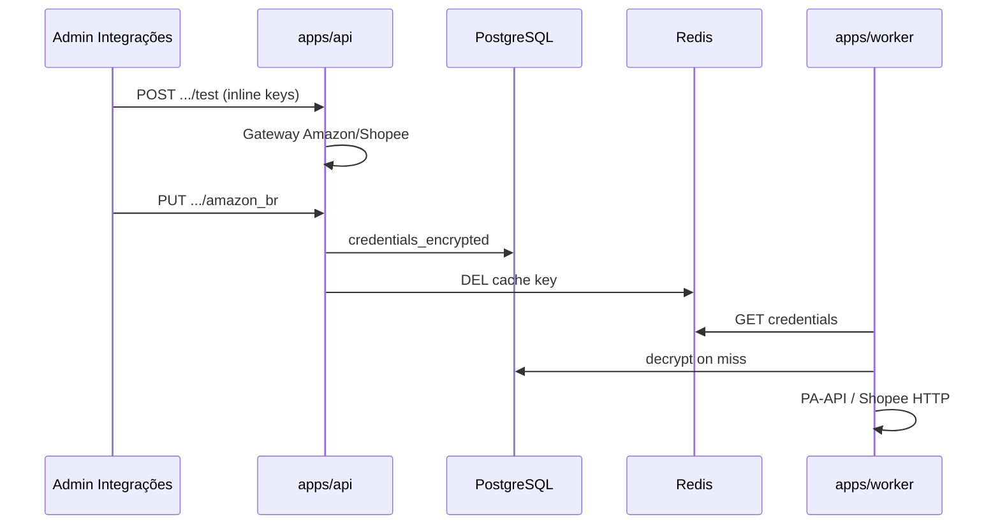

# Admin — Credenciais de API (Marketplace Vault)

Plano de referência: [`.cursor/plans/admin_api_credentials_vault_d44a5b72.plan.md`](../.cursor/plans/admin_api_credentials_vault_d44a5b72.plan.md)

## O quê

Cofre operacional para **chaves de API de marketplace** (Amazon PA-API + Shopee Open API), gerenciável em `/configuracoes` → aba **Integrações**:

- Criptografia **AES-256-GCM** at rest (`ENCRYPTION_KEY` no servidor)
- Cache Redis (`vitrine:marketplace-credentials:{marketplace}`, TTL 5 min) para o worker
- Botão **Testar conectividade** (pre-flight no backend)
- Secrets mascarados na UI (`MaskedSecretInput`)
- **Associate Tag** permanece em Contas de afiliado (read-only no card Amazon)

**Fase 1:** Amazon + Shopee. **Mercado Livre OAuth:** Fase 3 (placeholder na UI).

**Fora do escopo:** GA4, Resend, S3 no DB; rotação automática de `ENCRYPTION_KEY`.

## Por quê

Permite rotação rápida de credenciais sem deploy, desbloqueia fetchers reais no worker (pipelines B/C) e separa **tag pública de afiliado** de **secret de API** — alinhado ao PRD Core §4 e ao modo híbrido em [`admin-products-phase1.md`](./admin-products-phase1.md).

## Como funciona



### Separação tag vs API key

| Dado                              | Onde                          | Uso                                   |
| --------------------------------- | ----------------------------- | ------------------------------------- |
| `affiliate_tag`                   | `affiliate_accounts`          | `/go`, batch checkout, gate de escala |
| Access Key / Secret / Partner Key | `marketplace_api_credentials` | Worker sync de preços/catálogo        |

## Schema

Migration `0021_marketplace_api_credentials.sql` — tabela `marketplace_api_credentials` (unique por `marketplace`).

## API admin (JWT)

| Método | Rota                                               | Acesso                                       |
| ------ | -------------------------------------------------- | -------------------------------------------- |
| GET    | `/admin/marketplace-credentials`                   | autenticado — status mascarado               |
| PUT    | `/admin/marketplace-credentials/:marketplace`      | admin — body com secrets                     |
| DELETE | `/admin/marketplace-credentials/:marketplace`      | admin                                        |
| POST   | `/admin/marketplace-credentials/:marketplace/test` | admin — body opcional com credenciais inline |

BFF: `apps/admin/src/app/api/admin/marketplace-credentials/`.

`GET /admin/operational-status` inclui `marketplaceCredentials[]` para o painel Saúde.

## Env

```bash
# 32 bytes base64 — obrigatório em produção
ENCRYPTION_KEY=
# Gerar: openssl rand -base64 32
```

Dev default em `packages/shared` (trocar em produção).

## Arquivos-chave

| Camada           | Path                                                                                 |
| ---------------- | ------------------------------------------------------------------------------------ | ---- | ------ | ------------------ |
| Cipher           | `packages/infrastructure/src/security/aes-gcm-credential-cipher.ts`                  |
| Resolver + cache | `packages/application/src/services/MarketplaceCredentialResolver.ts`                 |
| Use cases        | `packages/application/src/use-cases/admin-settings/Get                               | Save | Delete | TestMarketplace\*` |
| Amazon client    | `packages/infrastructure/src/marketplace/amazon/amazon-pa-api.client.ts`             |
| Shopee client    | `packages/infrastructure/src/marketplace/shopee/shopee-open-api.client.ts`           |
| Fetchers         | `packages/infrastructure/src/marketplace/strategies/marketplace-fetcher.strategy.ts` |
| UI               | `apps/admin/src/components/settings/MarketplaceIntegrationsPanel.tsx`                |

## Como testar

```bash
docker compose up -d postgres redis
npm run db:migrate -w @ecommerce-amazon/infrastructure
npm run dev -w @ecommerce-amazon/api
npm run dev -w @ecommerce-amazon/admin
```

1. Login em `http://localhost:3002`
2. `/configuracoes` → **Integrações**
3. Preencher keys Amazon/Shopee → **Testar conectividade** → **Salvar**
   - Com credenciais já salvas, **Testar conectividade** funciona com campos vazios (usa o cofre)
   - Para rotacionar chaves, preencha Access Key + Secret Key, teste e só então salve
4. Verificar chips no painel **Saúde**

Testes unitários:

```bash
npm run test:unit -- packages/application/src/use-cases/admin-settings/marketplace-credentials.test.ts
npm run test:unit -- packages/infrastructure/src/security/aes-gcm-credential-cipher.test.ts
```

## Próximos passos

- **Fase 3:** Mercado Livre OAuth (`/oauth/start`, callback, worker `RefreshOAuthToken`)
- Rotação de `ENCRYPTION_KEY` com re-encrypt em lote
- Rate limit / quota PA-API no painel Saúde
