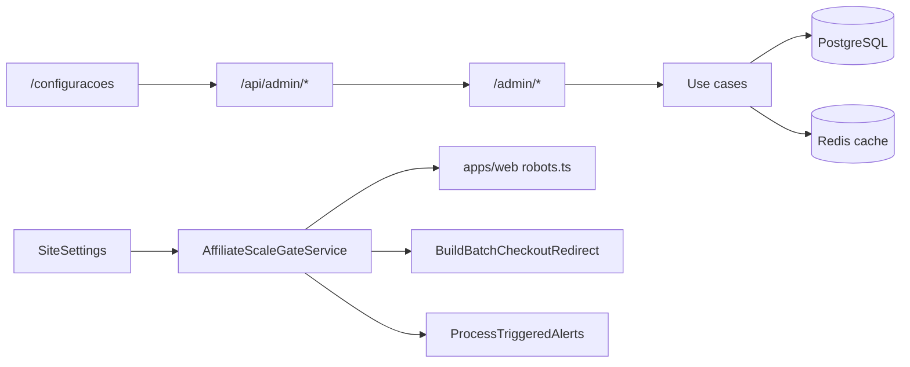

# Admin — Configurações Operacionais

Plano de referência: [`.cursor/plans/admin_config_operacional_5464f04d.plan.md`](../.cursor/plans/admin_config_operacional_5464f04d.plan.md)

## O quê

Hub operacional em `/configuracoes` do painel CMS:

- **Contas de afiliado** — CRUD: listar, criar, editar tag, validar manualmente, suspender/reativar, excluir (checklist PRD §4.2)
- **Preferências CMS/plataforma** — feature flags persistidos em `site_settings`
- **Operadores** — listar, convidar, role, ativar/desativar (somente admin)
- **Saúde da plataforma** — flags de env, gate de escala, últimos `sync_job_logs` com falha
- **Troca de senha** do operador logado

**Fora desta fase:** convite por e-mail, CRUD cupons, edição de brand via UI, BullMQ dashboard.

## Por quê

Fecha o gap do stub “Configurações operacionais em breve” e implementa o **gate manual de contas afiliado** antes de escala (PRD Core §4.2), complementando [`admin-profile-phase1.md`](./admin-profile-phase1.md).

## Como funciona



### Gate composto (`AffiliateScaleGateService`)

Combina `site_settings` + status em `affiliate_accounts`:

| Flag / regra                                                          | Efeito                                                       |
| --------------------------------------------------------------------- | ------------------------------------------------------------ |
| `features.batchCheckoutEnabled = false`                               | Bloqueia `POST /wishlist/checkout-batch`                     |
| `features.priceAlertsEnabled = false`                                 | Worker não dispara e-mails de alerta                         |
| `features.pricesEnabled = false`                                      | Oculta preços na API pública e bloqueia histórico/alertas    |
| Alteração de `pricesEnabled`                                          | Revalida cache Next.js (`public:site-settings`) + layout `/` |
| `features.publicIndexingEnabled = false`                              | `robots.ts` → `disallow: /`                                  |
| `seo.respectAffiliateGate = true` + conta `pending_manual_validation` | `robots.ts` → `disallow: /`                                  |
| Conta `pending` / `suspended`                                         | Bloqueia `/go` e batch (regra existente)                     |

Cache Redis: `vitrine:site-settings` (TTL 5 min), invalidado em mutações.

## Schema

Migration `0019_operational_settings.sql`:

| Tabela/coluna                         | Uso                                  |
| ------------------------------------- | ------------------------------------ |
| `site_settings`                       | Single-row JSONB (`id` fixo no seed) |
| `affiliate_accounts.validation_notes` | Evidências do checklist de validação |

Contrato Zod: `packages/shared/src/admin/site-settings-schemas.ts`

## API admin (JWT)

| Método | Rota                            | Acesso      |
| ------ | ------------------------------- | ----------- |
| GET    | `/admin/affiliate-accounts`     | autenticado |
| POST   | `/admin/affiliate-accounts`     | admin       |
| PATCH  | `/admin/affiliate-accounts/:id` | admin       |
| DELETE | `/admin/affiliate-accounts/:id` | admin       |
| GET    | `/admin/operators`              | admin       |
| POST   | `/admin/operators`              | admin       |
| PATCH  | `/admin/operators/:id`          | admin       |
| PATCH  | `/admin/profile/password`       | autenticado |
| GET    | `/admin/site-settings`          | autenticado |
| PATCH  | `/admin/site-settings`          | admin       |
| GET    | `/admin/operational-status`     | autenticado |

### API pública

| Método | Rota                    | Uso                                                    |
| ------ | ----------------------- | ------------------------------------------------------ |
| GET    | `/site-settings/public` | `indexingBlocked`, `pricesEnabled` para vitrine/robots |

Promoção para `active` exige `checklistConfirmed: true` no PATCH da conta.

`POST /admin/affiliate-accounts` body: `{ marketplace, affiliateTag }` — cria conta com status `pending_manual_validation`. Uma conta por marketplace (índice único).

`DELETE /admin/affiliate-accounts/:id` — remove conta; redirecionamentos do marketplace ficam sem tag até nova conta.

## UI admin

Rota: [`apps/admin/src/app/(dashboard)/configuracoes/page.tsx`](<../apps/admin/src/app/(dashboard)/configuracoes/page.tsx>)

Layout em abas (`OperationalSettingsManager`): painel intro + navegação por abas, cada aba com painéis flutuantes próprios (padrão `ProductForm`).

Componentes em `apps/admin/src/components/settings/`:

- `AffiliateAccountsPanel` — cards por marketplace, criar (sheet), validar, suspender, excluir
- `SiteSettingsPanel` — switches de feature flags
- `OperatorsPanel` — CRUD operadores (admin only)
- `OperationalHealthPanel` — chips env + falhas de sync
- `ChangePasswordForm` — dialog de senha

Editores (`role === editor`) veem contas e saúde em leitura; mutações e painel de operadores ficam ocultos.

`CMSBlockOrderManager` respeita `cms.publishConfirmRequired` com `AlertDialog` antes de salvar ordem.

## Arquivos-chave

| Camada       | Path                                                                                                             |
| ------------ | ---------------------------------------------------------------------------------------------------------------- |
| Use cases    | `packages/application/src/use-cases/admin-settings/`                                                             |
| Gate service | `packages/application/src/services/AffiliateScaleGateService.ts`                                                 |
| Repos        | `drizzle-site-settings.repository.ts`, `drizzle-affiliate-account.repository.ts`                                 |
| API          | `apps/api/src/adapters/http/routes/admin-settings-routes.ts`                                                     |
| Guard admin  | `apps/api/src/adapters/http/require-admin-operator.ts`                                                           |
| BFF          | `apps/admin/src/app/api/admin/{affiliate-accounts,operators,site-settings,operational-status,profile/password}/` |
| Web robots   | `apps/web/src/app/robots.ts`                                                                                     |

## Como testar

```bash
docker compose up -d postgres redis
npm run db:migrate -w @ecommerce-amazon/infrastructure
npm run db:seed -w @ecommerce-amazon/infrastructure
npm run dev -w @ecommerce-amazon/api
npm run dev -w @ecommerce-amazon/admin
```

1. Login em `http://localhost:3002` (seed: `admin@vitrine.local`)
2. Abrir `/configuracoes`
3. Validar conta Shopee (seed `pending_manual_validation`) com checklist
4. Desligar `publicIndexingEnabled` e verificar `GET /site-settings/public`
5. Com vitrine (`apps/web`): `curl http://localhost:3001/robots.txt`

Testes unitários:

```bash
npm run test:unit -- packages/application/src/use-cases/admin-settings
```

## Próximos passos

- Convite de operador por e-mail / reset token
- Publish workflow draft/preview da home CMS
- Painel de profundidade de filas BullMQ
