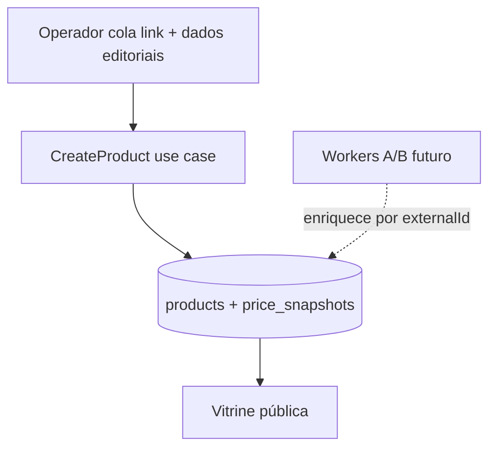

# Admin — gestão de produtos (fase 1, modo híbrido manual)

Cadastro manual de produtos no painel operador enquanto as APIs oficiais (PA-API Amazon, Shopee, Mercado Livre) não estão homologadas. A estrutura já prepara o catálogo para sincronização futura via workers.

Plano de referência: gestão híbrida manual + link de afiliado (prompt de produto admin).

## O quê foi entregue

- Listagem de produtos em `/produtos` (admin)
- Formulário de criação em `/produtos/novo`
- Parser de URL de afiliado (Amazon, Shopee, Mercado Livre) → `marketplace` + `externalId`
- Switch **Exibir valor numérico na vitrine?** mapeado ao SLA de preço (`stale_price`)
- Formulário em **5 abas** (Link & Essenciais · Análise Editorial · Especificações · **Imagens** · SEO Avançado)
- Aba **Imagens** (após Especificações): upload gerenciado (`POST /admin/media/images`) com recorte 1:1 + galeria ordenada + URL externa opcional
- Especificações dinâmicas por categoria (`specs_normalized`) na aba **Especificações**
- `short_description` híbrida: gerada dos prós na API + textarea editável no admin
- `long_description_html`: editor rico TipTap (modo Visual + aba Código HTML) na aba Análise Editorial
- Meta tags SEO automatizadas na vitrine; sobrescrita opcional na aba SEO Avançado
- Tooltips contextuais (ⓘ) em todos os campos do formulário; contadores SEO na aba SEO Avançado
- Assistente **Gerar SEO com IA**: prompt contextual + aplicar JSON nos campos `metaTitle` / `metaDescription`
- API admin: `GET /admin/products`, `POST /admin/products`
- Enum `mercadolivre_br` no domínio, Drizzle e fetcher stub
- Migration `0006_mercadolivre_br.sql`
- Migration `0007_product_visible.sql` — coluna `visible` (default `true`)

## URL canônica (SEO)

Utilitário: [`packages/shared/src/seo/product-canonical.ts`](../packages/shared/src/seo/product-canonical.ts)

| Camada | Comportamento |
|--------|---------------|
| Banco | `canonical_url` varchar(512), nullable — **sobrescrita editorial de segurança** (Editorial Override); default `NULL` no dia a dia |
| Admin | **Sem input no formulário** — operador leigo deixa vazio; alterações avançadas via DB/Drizzle Studio |
| Web `/produtos/[slug]` | `resolveProductCanonicalUrl`: override do banco **ou** fallback `{NEXT_PUBLIC_SITE_URL}/produtos/{slug}` |
| JSON-LD | Campo `url` do Product segue a mesma hierarquia |

Evita punição por conteúdo duplicado quando o produto é acessado via coleções, UTMs ou rotas alternativas. A coluna permite manobras cirúrgicas de SEO (migração de URL, consolidação de slugs duplicados) sem deploy.

## Meta tags (`meta_title`, `meta_description`)

Utilitário: [`packages/shared/src/seo/product-meta.ts`](../packages/shared/src/seo/product-meta.ts)

| Camada | Comportamento |
|--------|---------------|
| Banco | nullable; default `NULL` no cadastro admin |
| Vitrine | `resolveProductMetaTitle` / `resolveProductMetaDescription` no `generateMetadata` |
| Padrão automático | `{titleClean} \| Análise, Prós, Contras e Ofertas` + frase padrão com nome do produto |
| Admin | Aba **SEO Avançado** — sobrescrita opcional; vazio = automação na vitrine |
| Contadores | Meta Title e Meta Description: `N / limite` (60 e 160 — alvo Google); `maxLength` 200 e 320 (Zod) |
| Tooltips | Ícone ⓘ ao lado dos rótulos — textos em [`product-form-hints.ts`](../apps/admin/src/lib/product-form-hints.ts); componentes `FieldHint`, `ProductFormLabelRow` |
| Assistente IA SEO | Botão **Gerar SEO com IA** → modal com prompt (`buildProductSeoLlmPrompt`) + colar JSON + **Aplicar no formulário** (`ProductSeoLlmPromptHelper.tsx`) |

## Apresentação e review

| Campo | Admin | Backend |
|-------|-------|---------|
| `short_description` | Textarea pré-preenchida a partir dos prós | Se vazio no save, API gera dos prós |
| `long_description_html` | Editor TipTap (Visual + Código HTML) + ícone ✨ com prompt copiável para IA externa | Sem integração automática; revisão humana obrigatória |
| `specs_normalized` | Aba **Especificações** → seção **Especificações do Produto** | JSON `Record<string, string>`; alimenta comparador e tabela de specs na vitrine |

### Editor rico — `long_description_html`

Componentes: [`ProductLongDescriptionEditor.tsx`](../apps/admin/src/components/products/ProductLongDescriptionEditor.tsx), [`ProductEditorToolbar.tsx`](../apps/admin/src/components/products/ProductEditorToolbar.tsx). Primitivos compartilhados com artigos em [`apps/admin/src/components/editor/`](../apps/admin/src/components/editor/).

| Recurso | Detalhe |
|---------|---------|
| Modos | **Visual** (TipTap) e **Código HTML** (colar saída de IA) |
| Toolbar | H3, negrito/itálico/riscado, listas, tabela, link |
| Fluxo IA | ✨ copiar prompt → colar na aba HTML → revisar em Visual → salvar |
| Persistência | `string` HTML em `long_description_html` (sem migration) |
| Limite | Contador 50.000 caracteres no form (Zod `max(50000)`) |
| Vitrine | `prose` + `dangerouslySetInnerHTML` em `/produtos/[slug]` (inalterado) |

## Especificações por categoria

Templates estáticos por **slug de categoria** em [`packages/shared/src/product/spec-templates.ts`](../packages/shared/src/product/spec-templates.ts).

| Comportamento | Detalhe |
|---------------|---------|
| Lookup | Cadeia folha → raiz (`buildCategorySlugChain` + `resolveSpecTemplateForSlugChain`) |
| Campo no form | `specsNormalized` (react-hook-form) |
| Template encontrado | Inputs fixos com labels do template (ex.: Switches, Layout) |
| Sem template | Somente atributos customizados + hint |
| Customizados | Botão **+ Adicionar atributo customizado** (par chave/valor) |
| Edição | Valores existentes em `specs_normalized` hidratam os inputs; chaves fora do template aparecem como customizados |
| Save | Zod remove pares com chave ou valor vazio (trim) |

**MVP — slugs com template:** `teclados-mecanicos`, `perifericos`, `cadeiras-ergonomicas`. Para expandir, adicione entradas em `CATEGORY_SPEC_TEMPLATES`.

Componentes: `ProductSpecsForm.tsx`, hook `useAdminCategoryOptions.ts`.

## Visibilidade na home (`visible`)

| Switch admin | Persistência | Efeito |
|--------------|--------------|--------|
| Ligado (default) | `visible = true` | Aparece nos blocos da home (`product_grid`, `dynamic_product_grid`, `featured_product`) |
| Desligado | `visible = false` | Oculto da home; **sempre listado no admin**; página `/produtos/:slug` continua acessível |

- Listagem admin (`GET /admin/products`) usa `ListAdminProducts` — **não** filtra por `visible`.
- Vitrine pública filtra `visible` apenas nos blocos da home e em `GET /products?visibleOnly=true`.

## Imagens do produto

| Camada | Comportamento |
|--------|---------------|
| Campo | `images: string[]` (URLs HTTPS) |
| Admin | Aba **Imagens** → `ProductImagesSection` |
| Upload | `AdminImageFilePicker` + recorte 1:1 (1000×1000) → `uploadAdminImageClient` → append na galeria |
| URL externa | Bloco colapsável "Adicionar por URL" |
| Ordem | ↑↓ na lista; posição 1 = capa (`imageUrl` na vitrine) |
| BFF | `POST /api/admin/media/images` (proxy para API) |

Componentes: `ProductImagesSection.tsx`, reutiliza `AdminImageFilePicker` e `AdminImageCropDialog`.

## Fora de escopo (fase 3)

- Enfileirar worker no create/update; `SyncCatalogBatch` ainda só atualiza produtos existentes
- Botão de geração de review por IA (`POST /admin/products/generate-review`)
- Delete / soft-delete

## Edição (fase 2)

- Rota admin: `GET /admin/products/:slug`, `PATCH /admin/products/:slug`
- Tela: `/produtos/[slug]` com `ProductForm` em modo `edit`
- Slug imutável na edição (links públicos preservados)

## Modo híbrido manual vs worker



O operador informa título limpo, imagens, prós/contras, preço e link de afiliado já tagueado. Quando a PA-API for liberada, os pipelines B/C passam a enriquecer o mesmo registro (`marketplace` + `external_id`).

## Switch de preço ↔ compliance

| Switch admin | Persistência | Vitrine |
|--------------|--------------|---------|
| Ligado | `stale_price = false`, `price_amount` preenchido | Valor numérico + "Monitorado há X h" |
| Desligado | `stale_price = true` (mesmo com `price_amount`) | Badge "Consultar preço atualizado" |

- Snapshot inicial com `source = manual_override` quando há preço informado
- SLA 24h continua em leitura pública via `PriceComplianceService` (preço visível expira após 24h)

## Escala editorial

| Camada | Escala |
|--------|--------|
| UI admin | 0–10 (ex.: 8,5) |
| Banco / domínio | 0–100 (ex.: 85) |
| Badge "Escolha editorial" na vitrine | `editorial_score >= 80` (UI ≥ 8,0) |

## Parser de URL

Módulo: [`packages/shared/src/marketplace/parse-product-url.ts`](../packages/shared/src/marketplace/parse-product-url.ts)

| Marketplace | Padrão |
|-------------|--------|
| Amazon BR | `/dp/{ASIN}`, `/gp/product/{ASIN}` |
| Shopee BR | `/product/{shopId}/{itemId}`, `-i.{shopId}.{itemId}` |
| Mercado Livre | `MLB-{id}` normalizado para `MLB{id}` |

Revalidado no backend em `CreateProduct` (não confiar só no client).

## API admin

Ver [api-rest.md](./api-rest.md) § Admin — produtos.

Schemas Zod: [`packages/shared/src/admin/product-schemas.ts`](../packages/shared/src/admin/product-schemas.ts) (`@ecommerce-amazon/shared/admin`).

## Arquivos-chave

| Camada | Arquivo |
|--------|---------|
| Use case | `packages/application/src/use-cases/product/CreateProduct.ts` |
| Rotas API | `apps/api/src/adapters/http/routes/admin-product-routes.ts` |
| Presenter admin | `apps/api/src/adapters/presenters/product.presenter.ts` |
| BFF admin | `apps/admin/src/app/api/admin/products/route.ts` |
| Formulário | `apps/admin/src/components/products/ProductForm.tsx` |
| Análise editorial | `apps/admin/src/components/products/ProductAnalysisSection.tsx` |
| Editor rico (review) | `apps/admin/src/components/products/ProductLongDescriptionEditor.tsx` |
| Editor compartilhado | `apps/admin/src/components/editor/` |
| Galeria / upload | `apps/admin/src/components/products/ProductImagesSection.tsx` |
| Specs por categoria | `apps/admin/src/components/products/ProductSpecsForm.tsx` |
| Templates de specs | `packages/shared/src/product/spec-templates.ts` |
| Listagem | `apps/admin/src/app/(dashboard)/produtos/page.tsx` |

## Como testar

```bash
npm run db:migrate && npm run db:seed
npm run dev:api    # :3000
npm run dev:admin  # :3002
```

1. Login em http://localhost:3002/login
2. **Produtos** → **Novo produto**
3. Colar URL Amazon/Shopee/ML — verificar marketplace e ID detectados
4. Aba **Imagens**: enviar arquivo ou URL; reordenar; salvar
5. Confirmar listagem em `/produtos` e vitrine pública em `/produtos/{slug}` (web :3001)

## Próximos passos

- `PATCH /admin/products/:slug` para edição editorial
- Extender `SyncCatalogBatch` para upsert de produtos novos quando API estiver ativa
- Filtro por marketplace na listagem admin
