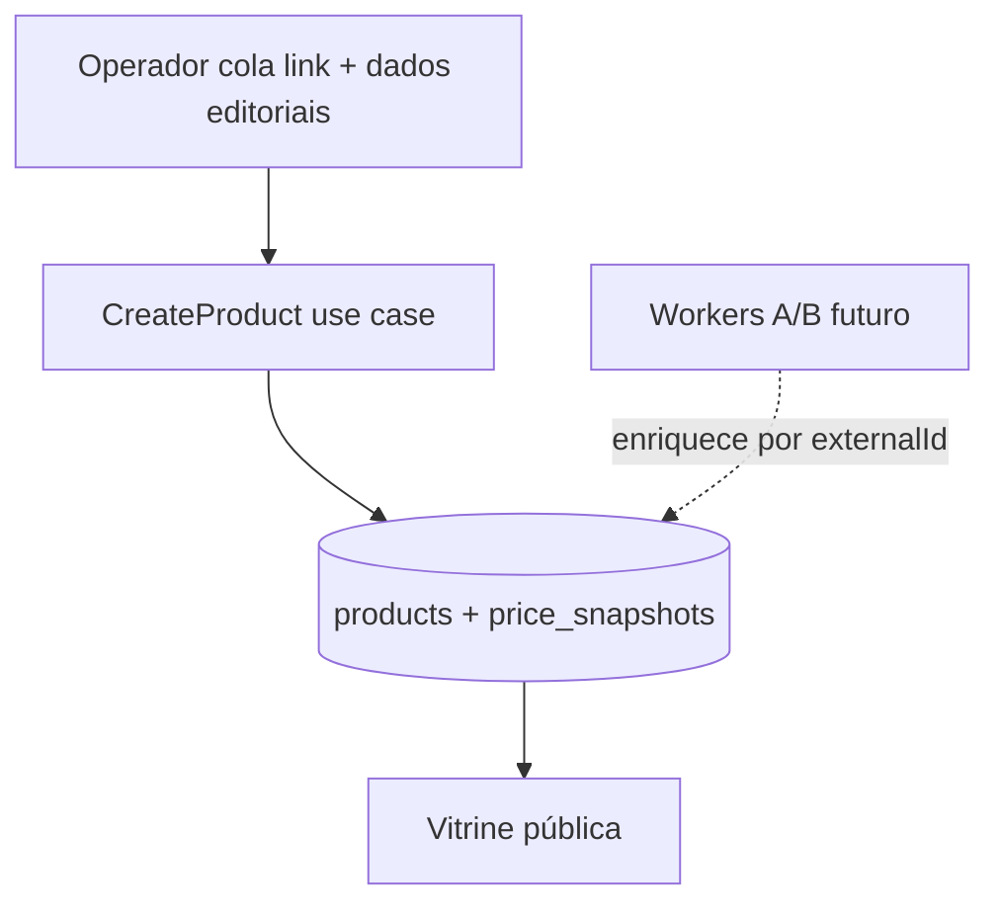

# Admin — gestão de produtos (fase 1, modo híbrido manual)

Cadastro manual de produtos no painel operador enquanto as APIs oficiais (PA-API Amazon, Shopee, Mercado Livre) não estão homologadas. A estrutura já prepara o catálogo para sincronização futura via workers.

Plano de referência: gestão híbrida manual + link de afiliado (prompt de produto admin).

## O quê foi entregue

- Listagem de produtos em `/produtos` (admin)
- Formulário de criação em `/produtos/novo`
- Parser de URL de afiliado (Amazon, Shopee, Mercado Livre) → `marketplace` + `externalId`
- Switch **Exibir valor numérico na vitrine?** mapeado ao SLA de preço (`stale_price`)
- Switch **Exibir na home?** (`visible`) — oculta produto dos blocos da home
- API admin: `GET /admin/products`, `POST /admin/products`
- Enum `mercadolivre_br` no domínio, Drizzle e fetcher stub
- Migration `0006_mercadolivre_br.sql`
- Migration `0007_product_visible.sql` — coluna `visible` (default `true`)

## URL canônica (SEO)

Utilitário: [`packages/shared/src/seo/product-canonical.ts`](../packages/shared/src/seo/product-canonical.ts)

| Camada | Comportamento |
|--------|---------------|
| Banco | `canonical_url` varchar(512), nullable — **sobrescrita editorial de segurança** (Editorial Override); default `NULL` no dia a dia |
| Admin | **Sem input no formulário** — operador leigo deixa vazio; alterações avançadas via DB/Drizzle Studio |
| Web `/produtos/[slug]` | `resolveProductCanonicalUrl`: override do banco **ou** fallback `{NEXT_PUBLIC_SITE_URL}/produtos/{slug}` |
| JSON-LD | Campo `url` do Product segue a mesma hierarquia |

Evita punição por conteúdo duplicado quando o produto é acessado via coleções, UTMs ou rotas alternativas. A coluna permite manobras cirúrgicas de SEO (migração de URL, consolidação de slugs duplicados) sem deploy.

## Visibilidade na home (`visible`)

| Switch admin | Persistência | Efeito |
|--------------|--------------|--------|
| Ligado (default) | `visible = true` | Aparece nos blocos da home (`product_grid`, `dynamic_product_grid`, `featured_product`) |
| Desligado | `visible = false` | Oculto da home; **sempre listado no admin**; página `/produtos/:slug` continua acessível |

- Listagem admin (`GET /admin/products`) usa `ListAdminProducts` — **não** filtra por `visible`.
- Vitrine pública filtra `visible` apenas nos blocos da home e em `GET /products?visibleOnly=true`.

## Fora de escopo (fase 3)

- Upload de imagem (somente URLs HTTPS)
- Enfileirar worker no create/update; `SyncCatalogBatch` ainda só atualiza produtos existentes
- Campos SEO (`metaTitle`, `metaDescription`) no form
- Delete / soft-delete

## Edição (fase 2)

- Rota admin: `GET /admin/products/:slug`, `PATCH /admin/products/:slug`
- Tela: `/produtos/[slug]` com `ProductForm` em modo `edit`
- Slug imutável na edição (links públicos preservados)

## Modo híbrido manual vs worker



O operador informa título limpo, imagens, prós/contras, preço e link de afiliado já tagueado. Quando a PA-API for liberada, os pipelines B/C passam a enriquecer o mesmo registro (`marketplace` + `external_id`).

## Switch de preço ↔ compliance

| Switch admin | Persistência | Vitrine |
|--------------|--------------|---------|
| Ligado | `stale_price = false`, `price_amount` preenchido | Valor numérico + "Monitorado há X h" |
| Desligado | `stale_price = true` (mesmo com `price_amount`) | Badge "Consultar preço atualizado" |

- Snapshot inicial com `source = manual_override` quando há preço informado
- SLA 24h continua em leitura pública via `PriceComplianceService` (preço visível expira após 24h)

## Escala editorial

| Camada | Escala |
|--------|--------|
| UI admin | 0–10 (ex.: 8,5) |
| Banco / domínio | 0–100 (ex.: 85) |
| Badge "Escolha editorial" na vitrine | `editorial_score >= 80` (UI ≥ 8,0) |

## Parser de URL

Módulo: [`packages/shared/src/marketplace/parse-product-url.ts`](../packages/shared/src/marketplace/parse-product-url.ts)

| Marketplace | Padrão |
|-------------|--------|
| Amazon BR | `/dp/{ASIN}`, `/gp/product/{ASIN}` |
| Shopee BR | `/product/{shopId}/{itemId}`, `-i.{shopId}.{itemId}` |
| Mercado Livre | `MLB-{id}` normalizado para `MLB{id}` |

Revalidado no backend em `CreateProduct` (não confiar só no client).

## API admin

Ver [api-rest.md](./api-rest.md) § Admin — produtos.

Schemas Zod: [`packages/shared/src/admin/product-schemas.ts`](../packages/shared/src/admin/product-schemas.ts) (`@ecommerce-amazon/shared/admin`).

## Arquivos-chave

| Camada | Arquivo |
|--------|---------|
| Use case | `packages/application/src/use-cases/product/CreateProduct.ts` |
| Rotas API | `apps/api/src/adapters/http/routes/admin-product-routes.ts` |
| Presenter admin | `apps/api/src/adapters/presenters/product.presenter.ts` |
| BFF admin | `apps/admin/src/app/api/admin/products/route.ts` |
| Formulário | `apps/admin/src/components/products/ProductForm.tsx` |
| Listagem | `apps/admin/src/app/(dashboard)/produtos/page.tsx` |

## Como testar

```bash
npm run db:migrate && npm run db:seed
npm run dev:api    # :3000
npm run dev:admin  # :3002
```

1. Login em http://localhost:3002/login
2. **Produtos** → **Novo produto**
3. Colar URL Amazon/Shopee/ML — verificar marketplace e ID detectados
4. Preencher título, preço, toggle de exibição, salvar
5. Confirmar listagem em `/produtos` e vitrine pública em `/produtos/{slug}` (web :3001)

## Próximos passos

- `PATCH /admin/products/:slug` para edição editorial
- Extender `SyncCatalogBatch` para upsert de produtos novos quando API estiver ativa
- Filtro por marketplace na listagem admin
