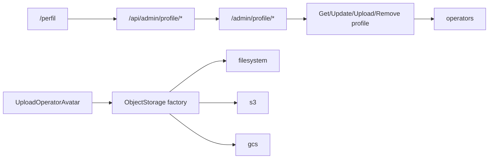

# Admin — edição de perfil do operador (fase 1)

## O quê

Tela `/perfil` no painel CMS para o operador logado editar **nome**, **bio** e **foto de perfil** (upload com recorte quadrado). Inclui camada de **object storage plugável** (filesystem, S3, GCS) e link **Meu perfil** no dropdown do usuário.

**Fora desta fase:** troca de senha, gestão de outros operadores (`/configuracoes`), campos extras (telefone, cargo).

## Por quê

Complementa [articles-taxonomy-phase2.md](./articles-taxonomy-phase2.md), que já expõe `operators.avatar_url` e `operators.bio` no author box público, mas deixou a UI de edição para depois.

## Como funciona



1. O layout do dashboard carrega `GET /admin/profile` server-side para avatar no header.
2. Texto (nome, bio) salva via `PATCH /admin/profile`; a API devolve JWT novo e o BFF atualiza o cookie.
3. Foto é fluxo separado: recorte client-side (`react-easy-crop`, 512×512 JPEG) → `POST /admin/profile/avatar` (multipart).
4. Remoção: `DELETE /admin/profile/avatar` apaga objeto gerenciado e zera `avatar_url`.
5. Alterações de perfil/avatar revalidam a vitrine (`/sobre` + tag `public:team-members`) quando o operador aparece na seção equipe (`show_on_team`).
6. URLs externas (ex.: seed Pexels) não são apagadas pelo storage — só URLs gerenciadas pelo driver ativo.

## Storage plugável

| Driver                     | Env                                             | Uso                                          |
| -------------------------- | ----------------------------------------------- | -------------------------------------------- |
| `filesystem` (default dev) | `STORAGE_LOCAL_ROOT`, `STORAGE_PUBLIC_BASE_URL` | API serve `/uploads/*` via `@fastify/static` |
| `s3`                       | `AWS_S3_BUCKET`, `AWS_S3_REGION`, credenciais   | `PutObject` / `DeleteObject`                 |
| `gcs`                      | `GCS_BUCKET`, `GCS_PROJECT_ID`, ADC/credentials | `@google-cloud/storage`                      |

Port: `ObjectStorage` em `packages/domain`. Factory: `createObjectStorage()` em `packages/infrastructure/src/storage/`.

Chave de avatar: `admin-avatars/YYYY/MM/avatar-YYYYMMDD-HHMMSS-{hex32}.{ext}`.

## Arquivos-chave

| Camada           | Path                                                                           |
| ---------------- | ------------------------------------------------------------------------------ |
| Port             | `packages/domain/src/gateways/object-storage.ts`, `services/avatar-storage.ts` |
| Storage adapters | `packages/infrastructure/src/storage/*`                                        |
| Use cases        | `packages/application/src/use-cases/admin-profile/`                            |
| API              | `apps/api/src/adapters/http/routes/admin-profile-routes.ts`                    |
| Schemas          | `packages/shared/src/admin/profile-schemas.ts`                                 |
| BFF              | `apps/admin/src/app/api/admin/profile/`                                        |
| UI               | `apps/admin/src/app/(dashboard)/perfil/page.tsx`, `components/profile/*`       |
| Dropdown         | `apps/admin/src/components/admin/AdminUserMenu.tsx`                            |

## API / BFF

| Método | API                                                       | BFF                         |
| ------ | --------------------------------------------------------- | --------------------------- |
| GET    | `/admin/profile`                                          | `/api/admin/profile`        |
| PATCH  | `/admin/profile` `{ name, bio? }` → `{ operator, token }` | idem + refresh cookie       |
| POST   | `/admin/profile/avatar` multipart `avatar`                | `/api/admin/profile/avatar` |
| DELETE | `/admin/profile/avatar`                                   | `/api/admin/profile/avatar` |

DTO `operator`: `{ id, email, name, avatarUrl, bio, role, status, isManagedAvatar }`.

## Env vars

Ver `.env.example` — seção **Object storage**. Mínimo local:

```bash
STORAGE_DRIVER=filesystem
STORAGE_PUBLIC_BASE_URL=http://localhost:3000/uploads
STORAGE_LOCAL_ROOT=./uploads
```

## Como testar

```bash
# API + admin + postgres/redis
npm run dev:api
npm run dev:admin

# Login em http://localhost:3002/login (seed: admin@vitrine.local)
# Abrir http://localhost:3002/perfil
# Ou pelo dropdown: Meu perfil
```

Upload local: após enviar foto, URL pública deve responder em `http://localhost:3000/uploads/admin-avatars/...`.

Testes unitários:

```bash
npm run test:unit -- validate-avatar-image UpdateOperatorProfile
npm run test:integration -- object-storage
```

## Próximos passos

- Troca de senha em `/perfil` ou `/configuracoes`
- CRUD de operadores (admin convida/editores)
- Reutilizar `ObjectStorage` para capas de artigos/coleções
