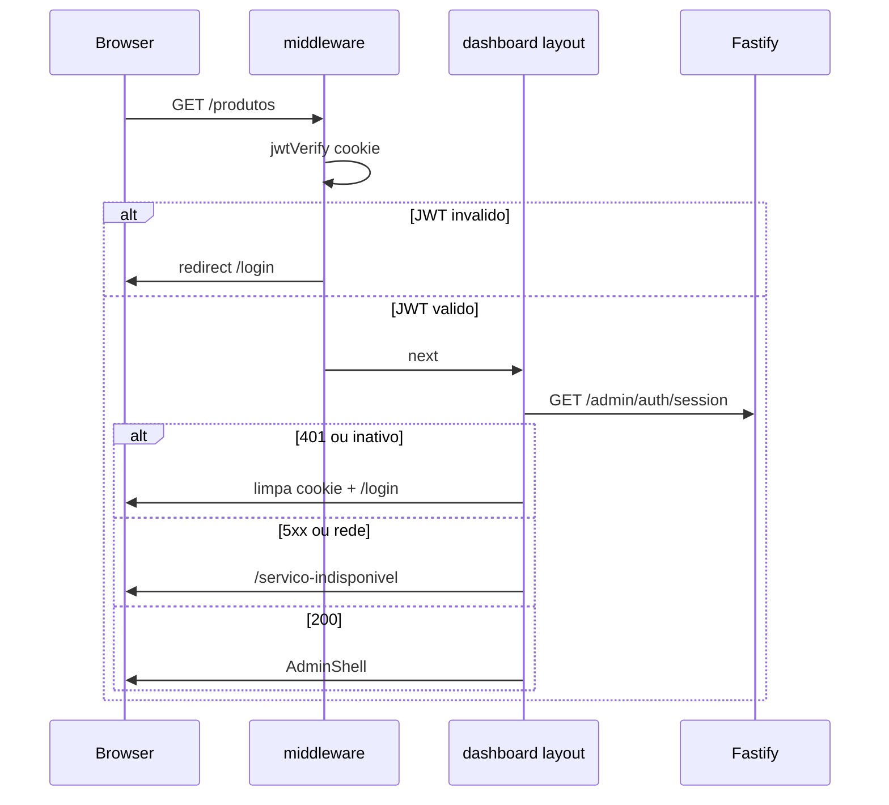

# Segurança do Admin CMS

Plano de referência: [`.cursor/plans/admin_security_hardening_c382d2c0.plan.md`](../.cursor/plans/admin_security_hardening_c382d2c0.plan.md).

## O quê foi entregue

- Confirmação de sessão **fail-closed** com `GET /admin/auth/session` (operador ativo no PostgreSQL)
- Página `/servico-indisponivel` sem `AdminShell` quando API/DB não respondem
- Middleware com verificação JWT (`jose`) e limpeza de cookie inválido
- BFF e `adminClientFetch` com erros tipados (`401` / `503`) e logout automático no client
- Rate limit in-memory no login da API (10 tentativas / 15 min por IP)
- Pepper em `BcryptPasswordHasher` via `PASSWORD_PEPPER`
- Handler de erro no cliente Redis (sem `Unhandled error event`)
- Endpoint `GET /health/ready` com ping PostgreSQL

## Modelo de ameaças (resumo)

| Ameaça | Mitigação |
|--------|-----------|
| XSS roubando token | Cookie `httpOnly` + `SameSite=Lax` |
| Sessão sem backend | Layout confirma `GET /admin/auth/session` antes do shell |
| JWT após desativação | Endpoint valida `operators.status === active` |
| Brute force no login | Rate limit 429 + mensagem uniforme de credenciais |
| Vazamento de hashes no DB | bcrypt + **pepper** (`PASSWORD_PEPPER`) |
| Enumeração de e-mail | Mesma mensagem para usuário inexistente/senha errada |
| Shell exposto com API off | Redirect para `/servico-indisponivel` (sem sidebar) |

## Fluxo fail-closed



## Variáveis de ambiente

| Variável | Uso |
|----------|-----|
| `JWT_SECRET` | Assinatura HS256 — **mesmo valor** em API e admin |
| `JWT_EXPIRES_IN` | Expiração do JWT e `maxAge` do cookie (ex.: `8h`) |
| `PASSWORD_PEPPER` | Segredo aplicado antes do bcrypt (mín. 16 chars) |
| `API_INTERNAL_URL` | URL da API para BFF e confirmação de sessão |

**Importante:** alterar `PASSWORD_PEPPER` invalida hashes existentes. Em dev, rode `npm run db:seed` após mudar o pepper.

## Arquivos-chave

| Área | Path |
|------|------|
| Use case sessão | `packages/application/src/use-cases/admin-auth/ValidateOperatorSession.ts` |
| Endpoint sessão | `apps/api/src/adapters/http/routes/admin-routes.ts` |
| Pepper bcrypt | `packages/infrastructure/src/auth/bcrypt-password.hasher.ts` |
| Guard layout | `apps/admin/src/lib/auth/require-confirmed-session.ts` |
| Middleware JWT | `apps/admin/src/middleware.ts` |
| Client 401 | `apps/admin/src/lib/api/admin-client.ts` |
| Indisponível | `apps/admin/src/app/servico-indisponivel/page.tsx` |
| Rate limit login | `apps/api/src/adapters/http/login-rate-limiter.ts` |

## Como testar

```bash
# Após configurar PASSWORD_PEPPER no .env
npm run db:seed
npm run dev:api
npm run dev:admin
```

| Cenário | Resultado esperado |
|---------|-------------------|
| Sem cookie → `/produtos` | Redirect `/login` |
| Cookie inválido | Redirect `/login`, cookie limpo |
| JWT válido + Postgres off | `/servico-indisponivel` (sem shell) |
| Operador `disabled` no DB | 401 na sessão → `/login` |
| Login com API off | Toast 503, sem cookie |
| `fetch` client com 401 | Logout + `/login?reason=session_expired` |
| 11 logins falhos em 15 min | HTTP 429 |
| `GET /health/ready` com DB off | HTTP 503 |

## Fora de escopo (próximos passos)

- Blacklist/revogação de JWT no Redis
- Argon2id, RBAC por `OperatorRole`, CSRF explícito
- Testes E2E de auth no `apps/api`
