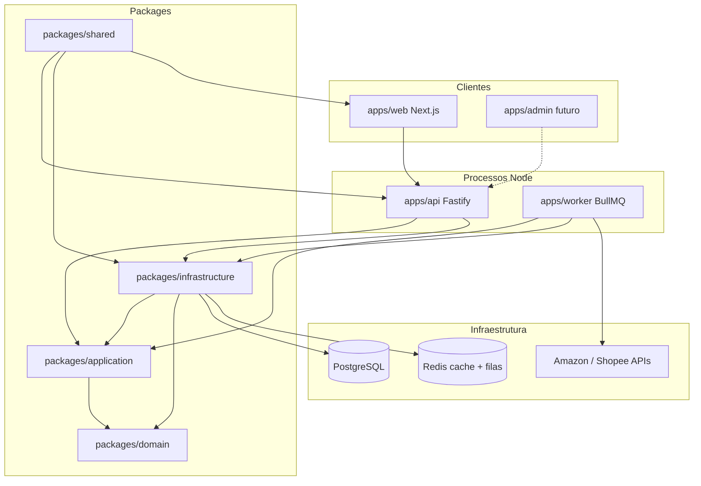

# Arquitetura — Clean Architecture

Plano de referência: [arquitetura_tecnica_node.plan.md](../.cursor/plans/arquitetura_tecnica_node.plan.md).

## Visão macro



**Invariante de negócio:** request HTTP do visitante **nunca** chama marketplace. Apenas `apps/worker` faz fetch externo.

## Monorepo

```
ecommerce-amazon/
├── apps/
│   ├── api/           # REST, leitura catálogo + escrita alertas/wishlist/eventos
│   ├── web/           # Next.js 15, vitrine CMS-driven
│   └── worker/        # BullMQ processors + schedulers
├── packages/
│   ├── domain/        # Entidades, VOs, enums, ports, eventos
│   ├── application/   # Use cases (1 classe = 1 caso de uso)
│   ├── infrastructure/# Drizzle, Redis, repositórios, filas, email
│   └── shared/        # Env Zod, schemas CMS, CORS, Logger, Result
├── docs/              # Documentação implementada
└── .cursor/plans/     # Especificação (não substitui docs/)
```

Ordem de build TypeScript: `domain` → `shared` → `application` → `infrastructure` → apps.

## Camadas e dependências

| Camada | Pacote / app | Pode importar | Não pode importar |
|--------|--------------|---------------|-------------------|
| Domain | `packages/domain` | — | Fastify, Drizzle, BullMQ, React |
| Application | `packages/application` | `domain`, `shared` | Fastify, Drizzle |
| Infrastructure | `packages/infrastructure` | `domain`, `application`, `shared` | `apps/*` |
| API adapter | `apps/api` | `application`, `infrastructure`, `shared`, `domain` | SQL direto |
| Worker adapter | `apps/worker` | idem API | SQL direto |
| Web | `apps/web` | `domain` (enums), `shared` (schemas CMS) | `infrastructure`, DB |

## Fluxo por request HTTP

```
Route (Fastify)
  → Zod parse (apps/api/adapters/dtos/request/schemas.ts)
  → Use Case (packages/application)
  → CacheStore get/set (opcional)
  → Repository port (packages/domain)
  → Drizzle repository (packages/infrastructure)
  → Presenter → JSON
```

Controllers são finos: sem lógica de negócio, sem SQL. Validação Zod **somente** na borda HTTP e em `shared` (env, CMS props).

## Injeção de dependências

- **API:** `ApiContainer` em `packages/infrastructure` — monta repositórios, cache, use cases
- **Worker:** `WorkerContainer` — idem + filas BullMQ, fetchers, email

Use cases recebem ports (interfaces) do domain, nunca implementações concretas.

## Cache Redis (leitura)

Padrão **cache-aside** nos use cases de leitura.

| Recurso | Chave exemplo | TTL |
|---------|---------------|-----|
| Page layout | `vitrine:page:slug:{slug}` | 300s (5 min) |
| Listagem produtos | versionada por `cache:version:product:{id}` | 5 min (ref.) |
| Detalhe produto | idem | 10 min (ref.) |
| Histórico preço | idem | 1h (ref.) |

Após write no worker: `CacheInvalidator` incrementa version stamp — não faz scan de chaves.

## Eventos de domínio

- `PriceDropped` — emitido por `Product.updatePrice()` quando preço cai
- Publicado via `EventBus` → fila `domain_events` (BullMQ)
- Handler assíncrono dispara alertas/email — **não** inline no processor de preço

## Testes

Vitest com dois projetos:

- **unit** — domain, use cases (mocks de ports)
- **integration** — API routes, repositórios (quando configurado)

```bash
npm run test          # todos
npm run test:unit
npm run test:integration
```

## Pacote `shared`

Responsabilidades transversais (sem lógica de negócio):

| Módulo | Path | Uso |
|--------|------|-----|
| Env | `packages/shared/src/index.ts` | `loadEnv()`, `DATABASE_URL`, `REDIS_URL` |
| CORS | `packages/shared/src/cors.ts` | `createCorsOriginDelegate()` |
| CMS schemas | `packages/shared/src/cms/block-schemas.ts` | Props por `BlockType`, `PageLayoutDto` |
| Result | `shared` | `ok()` / `err()` para use cases |

## Apps web — integração API

- `apps/web/src/lib/api/client.ts` — `apiFetch`, header `x-session-id`
- Schemas Zod espelham presenters da API: `apps/web/src/lib/api/schemas.ts`
- SSR Home: `revalidate: 60` no fetch de layout

## Próximos apps (planejados, não implementados)

| App | Função |
|-----|--------|
| `apps/admin` | CMS CRUD páginas/blocos, preview, publish |

Contrato admin descrito em [ui_home_vitrine.plan.md](../.cursor/plans/ui_home_vitrine.plan.md) — rotas `/admin/*` **não existem** na API atual.
