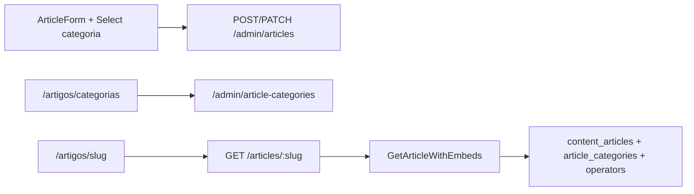

# Artigos — Categorias, Autores e Relacionados (fase 2)

## O quê

Taxonomia editorial de artigos (`article_categories`), perfil público de autor em `operators` (avatar, bio, role), seletor de categoria no admin e enriquecimento da página pública `/artigos/[slug]` com metadata header, author box e grid de artigos relacionados por categoria.

**Fora desta fase:** tags de artigos, índice `/artigos`, tela de edição de perfil do operador em `/configuracoes`.

## Por quê

Complementa [admin-articles-phase1.md](./admin-articles-phase1.md) e [articles-public-rendering.md](./articles-public-rendering.md) com autoridade editorial (E-E-A-T), organização por categoria e recirculação interna (≥3 links contextuais via artigos relacionados).

## Como funciona



1. Operador gerencia categorias em `/artigos/categorias` (CRUD via Sheet).
2. Ao criar artigo, `author_id` é definido server-side pelo JWT; categoria é opcional no formulário.
3. `GET /articles/:slug` retorna `author`, `category` e até 3 `relatedArticles` da mesma `category_id`.
4. A vitrine renderiza hero + corpo; rodapé minimal (`ArticlePostFooter`) com `#categoria` linkável, data e autor; listagem em `/artigos/categoria/[slug]`.

## Schema (migration `0013`)

| Tabela / coluna | Descrição |
|-----------------|-----------|
| `article_categories` | `id`, `name`, `slug` UNIQUE |
| `operators.avatar_url` | URL da foto do autor |
| `operators.bio` | varchar(250) |
| `operators.role` | enum `admin` \| `editor` |
| `content_articles.category_id` | FK → `article_categories`, ON DELETE SET NULL |

## Arquivos-chave

| Camada | Path |
|--------|------|
| Migration | `packages/infrastructure/src/persistence/drizzle/migrations/0013_article_taxonomy_authors.sql` |
| Schema | `packages/infrastructure/src/persistence/drizzle/schema/article-categories.ts` |
| Domain | `packages/domain/src/entities/ArticleCategory.ts`, `ContentArticle.categoryId` |
| Use cases | `packages/application/src/use-cases/admin-article-category/`, `GetArticleWithEmbeds.ts` |
| API admin | `apps/api/src/adapters/http/routes/admin-article-category-routes.ts` |
| Schemas | `packages/shared/src/admin/article-category-schemas.ts`, `article-schemas.ts` |
| Admin UI | `apps/admin/src/components/article-categories/`, `ArticleForm.tsx` |
| Web | `ArticlePostFooter.tsx`, `ArticleRelatedGrid.tsx` |

## API

### Admin — `/admin/article-categories`

| Método | Rota | Descrição |
|--------|------|-----------|
| GET | `/admin/article-categories` | `{ items: ArticleCategorySummary[] }` |
| POST | `/admin/article-categories` | `CreateArticleCategoryBody` → `{ id }` |
| PATCH | `/admin/article-categories/:id` | `UpdateArticleCategoryBody` → `204` |
| DELETE | `/admin/article-categories/:id` | `204` (409 se houver artigos vinculados) |

### Público — `GET /articles/:slug`

DTO estendido (`ArticlePublicDetail`):

- `author`: `{ name, avatarUrl, bio } | null`
- `category`: `{ name, slug } | null`
- `relatedArticles`: `[{ slug, title, coverImageUrl, publishedAt }]` (máx. 3)

`CreateArticleBody` / `UpdateArticleBody` aceitam `categoryId` opcional.

## Como rodar / testar

```bash
npm run db:migrate
npm run db:seed
npm run dev -w @ecommerce-amazon/api
npm run dev -w @ecommerce-amazon/admin
npm run dev -w @ecommerce-amazon/web
```

1. `/artigos/categorias` — criar categorias (ex.: Guias, Reviews).
2. Criar/editar artigo com categoria selecionada.
3. `/artigos/guia-cadeira-ergonomica` — badge, avatar do autor, author box, relacionados (se houver outros publicados na mesma categoria).

## Próximos passos

- Tags N:N para artigos
- Perfil do operador editável em `/configuracoes`
- Índice público `/artigos` com busca, categorias e paginação
