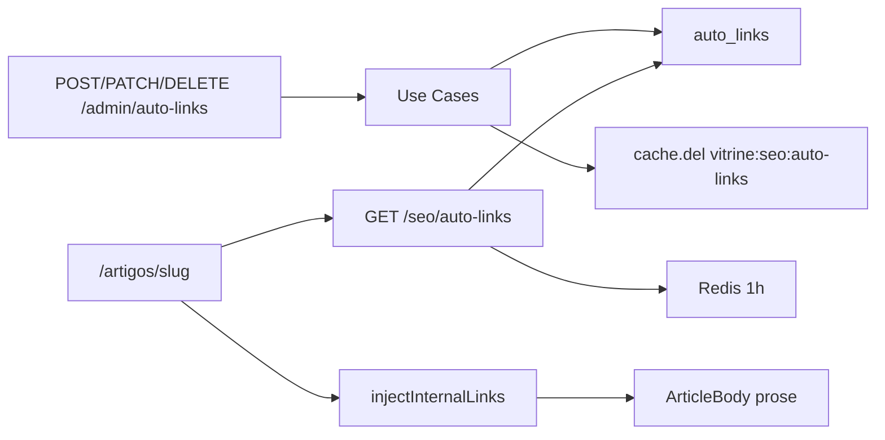

# Auto-Links — CRUD Admin + Parser SEO

Gestão de keywords para interlinkagem automática em artigos editoriais. A injeção ocorre **em runtime** na vitrine — o HTML do artigo no banco permanece intacto.

Plano de referência: [`.cursor/plans/auto-links_admin_api_41238b7c.plan.md`](../.cursor/plans/auto-links_admin_api_41238b7c.plan.md), UI: [`.cursor/plans/auto-links_admin_ui_b60bf533.plan.md`](../.cursor/plans/auto-links_admin_ui_b60bf533.plan.md).

## O quê foi entregue

### Backend

- Entidade `AutoLink` com `AutoLinkId` branded e validações de domínio
- Port `AutoLinkRepository` completo (CRUD + listagem paginada + ativos ordenados)
- `DrizzleAutoLinkRepository` com ordenação `priority DESC`, `LENGTH(keyword) DESC`
- Use cases admin: `CreateAutoLink`, `UpdateAutoLink`, `DeleteAutoLink`, `ListAutoLinksAdmin`
- API admin protegida por JWT: `POST/GET/PATCH/DELETE /admin/auto-links`
- Cache Redis `vitrine:seo:auto-links` (TTL 1h) com invalidação nas mutações
- Parser `injectInternalLinks` com sort defensivo, `maxMatches`, zonas protegidas (`<a>`, `<h1>`–`<h6>`, ``)

### UI admin (`apps/admin`)

- Rota **`/auto-links`** com item na sidebar (ícone Link2)
- Listagem paginada com busca por keyword/URL
- CRUD via Sheet lateral (`AutoLinkFormSheet`)
- **Picker híbrido de URL de destino** (`InternalLinkTargetPicker`): busca **server-side** via `GET /admin/internal-link-targets` com debounce; produtos e artigos só após ≥2 caracteres, limitados a 20 produtos por busca; categorias, coleções e taxonomias editoriais carregadas sob demanda
- Listagem exibe **label amigável** + tipo do destino quando resolvível (badge Manual para URLs externas/custom)
- Toggle **`is_active`** inline na listagem (PATCH imediato)
- BFF Next.js: `/api/admin/auto-links` e `/api/admin/auto-links/[id]`
- Atalho em **Artigos** → botão "Auto-Links"

## Fora de escopo

- Preview ao vivo do parser no admin
- Importação em massa (CSV/JSON)
- Migration UNIQUE em `keyword` (validação no use case)

## Como funciona



1. Operador cadastra keywords via API admin (sem alterar HTML dos artigos).
2. `GET /seo/auto-links` retorna regras ativas ordenadas por prioridade.
3. Na vitrine, `ArticleBody` chama `injectInternalLinks(body, autoLinks)` antes de parsear shortcodes.
4. Mutações admin invalidam cache para refletir na próxima leitura pública.

### Regras do parser

| Regra            | Comportamento                                        |
| ---------------- | ---------------------------------------------------- |
| Ordenação        | `priority DESC`, depois `keyword.length DESC`        |
| `maxMatches`     | Limite por regra no mesmo texto                      |
| Zonas protegidas | Não injeta em `<a>`, headings `<h1>`–`<h6>`, `` |
| Persistência     | HTML do artigo no DB **nunca** é modificado          |

## Arquivos-chave

| Camada           | Path                                                                                   |
| ---------------- | -------------------------------------------------------------------------------------- |
| Domain           | `packages/domain/src/entities/AutoLink.ts`                                             |
| Port             | `packages/domain/src/repositories/AutoLinkRepository.ts`                               |
| Infra            | `packages/infrastructure/src/persistence/repositories/drizzle-auto-link.repository.ts` |
| Use cases        | `packages/application/src/use-cases/auto-links/`                                       |
| Público          | `packages/application/src/use-cases/seo/ListActiveAutoLinks.ts`                        |
| Parser           | `packages/shared/src/seo/link-parser.ts`                                               |
| Cache key        | `packages/shared/src/seo/auto-links-cache.ts`                                          |
| Schemas admin    | `packages/shared/src/admin/auto-link-schemas.ts`                                       |
| API admin        | `apps/api/src/adapters/http/routes/admin-auto-link-routes.ts`                          |
| Admin UI         | `apps/admin/src/app/(dashboard)/auto-links/page.tsx`                                   |
| Admin BFF        | `apps/admin/src/app/api/admin/auto-links/`                                             |
| Admin components | `apps/admin/src/components/auto-links/`                                                |
| Picker helpers   | `apps/admin/src/lib/internal-link-targets.ts`                                          |
| Picker loader    | `apps/admin/src/lib/api/internal-link-targets-client.ts`                               |
| Search use case  | `packages/application/src/use-cases/auto-links/SearchInternalLinkTargets.ts`           |
| Vitrine          | `apps/web/src/components/articles/ArticleBody.tsx`                                     |

## API

### Público

| Método | Rota              | Resposta                                                    |
| ------ | ----------------- | ----------------------------------------------------------- |
| `GET`  | `/seo/auto-links` | `{ items: [{ keyword, targetUrl, maxMatches, priority }] }` |

Cache Redis: `vitrine:seo:auto-links`, TTL 3600s.

### Admin (Bearer JWT)

| Método   | Rota                    | Body / query                   | Status             |
| -------- | ----------------------- | ------------------------------ | ------------------ |
| `GET`    | `/admin/auto-links`     | `?page=&limit=&search=`        | 200 lista paginada |
| `POST`   | `/admin/auto-links`     | `CreateAutoLinkBody`           | 201 `{ id }`       |
| `PATCH`  | `/admin/auto-links/:id` | `UpdateAutoLinkBody` (parcial) | 204                |
| `DELETE` | `/admin/auto-links/:id` | —                              | 204                |

**Erros:** 400 validação, 404 não encontrado, 409 keyword duplicada.

## Como testar

```bash
npm run db:migrate && npm run db:seed
npm run dev:api    # :3000
npm run dev:admin  # :3002
npm run dev:web    # :3001

# Login admin
TOKEN=$(curl -s -X POST http://localhost:3000/admin/auth/login \
  -H 'Content-Type: application/json' \
  -d '{"email":"admin@vitrine.local","password":"vitrine-admin"}' | jq -r .token)

# Listar
curl -H "Authorization: Bearer $TOKEN" "http://localhost:3000/admin/auto-links?page=1&limit=20"

# Criar
curl -X POST http://localhost:3000/admin/auto-links \
  -H "Authorization: Bearer $TOKEN" \
  -H 'Content-Type: application/json' \
  -d '{"keyword":"setup gamer","targetUrl":"/colecoes/setup-gamer-iniciante","maxMatches":1,"priority":10}'

# Público (cache)
curl http://localhost:3000/seo/auto-links | jq

# Vitrine
open http://localhost:3001/artigos/guia-cadeira-ergonomica

# UI admin
open http://localhost:3002/auto-links
```

Checklist UI:

1. Login → sidebar **Auto-Links**
2. Criar keyword escolhendo destino via combobox (produto, categoria, coleção ou artigo)
3. Criar com toggle **URL manual** + link HTTPS externo
4. Listagem mostra label amigável + badge de tipo (ou Manual)
5. Toggle inativo na listagem
6. Buscar por keyword
7. Editar regra existente — destino resolvido corretamente no picker
8. Editar e excluir com confirmação
9. Keyword duplicada → toast de erro

```bash
npm test -- --run AutoLink auto-links link-parser
```

## Próximos passos

- Preview ao vivo do `injectInternalLinks` no admin
- Importação em massa de keywords
