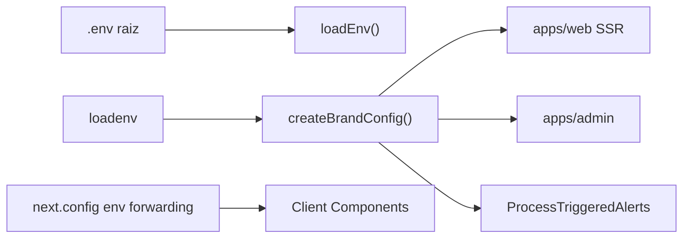

# Configuração centralizada de marca

Nome, URL, contato e redes sociais da vitrine vivem em um único módulo compartilhado, consumido por Web, Admin, API (via use cases) e seed.

## Por quê

Evitar strings `"Vitrine"` espalhadas em dezenas de arquivos. Alterar a marca em produção = ajustar `.env` e rebuild dos apps Next.js (client bundle).

## Onde está

| Artefato              | Path                                                                                                    |
| --------------------- | ------------------------------------------------------------------------------------------------------- |
| Módulo principal      | [`packages/shared/src/config/brand.ts`](../packages/shared/src/config/brand.ts)                         |
| Env tipado            | [`packages/shared/src/index.ts`](../packages/shared/src/index.ts) (`SITE_NAME`, `WEB_PUBLIC_URL`, etc.) |
| Web (server)          | [`apps/web/src/lib/site-url.ts`](../apps/web/src/lib/site-url.ts) → `getServerBrandConfig()`            |
| Admin (server/client) | [`apps/admin/src/lib/brand.ts`](../apps/admin/src/lib/brand.ts)                                         |

Import:

```typescript
import { getBrandConfig, formatWebPageTitle } from '@ecommerce-amazon/shared/config/brand';
import { loadEnv } from '@ecommerce-amazon/shared';

const brand = getBrandConfig(loadEnv()); // server / worker / use cases
```

Client Components (Next.js) — use `getClientBrandConfig()` (ignora `SITE_NAME` server-only; evita hydration mismatch):

```typescript
import { getClientBrandConfig } from '@ecommerce-amazon/shared/config/brand';

const brand = getClientBrandConfig(); // lê só NEXT_PUBLIC_* (forwarded em next.config.ts)
```

## Variáveis de ambiente

| Variável                | Default                         | Uso                                                                     |
| ----------------------- | ------------------------------- | ----------------------------------------------------------------------- |
| `SITE_NAME`             | `Vitrine`                       | Nome público (canônico server-side)                                     |
| `NEXT_PUBLIC_SITE_NAME` | —                               | Fallback para bundle client (forwarded de `SITE_NAME` no `next.config`) |
| `COMPANY_LEGAL_NAME`    | `Vitrine Ltda`                  | Rodapé/legal futuro                                                     |
| `CONTACT_EMAIL`         | `contato@vitrine.com.br`        | E-mails transacionais (conteúdo)                                        |
| `SITE_TAGLINE`          | `Curadoria inteligente`         | Subtítulo home/metadata                                                 |
| `WEB_PUBLIC_URL`        | `http://localhost:${WEB_PORT}`  | URL canônica server                                                     |
| `NEXT_PUBLIC_SITE_URL`  | —                               | URL pública Next (unificada com `WEB_PUBLIC_URL` no transform)          |
| `SITE_SOCIAL_INSTAGRAM` | `https://instagram.com/vitrine` | Redes sociais                                                           |
| `SITE_SOCIAL_TELEGRAM`  | `https://t.me/vitrine_ofertas`  | Redes sociais                                                           |

`EMAIL_FROM` permanece separado (remetente Resend).

## Helpers de copy

| Função                               | Exemplo                                         |
| ------------------------------------ | ----------------------------------------------- |
| `formatWebPageTitle(page, brand)`    | `Artigos \| Vitrine`                            |
| `formatWebHomeTitle(brand)`          | `Vitrine — Curadoria inteligente`               |
| `formatAdminPageTitle(page, brand)`  | `Produtos — Vitrine CMS`                        |
| `formatEditorialTeamName(brand)`     | `Redação Vitrine`                               |
| `formatCopyrightNotice(brand, year)` | `© 2026 Vitrine. Todos os direitos reservados.` |

## Fluxo



## Fora de escopo

- Cookie keys (`vitrine_session`), prefixos Redis (`vitrine:`) — identificadores técnicos
- Prompts LLM no admin
- Banner de cookies + Consent Mode (citado na política; implementação futura)

## Como testar

```bash
npm run build -w @ecommerce-amazon/shared
npm test -w @ecommerce-amazon/shared -- src/config/brand.test.ts
```

Altere `SITE_NAME=Minha Loja` no `.env`, reinicie API/worker e rebuild `apps/web` / `apps/admin` para ver o novo nome no header e metadata.
