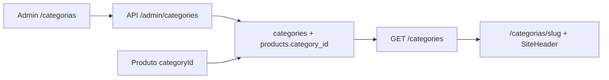

# Categorias hierárquicas (SEO + taxonomia)

Árvore de categorias com auto-relacionamento, metadados editoriais para páginas-ímã de tráfego e preparação para mapeamento de browse nodes (Amazon, Mercado Livre, Shopee).

## O quê foi entregue

- Tabela `categories` com hierarquia (`parent_id`), ordenação, SEO e IDs de marketplace
- `products.category_id` (FK) substituindo `category_vertical`
- Migration `0008_categories_hierarchy.sql` com backfill das 3 verticais legadas
- API pública: `GET /categories` (árvore), `GET /categories/:slug` (detalhe SEO)
- API admin: CRUD + reorder em `/admin/categories`
- Admin: tela `/categorias` com árvore visual e formulário SEO
- Produto: seletor cascata (`CategoryCascadeSelect`) amarrado à folha
- Vitrine: `/categorias/[slug]` SSR com metadata, JSON-LD, sidebar em árvore e grid de produtos
- Home CMS: pills em cascata (2ª fileira de subcategorias) filtrando a grade vinculada
- Header: mega menu multi-coluna (desktop) + drawer mobile com acordeão de categorias
- Breadcrumb de produto com links para `/categorias/{slug}`

## Por quê

Modelo plano (`category_vertical` string) não suportava subcategorias, páginas SEO de categoria nem de/para com browse nodes das APIs de afiliado.

## Como funciona



- Produto vincula-se à **folha** da árvore (validação no create/update)
- `GET /products?category=slug` filtra a **subárvore** (produtos em descendentes)
- Slug globalmente único → URL `/categorias/{slug}`

## Arquivos-chave

| Camada | Path |
|--------|------|
| Schema | `packages/infrastructure/src/persistence/drizzle/schema/categories.ts` |
| Migration | `packages/infrastructure/src/persistence/drizzle/migrations/0008_categories_hierarchy.sql` |
| Domain | `packages/domain/src/entities/Category.ts` |
| Repository | `packages/infrastructure/src/persistence/repositories/drizzle-category.repository.ts` |
| Use cases | `packages/application/src/use-cases/category/`, `admin-category/` |
| API | `apps/api/src/adapters/http/routes/index.ts`, `admin-category-routes.ts` |
| Admin UI | `apps/admin/src/app/(dashboard)/categorias/page.tsx` |
| Web pills | `apps/web/src/components/blocks/CategoryPillsRow.tsx` |
| Web sidebar | `apps/web/src/components/category/CategorySidebarTree.tsx` |
| Web header | `apps/web/src/components/layout/CategoryMegaMenu.tsx`, `MobileNavDrawer.tsx` |
| Tree helpers | `packages/shared/src/category/category-tree-nav.ts` |

## API (resumo)

### `GET /categories`

```typescript
{ items: Array<{ slug, label, icon?, productCount, subcategories? }> }
```

### `GET /categories/:slug`

Detalhe com `seoTitle`, `seoDescription`, `descriptionHtml`, `breadcrumbs`, `children`.

### Admin

- `GET /admin/categories` — árvore completa
- `POST /admin/categories` — criar
- `PATCH /admin/categories/:id` — editar
- `DELETE /admin/categories/:id` — excluir (sem filhos/produtos)
- `PATCH /admin/categories/reorder` — ordenação

## Como rodar / testar

```bash
# Aplicar migration
npm run db:migrate -w @ecommerce-amazon/infrastructure

# Seed (inclui árvore exemplo games → perifericos → teclados-mecanicos)
npm run db:seed -w @ecommerce-amazon/infrastructure

# Testes
npm run test -w @ecommerce-amazon/shared
npm run test -w @ecommerce-amazon/application
```

1. Admin → **Categorias** → criar subcategoria e preencher `descriptionHtml`
2. Admin → **Produtos** → selecionar categoria em cascata
3. Home → selecionar pill **Games** → segunda fileira com subcategorias; grade filtra por slug
4. Vitrine → `/categorias/home-office` → sidebar em árvore (desktop) + chips horizontais (mobile)
5. Header → hover em categoria raiz abre mega menu; mobile → ícone menu
6. `GET /products?category=games` deve incluir produtos em subcategorias

## Exposição na vitrine

| Ponto | Componente | Comportamento |
|-------|------------|---------------|
| Home pills | `CategoryPillsRow` | 1ª fileira = raízes CMS; 2ª fileira = filhos do pai ativo |
| Página categoria | `CategorySidebarTree` | Árvore lateral (lg+); chips horizontais em mobile |
| Header desktop | `CategoryMegaMenu` | Painel multi-coluna com até 3 níveis |
| Header mobile | `MobileNavDrawer` | Acordeão por categoria raiz |
| Produto | breadcrumb em `produtos/[slug]` | `Home > … > categoria > produto` |

## Próximos passos (fora desta entrega)

- Worker: auto-mapeamento `amazon_browse_node` → `category_id`
- Imagens no mega menu (hoje só `icon` textual/emoji)
- Paginação e filtros avançados na listagem de categoria
- Múltiplas categorias por produto (M:N)
