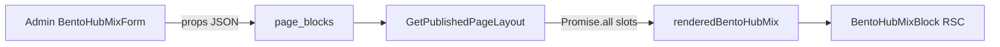

# CMS — Bloco Hub Bento Mix (`bento_hub_mix`)

## O quê

Bloco CMS de grid assimétrico (Bento) com **3 slots fixos** na Home:

| Slot | Tamanho (desktop) | Conteúdo                                | Comportamento na vitrine                        |
| ---- | ----------------- | --------------------------------------- | ----------------------------------------------- |
| 1    | 2×2               | Coleção curada **ou** artigo editorial  | Tile hero com cover, título e link              |
| 2    | 1×1               | Produto único                           | Card de oferta com badge de desconto automático |
| 3    | 1×1               | Categoria (Top 3) **ou** até 3 produtos | Mini-lista vertical com preço                   |

**Fora do escopo desta entrega:** countdown, cupons no hub, autocomplete server-side nos pickers, rota web `/artigos/[slug]` (link já aponta para ela; página de artigo virá no hub de conteúdo).

## Por quê

Combina tráfego editorial (SEO via artigo/coleção), conversão (oferta com desconto) e descoberta (mini-lista) num único quadrante — reduz “cegueira de banner” em relação a grades homogêneas.

## Como funciona



1. Operador configura os 3 slots no admin (`/paginas/home`).
2. Props validadas por `bentoHubMixPropsSchema` em `@ecommerce-amazon/shared/cms`.
3. A cada `GET /pages/:slug`, o BFF hidrata `renderedBentoHubMix` (não vai para cache Redis).
4. `BentoHubMixBlock` (Server Component) renderiza o grid com skeleton nos slots sem dados.

### Regras de preço (compliance)

- Slot 2: produto stale mantém card, sem badge de desconto; `PriceDisplay` mostra “Consultar preço atualizado”.
- Slot 3 (categoria): top 3 por score editorial entre produtos visíveis; preço stale oculta valor numérico mas mantém o item na lista (mesma regra do slot 2).
- Slot 3 (produtos manuais): mesma regra de preço; IDs inválidos são omitidos.

## Contrato de props

```typescript
{
  slot1: {
    contentType: 'collection' | 'article',
    entityId: uuid,
    title?: string,
    subtitle?: string,
    coverImageUrl?: string, // obrigatório se contentType === 'article'
  },
  slot2: { productId: uuid },
  slot3:
    | { contentType: 'category', categorySlug: string, listTitle?: string }
    | { contentType: 'products', productIds: uuid[] } // max 3
}
```

## API / endpoints novos

| Rota                  | Uso                                                                        |
| --------------------- | -------------------------------------------------------------------------- |
| `GET /admin/articles` | Picker de artigos publicados no admin (`{ items: [{ id, slug, title }] }`) |

Hidratação usa repositórios existentes (`findById`, `ListProducts`, `findByIds`) — sem rota pública nova.

## Arquivos-chave

| Camada         | Path                                                                                       |
| -------------- | ------------------------------------------------------------------------------------------ |
| Enum           | `packages/domain/src/enums/cms.ts`                                                         |
| Schema Zod     | `packages/shared/src/cms/block-schemas.ts`                                                 |
| Migration      | `packages/infrastructure/.../migrations/0010_bento_hub_mix.sql`                            |
| Hidratação BFF | `packages/application/src/use-cases/page/GetPublishedPageLayout.ts`                        |
| Artigos admin  | `packages/application/src/use-cases/content/ListAdminArticles.ts`                          |
| Web RSC        | `apps/web/src/components/blocks/BentoHubMixBlock.tsx`                                      |
| Admin form     | `apps/admin/src/components/cms/props-forms/BentoHubMixForm.tsx`                            |
| Seed           | `packages/infrastructure/src/persistence/drizzle/seed.ts` → `ensureBentoHubMixHomeBlock()` |

## Como testar

```bash
# Aplicar migration + seed (inclui bloco na home)
npm run db:setup

# Testes de schema e hidratação
npm run test --workspace=@ecommerce-amazon/shared -- block-schemas
npm run test --workspace=@ecommerce-amazon/application -- GetPublishedPageLayout

# Subir stack e validar
npm run dev
```

1. **Vitrine:** `http://localhost:3001` — seção Bento após “Categorias populares”.
2. **Admin:** `http://localhost:3002/paginas/home` → adicionar ou editar bloco “Hub Bento Mix”; conferir pré-visualização no Sheet.
3. **API:** `GET /pages/home` deve retornar `renderedBentoHubMix` no bloco correspondente.

## Próximos passos

- Página web `/artigos/[slug]` para destinos do slot 1 (artigo).
- Busca server-side (`?q=`) nos pickers quando o catálogo crescer.
- Testes E2E do layout responsivo (mobile stack vs desktop 2×2).
