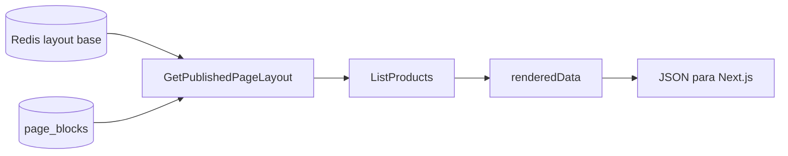

# CMS — Blocos dinâmicos (Fase 2)

Extensão do CMS com blocos orientados a queries de catálogo, use cases Admin (application) e hidratação BFF na entrega pública.

| Referência | Arquivo |
|------------|---------|
| Fase 1 | [cms-home-phase1.md](./cms-home-phase1.md) |
| Schemas Zod | [`packages/shared/src/cms/block-schemas.ts`](../packages/shared/src/cms/block-schemas.ts) |
| Admin use cases | [`packages/application/src/use-cases/admin-cms/`](../packages/application/src/use-cases/admin-cms/) |
| BFF entrega | [`GetPublishedPageLayout.ts`](../packages/application/src/use-cases/page/GetPublishedPageLayout.ts) |

## Escopo entregue

- `BlockType.DYNAMIC_PRODUCT_GRID` + migration `0003_dynamic_product_grid.sql`
- `DynamicProductGridPropsSchema` e `BlockPropsResolver` (discriminador Zod por tipo)
- DTOs de entrega: `PageBlockDeliveryDto`, `ProductDeliveryItem` com `renderedData` opcional
- Port `PageCacheInvalidator` + mutações em `PageRepository` (save, delete, reorder)
- Use cases Admin: `SavePageBlock`, `DeletePageBlock`, `UpdatePageBlocksOrder` (`Result<T, E>`)
- `GetPublishedPageLayout` hidrata blocos dinâmicos via `ListProducts` (preços stale → `amount: null`, `shouldShowPrice: false`)
- Filtros de catálogo: `minDiscountPercentage`, sorts `created_at`, `price_asc`, `price_desc`
- DI em `api-container.ts` (sem rotas HTTP Admin)

## Fora de escopo

- Rotas REST `POST/PATCH /admin/pages/*`
- Componente web `DynamicProductGridBlock` + registro no `BlockRegistry`
- Home (`apps/web`) busca layout com `cache: 'no-store'` para refletir edições do admin imediatamente
- `apps/admin` UI e autenticação

## Fluxo BFF (GET /pages/:slug)



1. Cache hit/miss carrega layout **sem** `renderedData`.
2. Para cada bloco `dynamic_product_grid`, executa query de catálogo com props validadas.
3. Produtos mapeados via `toProductDeliveryItem` respeitam `Product.shouldShowPrice`.
4. Resposta final inclui `renderedData` volátil (não cacheada).

## Props — `DYNAMIC_PRODUCT_GRID`

| Campo | Tipo | Notas |
|-------|------|-------|
| `title` | string 3–60 | obrigatório |
| `subtitle` | string? | |
| `categoryVertical` | string? | ex.: `home-office` |
| `minDiscountPercentage` | number 0–100? | requer `price_strikethrough` no produto |
| `sortBy` | enum | default `editorial_score` |
| `limit` | int 1–24 | default 8 |

## Use cases Admin

Todos retornam `Result<T, ValidationError | EntityNotFoundError>`.

| Use case | Input principal | Efeito |
|----------|-----------------|--------|
| `SavePageBlock` | `pageId`, `blockId?`, `type`, `position`, `props` | Valida props, upsert bloco, invalida cache |
| `DeletePageBlock` | `blockId` | Remove bloco, reindexa `sortOrder`, invalida cache |
| `UpdatePageBlocksOrder` | `pageId`, `blocksOrder[]` | Reordena em transação, invalida cache |

`position` no input Admin mapeia para `sortOrder` no banco.

## Como testar

```bash
npm run db:migrate
npm run db:seed   # inclui bloco dynamic na home (novos seeds)
npm run build -w @ecommerce-amazon/shared -w @ecommerce-amazon/domain -w @ecommerce-amazon/application -w @ecommerce-amazon/api
npx vitest run packages/shared packages/application
curl http://localhost:3000/pages/home | jq '.blocks[] | select(.type=="dynamic_product_grid")'
```

Seed existente sem re-seed: inserir bloco manualmente ou `SEED_FORCE=true npm run db:seed`.

## Próximos passos

- Rotas Admin REST + `apps/admin`
- Componente `DynamicProductGridBlock` no Next.js
- Hidratação de outros blocos dinâmicos (cupons, coleções)
