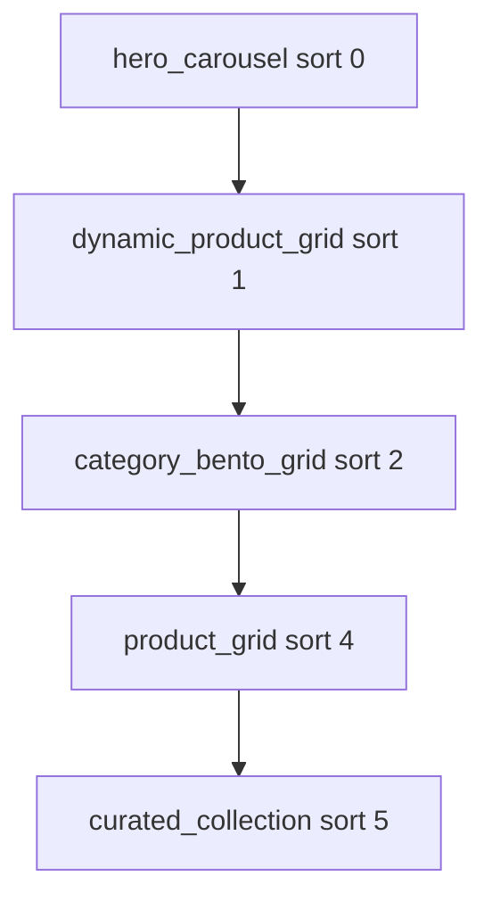

# Home — Ofertas Relâmpago (layout editorial)

Substituição do bloco `featured_product` / `hero_split` por carrossel de promoções com foco em escassez honesta.

| Referência | Arquivo |
|------------|---------|
| Blocos dinâmicos | [cms-dynamic-blocks-phase2.md](./cms-dynamic-blocks-phase2.md) |
| Home fase 1 | [cms-home-phase1.md](./cms-home-phase1.md) |

## Escopo entregue

- Layout da Home reordenado: **Hero Editorial** → **Ofertas Relâmpago** → **Categorias populares** → **Produtos populares**
- Remoção do `hero_split` + `featured_product` do seed e migração idempotente (`ensureFlashDealsHomeLayout`)
- Bloco `dynamic_product_grid` renderizado como **carrossel** (mesmo padrão de `product_grid`)
- Ordenação `discount_percent_desc` + filtro `minDiscountPercentage` (default seed: ≥30%)
- Preços stale excluídos do carrossel de ofertas (`freshPriceOnly` no repositório)
- Badge `−X%` nos cards quando o bloco enfatiza desconto (sem countdown falso)

## Fora de escopo

- Countdown ou estoque inventado
- Novo `BlockType` dedicado (reutiliza `dynamic_product_grid`)
- Remoção do tipo `featured_product` do CMS (ainda disponível no admin para outras páginas)

## Fluxo



1. `GET /pages/home` hidrata `dynamic_product_grid` via `ListProducts` com `sort: discount_percent_desc`, `minDiscountPercentage: 30`, `freshPriceOnly: true`.
2. `DynamicProductGridBlock` mapeia `renderedData` → `ProductCarousel` com `emphasizeDiscount`.
3. Produtos sem preço fresh ou com desconto &lt; threshold não entram na lista.

## Props do bloco (seed)

```typescript
{
  title: 'Ofertas Relâmpago',
  subtitle: 'Maiores descontos detectados nas últimas horas — confira antes que o preço suba',
  minDiscountPercentage: 30,
  sortBy: 'discount_percent_desc',
  limit: 12,
}
```

## Arquivos-chave

| Camada | Path |
|--------|------|
| Sort enum | `packages/domain/src/enums/cms.ts` |
| Query desconto | `packages/infrastructure/.../drizzle-product.repository.ts` |
| BFF hidratação | `packages/application/src/use-cases/page/GetPublishedPageLayout.ts` |
| Carrossel compartilhado | `apps/web/src/components/product/ProductCarousel.tsx` |
| Bloco web | `apps/web/src/components/blocks/DynamicProductGridBlock.tsx` |
| Seed / migração | `packages/infrastructure/src/persistence/drizzle/seed.ts` |

## Como testar

```bash
npm run db:seed
npm run dev:api   # :3000
npm run dev:web   # :3001
```

1. Abrir http://localhost:3001 — hero editorial no topo, sem card lateral achatado.
2. Seção **Ofertas Relâmpago** logo abaixo, carrossel horizontal com badges `−X%`.
3. **Categorias populares** (bento) em seguida.
4. **Produtos populares** por último (com pills de filtro no cabeçalho).

```bash
curl http://localhost:3000/pages/home | jq '.blocks[] | {type, sortOrder, title: .props.title}'
```

## Próximos passos

- Link “Ver todas as ofertas” opcional no bloco dinâmico
- Threshold de desconto configurável por marketplace no admin
