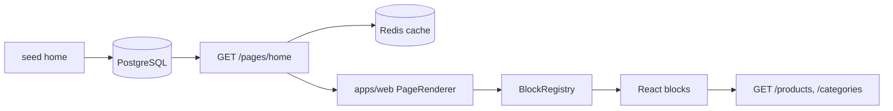

# CMS Home — Fase 1

Home **100% dirigida por CMS** (sem Admin UI). Plano de referência: [ui_home_vitrine.plan.md](../.cursor/plans/ui_home_vitrine.plan.md).

## Escopo entregue

- Domain `PageLayout` + `PageBlock` + `BlockType`
- Migration Drizzle `pages` / `page_blocks` + seed layout ESTORE (`home`)
- `GET /pages/:slug` com cache Redis (TTL 5 min)
- `apps/web`: PageRenderer, BlockRegistry, blocos, wishlist, click tracking
- Gaps API: `GET /categories`, wishlist enriquecido, `sort` em produtos, CORS

## Fora de escopo (fase 1)

- `apps/admin` — CRUD, drag-and-drop, publish/draft (fase 3)
- Páginas `/produtos/[slug]`, artigos, coleções dedicadas (fase 2)
- Blocos `curated_collection` e `coupon_strip` — stub UI apenas

## Fluxo



1. Seed insere layout publicado `home` com blocos ordenados.
2. SSR da Home chama `GET /pages/home` (revalidate 60s).
3. `PageRenderer` renderiza blocos top-level; filhos de `hero_split` são compostos por ID.
4. Blocos de produto buscam catálogo vivo via API (preço, stale, etc.).

## Modelo de dados

### Entidades (`packages/domain`)

- **PageLayout:** `slug`, `title`, `status`, `seoTitle?`, `seoDescription?`
- **PageBlock:** `pageId`, `type`, `sortOrder`, `props` (JSON), `visibility`

### BlockType

| Tipo | Componente web | Dados dinâmicos |
|------|----------------|-----------------|
| `hero_split` | `HeroSplitBlock` | Compõe blocos por `leftBlockId` / `rightBlockId` |
| `hero_carousel` | `HeroCarouselBlock` | Props estáticas (slides) |
| `featured_product` | `FeaturedProductBlock` | `GET /products/:slug` |
| `category_pills` | `CategoryPillsBlock` | `GET /categories` + contexto filtro |
| `product_grid` | `ProductGridBlock` | `GET /products?...` |
| `rich_text`, `banner`, `spacer` | respectivos | Props estáticas |
| `curated_collection`, `coupon_strip` | stub | Fase 2 |

Schemas Zod por tipo: [`packages/shared/src/cms/block-schemas.ts`](../packages/shared/src/cms/block-schemas.ts).

## Seed Home (ordem)

| sortOrder | type | Notas |
|-----------|------|-------|
| 0 | `hero_split` | ratio 2/1 → carousel + featured |
| 1 | `hero_carousel` | slides setup-gamer / home-office |
| 2 | `featured_product` | `cadeira-ergonomica-home-office` |
| 3 | `category_pills` | home-office, games, eletronicos |
| 4 | `product_grid` | 12 produtos, 4 colunas |

Alterar seed + `npm run db:seed` muda a Home sem deploy de React.

## API

### `GET /pages/:slug`

Retorna `PageLayoutDto` ou 404 se não publicado.

```typescript
{
  slug: string;
  title: string;
  seoTitle?: string;
  seoDescription?: string;
  blocks: Array<{
    id: string;
    type: BlockType;
    sortOrder: number;
    visibility: 'all' | 'desktop' | 'mobile';
    props: unknown; // validado por Zod no use case
  }>;
}
```

Use case: [`GetPublishedPageLayout`](../packages/application/src/use-cases/page/GetPublishedPageLayout.ts).

### Endpoints usados pelo web

| Rota | Uso |
|------|-----|
| `GET /pages/home` | Layout CMS |
| `GET /products`, `GET /products/:slug` | Grid e destaque |
| `GET /categories` | Labels das pills |
| `GET/POST/DELETE /wishlist` | Drawer global |
| `POST /events/click` | Tracking CTA (origem `listagem`) |

## apps/web

### Estrutura

```
apps/web/src/
  app/page.tsx              # SSR → PageRenderer
  components/cms/
    PageRenderer.tsx        # Ordena blocos; oculta filhos de hero_split
    BlockRegistry.tsx       # BlockType → componente
    CategoryFilterContext.tsx
  components/blocks/        # Um arquivo por BlockType
  components/product/       # ProductCard, PriceDisplay, MarketplaceBadge
  components/wishlist/      # Provider + Drawer
  lib/api/                  # client, schemas Zod, events
  lib/session.ts            # Cookie vitrine_session
```

### Padrões UX

- Preço stale: `PriceDisplay` oculta valor numérico
- CTA: "Ver na Amazon/Shopee" — cenário B abre nova aba + `POST /events/click`
- Session anônima via cookie; header `x-session-id` nas rotas de wishlist
- Grid "Produtos populares": card enxuto (preço, título, CTA — sem badge/rating)

### Design tokens (`globals.css`)

- Fundo `#F7F7F7`, primary `#111111`, radius `1rem`
- Elementos clicáveis: `cursor: pointer` global

## Como testar

```bash
npm run db:setup
npm run dev:api
npm run dev:web
# http://localhost:3001
```

1. Home renderiza hero split + pills + grid.
2. Pills filtram grid (client-side via context).
3. Coração adiciona à wishlist; drawer agrupa por marketplace.
4. CTA dispara nova aba + evento de clique.

## Próxima fase

- `/produtos/[slug]`, `/c/[slug]`, artigos
- Admin CMS (`apps/admin`): CRUD blocos, reorder, preview, publish

Contrato admin documentado no plano; rotas `/admin/*` **não implementadas**.
