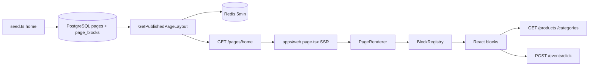

# CMS Home — Fase 1

Home **100% dirigida por CMS** (sem Admin UI).

| Referência | Arquivo |
|------------|---------|
| Plano UI | [ui_home_vitrine.plan.md](../.cursor/plans/ui_home_vitrine.plan.md) |
| Schemas Zod | [`packages/shared/src/cms/block-schemas.ts`](../packages/shared/src/cms/block-schemas.ts) |
| Domain | [domain-model.md](./domain-model.md) |
| API | [api-rest.md](./api-rest.md) § CMS |
| DB | [database-schema.md](./database-schema.md) § CMS |

## Escopo entregue

- Domain `PageLayout` + `PageBlock` + enums `BlockType`, `PageStatus`, `BlockVisibility`
- Migration Drizzle `pages` / `page_blocks` (`0001_cms_pages.sql`) + seed layout `home`
- `GET /pages/:slug` com cache Redis (TTL 5 min) e validação Zod de `props` por bloco
- `apps/web`: PageRenderer, BlockRegistry, 10 componentes de bloco, wishlist, click tracking
- Gaps API: `GET /categories`, wishlist enriquecido, `sort` em produtos, CORS

## Fora de escopo (fase 1)

| Item | Fase |
|------|------|
| `apps/admin` — CRUD, drag-and-drop, publish/draft | 3 |
| `/produtos/[slug]`, artigos, coleções dedicadas | 2 |
| Blocos `curated_collection` e `coupon_strip` com dados reais | 2 (stub UI) |
| Rotas `POST/PATCH /admin/pages/*` | Admin |

## Fluxo end-to-end



1. Seed insere layout `published` slug `home` com blocos ordenados.
2. SSR da Home (`apps/web/src/app/page.tsx`) chama `GET /pages/home` (`revalidate: 60`).
3. Use case valida cada `props` com Zod (`parseBlockProps`) antes de cachear.
4. `PageRenderer` renderiza blocos top-level; filhos referenciados por `hero_split` são compostos internamente.
5. Blocos de produto buscam catálogo vivo (preço, stale, affiliate URL).

## Modelo de dados

### Entidades domain

**PageLayout** — [`PageLayout.ts`](../packages/domain/src/entities/PageLayout.ts)

| Campo | Tipo |
|-------|------|
| `id` | uuid |
| `slug` | string (`home`) |
| `title` | string |
| `status` | `PageStatus` (`draft` \| `published`) |
| `seoTitle`, `seoDescription` | string? |
| `publishedAt`, `updatedAt` | Date |

**PageBlock** — [`PageBlock.ts`](../packages/domain/src/entities/PageBlock.ts)

| Campo | Tipo |
|-------|------|
| `id` | uuid |
| `pageId` | uuid FK |
| `type` | `BlockType` |
| `sortOrder` | number |
| `props` | `Record<string, unknown>` |
| `visibility` | `BlockVisibility` (`all` \| `desktop` \| `mobile`) |

### Port `PageRepository`

```typescript
interface PageRepository {
  findPublishedBySlug(slug: string): Promise<{
    layout: PageLayout;
    blocks: PageBlock[];
  } | null>;
}
```

Implementação: [`drizzle-page.repository.ts`](../packages/infrastructure/src/persistence/repositories/drizzle-page.repository.ts).

### DTOs compartilhados (`packages/shared`)

```typescript
// pageLayoutDtoSchema / pageBlockDtoSchema
type PageLayoutDto = {
  slug: string;
  title: string;
  seoTitle?: string;
  seoDescription?: string;
  blocks: PageBlockDto[];
};

type PageBlockDto = {
  id: string;
  type: BlockType;
  sortOrder: number;
  visibility: 'all' | 'desktop' | 'mobile';
  props: unknown;
};
```

`parseBlockProps(type, props)` — valida e normaliza defaults Zod por tipo.

## Catálogo `BlockType`

| BlockType | Componente React | Props schema | Dados dinâmicos |
|-----------|------------------|--------------|-----------------|
| `hero_split` | `HeroSplitBlock` | `heroSplitPropsSchema` | Compõe blocos por ID |
| `hero_carousel` | `HeroCarouselBlock` | `heroCarouselPropsSchema` | Estático (slides) |
| `featured_product` | `FeaturedProductBlock` | `featuredProductPropsSchema` | `GET /products/:slug` |
| `category_pills` | `CategoryPillsBlock` | `categoryPillsPropsSchema` | `GET /categories` + context |
| `product_grid` | `ProductGridBlock` | `productGridPropsSchema` | `GET /products?...` |
| `rich_text` | `RichTextBlock` | `richTextPropsSchema` | HTML estático |
| `banner` | `BannerBlock` | `bannerPropsSchema` | Imagem + link |
| `spacer` | `SpacerBlock` | `spacerPropsSchema` | Espaçamento |
| `curated_collection` | `CuratedCollectionBlock` | `curatedCollectionPropsSchema` | **Stub** — fase 2 |
| `coupon_strip` | `CouponStripBlock` | `couponStripPropsSchema` | **Stub** — fase 2 |

## Schemas Zod — props por bloco

Fonte: [`block-schemas.ts`](../packages/shared/src/cms/block-schemas.ts).

### `hero_carousel`

```typescript
{
  slides: Array<{
    imageUrl: string;      // URL
    title: string;         // min 1
    subtitle?: string;
    ctaLabel?: string;
    ctaHref?: string;
    linkedProductSlug?: string;
  }>;                      // min 1 slide
  autoplay: boolean;       // default true
  intervalMs: number;      // default 5000
}
```

### `featured_product`

```typescript
{
  productSlug?: string;           // min 1 — preferido no seed
  productId?: string;             // uuid — alternativa
  showMarketplaceBadge: boolean;  // default true
  ctaLabel?: string;              // ex.: "Ver na Amazon"
}
```

### `product_grid`

```typescript
{
  title: string;
  categorySlug?: string | null;
  marketplace?: 'amazon_br' | 'shopee_br';
  sort: 'editorial_score' | 'price_updated_at';  // default editorial_score
  pageSize: number;    // 4–24, default 12
  columns: 2 | 4;    // default 4
}
```

### `category_pills`

```typescript
{
  title?: string;
  categorySlugs: string[];   // min 1
  linkedBlockId?: string;    // uuid — sincroniza filtro com grid vizinho
}
```

### `hero_split`

```typescript
{
  ratio: '2/1' | '1/1';      // default '2/1'
  leftBlockId: string;       // uuid
  rightBlockId: string;      // uuid
}
```

Blocos referenciados **permanecem** na lista `blocks` da API mas **não** são renderizados no top-level — apenas dentro do split.

### `curated_collection` (stub)

```typescript
{ collectionSlug: string; layout: 'carousel' | 'grid'; }
```

### `coupon_strip` (stub)

```typescript
{ marketplace?: 'amazon_br' | 'shopee_br'; maxItems: number; }  // default 5
```

### `rich_text`

```typescript
{ html: string; align: 'left' | 'center' | 'right'; }
```

### `banner`

```typescript
{ imageUrl: string; href: string; alt: string; }
```

### `spacer`

```typescript
{ size: 'sm' | 'md' | 'lg'; }
```

### `BlockPropsMap`

Mapa tipado TypeScript ligando cada `BlockType` ao tipo inferido do schema — usado para type-safety em código que conhece o tipo em compile-time.

## Seed Home — IDs e ordem

Arquivo: [`seed.ts`](../packages/infrastructure/src/persistence/drizzle/seed.ts) → `seedHomePage()`.

| UUID fixo | type | sortOrder | Notas |
|-----------|------|-----------|-------|
| `f2111111-1111-4111-8111-111111111111` | `hero_split` | 0 | ratio 2/1 |
| `f3111111-1111-4111-8111-111111111111` | `hero_carousel` | 1 | filho esquerdo |
| `f4111111-1111-4111-8111-111111111111` | `featured_product` | 2 | filho direito |
| `f5111111-1111-4111-8111-111111111111` | `category_pills` | 3 | linked → grid |
| `f6111111-1111-4111-8111-111111111111` | `product_grid` | 4 | 12 produtos, 4 col |

Page: `f1111111-1111-4111-8111-111111111111`, slug `home`, status `published`.

Alterar seed + `npm run db:seed` muda a Home **sem** deploy de React.

## API

Ver [api-rest.md](./api-rest.md). Resumo:

- `GET /pages/home` → `PageLayoutDto`
- 404 se slug sem layout `published`
- Cache: `vitrine:page:slug:home`, 300s

Use case: [`GetPublishedPageLayout.ts`](../packages/application/src/use-cases/page/GetPublishedPageLayout.ts).

### Endpoints consumidos pelo web na Home

| Rota | Componente / uso |
|------|------------------|
| `GET /pages/home` | SSR `page.tsx` |
| `GET /products`, `GET /products/:slug` | `ProductGridBlock`, `FeaturedProductBlock` |
| `GET /categories` | `CategoryPillsBlock` (labels) |
| `GET/POST/DELETE /wishlist` | `WishlistProvider` + `WishlistDrawer` |
| `POST /events/click` | CTA marketplace (`origin: listagem`) |

## apps/web — estrutura

```
apps/web/src/
  app/
    page.tsx                    # SSR → fetch layout → PageRenderer
    layout.tsx                  # shell, providers, disclaimer
    providers.tsx               # TanStack Query, wishlist
    globals.css                 # design tokens
  components/cms/
    PageRenderer.tsx            # top-level blocks, hero_split children
    BlockRegistry.tsx           # BlockType → React component
    CategoryFilterContext.tsx   # filtro client-side pills → grid
  components/blocks/
    HeroSplitBlock.tsx
    HeroCarouselBlock.tsx
    FeaturedProductBlock.tsx
    CategoryPillsBlock.tsx
    ProductGridBlock.tsx
    RichTextBlock.tsx
    BannerBlock.tsx
    SpacerBlock.tsx
    CuratedCollectionBlock.tsx  # stub
    CouponStripBlock.tsx        # stub
  components/product/
    ProductCard.tsx
    PriceDisplay.tsx
    MarketplaceBadge.tsx
  components/wishlist/
    WishlistProvider.tsx
    WishlistDrawer.tsx
  components/layout/
    AffiliateDisclaimer.tsx
  lib/
    api/client.ts               # apiFetch, x-session-id
    api/schemas.ts              # Zod DTOs produtos/wishlist/categories
    api/events.ts               # recordClick()
    session.ts                  # cookie vitrine_session
    format.ts                   # preço pt-BR
```

## Interfaces React

### `BlockComponentProps`

```typescript
// BlockRegistry.tsx
type BlockComponentProps = {
  block: PageBlockDto;
  blocksById: Map<string, PageBlockDto>;
};
```

Todo bloco recebe o DTO e mapa de blocos (necessário para `hero_split` resolver filhos).

### `BlockRegistry`

```typescript
const BlockRegistry: Record<BlockType, ComponentType<BlockComponentProps> | undefined>;
```

Registro estático `BlockType` → componente. Novo bloco = enum + schema Zod + componente + entrada no registry — **sem** alterar `PageRenderer`.

### `PageRenderer` — lógica de composição

```typescript
// 1. Mapa id → block
// 2. collectChildBlockIds: hero_split → leftBlockId + rightBlockId
// 3. topLevel = blocks onde id ∉ childIds, ordenados por sortOrder
// 4. CategoryFilterProvider envolve tudo (pills ↔ grid)
```

Arquivo: [`PageRenderer.tsx`](../apps/web/src/components/cms/PageRenderer.tsx).

### `CategoryFilterContext`

Estado client-side: categoria selecionada nas pills propaga para `ProductGridBlock` com `linkedBlockId` correspondente.

## Padrões UX (regras de conversão)

| Regra | Implementação |
|-------|---------------|
| Preço stale | `PriceDisplay` oculta valor numérico (`amount: null`) |
| CTA transparente | "Ver na Amazon" / "Ver na Shopee" — nunca "Comprar agora" |
| Cenário B | Nova aba + `POST /events/click` antes do redirect |
| Disclaimer | `AffiliateDisclaimer` visível com CTA comercial |
| Session anônima | Cookie `vitrine_session` → header `x-session-id` |
| Grid popular | Card enxuto: preço, título, CTA — sem badge/rating na listagem |
| Links afiliado | `rel="noopener sponsored"` nos CTAs |

Regra Cursor: [`.cursor/rules/06-ux-conversion.mdc`](../.cursor/rules/06-ux-conversion.mdc).

## Design tokens (`globals.css`)

| Token | Valor |
|-------|-------|
| Fundo | `#F7F7F7` |
| Primary | `#111111` |
| Radius | `1rem` |
| Cursor | `pointer` em elementos clicáveis (global) |

Stack: Next.js 15, Tailwind, shadcn/ui, TanStack Query.

## Session e wishlist

[`session.ts`](../apps/web/src/lib/session.ts):

- Cookie `vitrine_session` (UUID)
- Fallback se `crypto.randomUUID` indisponível (HTTP via IP)
- Enviado como `x-session-id` nas rotas de wishlist

[`WishlistProvider.tsx`](../apps/web/src/components/wishlist/WishlistProvider.tsx): toggle coração no card, drawer lateral agrupado por marketplace.

## Click tracking

[`events.ts`](../apps/web/src/lib/api/events.ts) → `POST /events/click`:

```typescript
{ productId, origin: 'listagem', sessionId? }
```

## Como testar

```bash
npm run db:setup
npm run dev:api    # :3000
npm run dev:web    # :3001
```

Abrir http://localhost:3001

**Checklist:**

1. Home renderiza hero split (carrossel + destaque).
2. Pills filtram grid (client-side).
3. Coração adiciona à wishlist; drawer lista itens por marketplace.
4. CTA abre nova aba e registra clique.
5. Produto com `stale_price` não mostra valor numérico.

**API direta:**

```bash
curl http://localhost:3000/pages/home | jq .
curl http://localhost:3000/categories | jq .
curl http://localhost:3000/products?sort=editorial_score | jq .
```

## Próxima fase

| Entrega | Doc / plano |
|---------|-------------|
| `/produtos/[slug]` | PRD Core |
| `/c/[slug]`, artigos | PRD Growth |
| Admin CMS | [ui_home_vitrine.plan.md](../.cursor/plans/ui_home_vitrine.plan.md) § Admin |
| Blocos coleção/cupom reais | PRD Growth + API `/collections`, `/coupons` |

Contrato admin (preview, publish, reorder) documentado no plano UI — **não implementado**.
