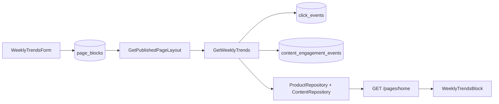

# CMS — Bloco Tendências da Semana

Bloco `weekly_trends` na home CMS: ranking automático dos últimos 7 dias com alternância Produtos / Artigos.

| Referência | Arquivo |
|------------|---------|
| Plano | [`.cursor/plans/cms_weekly_trends_block_9184fe13.plan.md`](../.cursor/plans/cms_weekly_trends_block_9184fe13.plan.md) |
| CMS Fase 1 | [cms-home-phase1.md](./cms-home-phase1.md) |
| Schemas | [`packages/shared/src/cms/block-schemas.ts`](../packages/shared/src/cms/block-schemas.ts) |
| Use case | [`GetWeeklyTrends.ts`](../packages/application/src/use-cases/trends/GetWeeklyTrends.ts) |
| BFF | [`GetPublishedPageLayout.ts`](../packages/application/src/use-cases/page/GetPublishedPageLayout.ts) |

## O quê

- Novo `BlockType.WEEKLY_TRENDS` com props configuráveis no admin (`/paginas/home`)
- Hidratação BFF em `GET /pages/:slug` via `renderedWeeklyTrends`
- UI na vitrine: título, subtítulo honesto, segmented control Produtos/Artigos, carrosséis reutilizando `ProductCarousel` e `ArticleCarousel`
- Telemetria: placement `cms.weekly_trends` em cliques afiliados e engagement de artigos

## Por quê

Liga vitrine (produtos por cliques) ao hub editorial (artigos por leituras), usando telemetria first-party já existente — sem GA4 na vitrine nem curadoria manual diária.

## Métricas e limitações

| Aba | Tabela | Métrica | Janela |
|-----|--------|---------|--------|
| Produtos | `click_events` | cliques afiliados (`origin != redirect_go`) | 7 dias rolling |
| Artigos | `content_engagement_events` | `article_page_view` | 7 dias rolling |

**Não inclui (MVP):** page views de produto, velocidade semana-a-semana, badges de urgência, ranking exibido ao visitante.

**Cold start:** bloco oculto na vitrine se ambas as abas tiverem menos que `minItems` (default 3).

## Props (`weeklyTrendsPropsSchema`)

| Campo | Default | Notas |
|-------|---------|-------|
| `title` | `Tendências da semana` | 3–60 chars |
| `subtitle` | — | Se vazio: *"Baseado na atividade dos últimos 7 dias"* |
| `defaultTab` | `products` | `products` \| `articles` |
| `showTabToggle` | `true` | Oculta alternância se só uma aba tem dados |
| `limit` | `8` | 4–12 itens por aba |
| `minItems` | `3` | Mínimo para exibir cada aba |
| `productsCtaHref` / `productsCtaLabel` | `/categorias` / *Ver catálogo completo ➔* | Rodapé aba produtos |
| `articlesCtaHref` / `articlesCtaLabel` | `/artigos` / *Ver todos os artigos ➔* | Rodapé aba artigos |

## Delivery DTO

```typescript
renderedWeeklyTrends?: {
  products: ProductDeliveryItem[];
  articles: ArticleTrendDeliveryItem[];
  periodLabel: string; // "últimos 7 dias"
}
```

`renderedWeeklyTrends` **não** entra no cache Redis do layout base (TTL 300s) — apenas props estáticos.

## Fluxo



## Arquivos-chave

| Camada | Path |
|--------|------|
| Enum | `packages/domain/src/enums/cms.ts` |
| Migration | `packages/infrastructure/.../migrations/0022_weekly_trends.sql` |
| Analytics port | `packages/domain/src/repositories/AnalyticsRepository.ts` |
| Repo | `packages/infrastructure/.../drizzle-analytics.repository.ts` |
| Use case | `packages/application/src/use-cases/trends/GetWeeklyTrends.ts` |
| Web block | `apps/web/src/components/blocks/WeeklyTrendsBlock.tsx` |
| Article carousel | `apps/web/src/components/articles/ArticleCarousel.tsx` |
| Admin form | `apps/admin/src/components/cms/props-forms/WeeklyTrendsForm.tsx` |
| Placement | `packages/shared/src/analytics/placements.ts` → `CMS_WEEKLY_TRENDS` |

## Como testar

```bash
npm run db:migrate   # aplica 0022_weekly_trends
npm run dev:api
npm run dev:admin    # /paginas/home → adicionar bloco "Tendências da semana"
npm run dev:web
```

1. Admin: criar bloco, salvar layout publicado.
2. Gerar telemetria (cliques em `/go/:slug`, views em `/artigos/:slug`) ou aguardar tráfego real.
3. Home: bloco aparece quando ≥ `minItems` em pelo menos uma aba.
4. Alternar abas; verificar carrossel e CTAs.
5. Dashboard admin: cliques por bloco / funnel editorial com placement `cms.weekly_trends`.

**Testes unitários:**

```bash
npm run test -w packages/application -- GetWeeklyTrends
npm run test -w packages/shared -- block-schemas
```

## Próximos passos (fora do escopo)

- GA4 `view_item` na vitrine para tendências por page view de produto
- Velocidade WoW ("em alta") e rollup `click_daily_aggregates`
- Cache dedicado `vitrine:trends:7d` (TTL 15 min) se perf exigir
