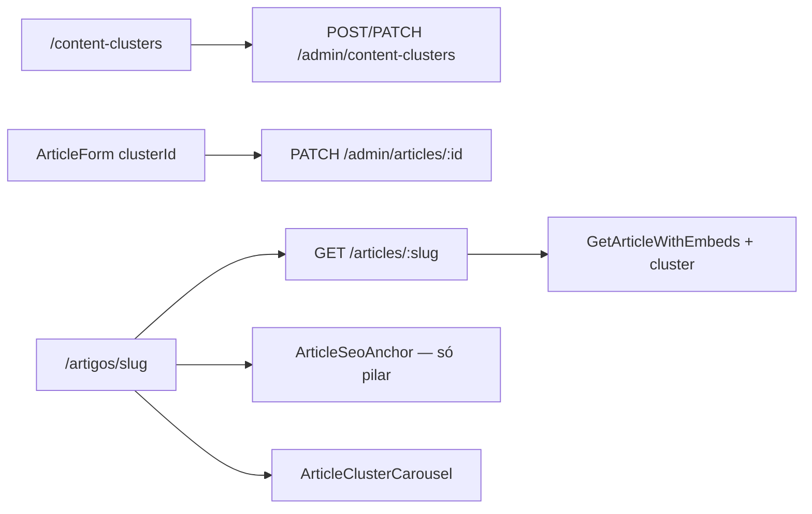

# Content Clusters — Hub & Spoke

## O quê

Malha editorial **Hub & Spoke** para artigos: um **artigo pilar** (hub) agrupa **satélites** (spokes) via `content_clusters`. Na vitrine:

1. **SEO Anchor** — índice navegável no topo do pilar, listando satélites em ordem de leitura.
2. **Cluster Carousel** — carrossel (desktop) / grid (mobile) no final do pilar e de cada satélite para cross-linking.

Inclui CRUD admin em `/content-clusters`, seletor de cluster no formulário de artigo e campo `cluster` em `GET /articles/:slug`.

Plano de referência: [`.cursor/plans/content_clusters_hub_spoke_5b8aafd9.plan.md`](../.cursor/plans/content_clusters_hub_spoke_5b8aafd9.plan.md).

## Por quê

Implementa interlinking estruturado do [PRD Growth §2.5](../.cursor/plans/prd_growth_aquisicao_trafego.plan.md) — autoridade de nicho, dwell time e recirculação intencional além dos artigos relacionados por categoria.

## Como funciona



1. Operador cria cluster (nome, slug, descrição, artigo pilar).
2. Satélites recebem `clusterId` no formulário do artigo.
3. API pública retorna `cluster` com `role` (`pilar` | `spoke`), `pilarArticle` e `members` publicados (pilar primeiro; satélites por `publishedAt ASC`).
4. Pilar exibe SEO Anchor quando há ≥1 satélite publicado; carousel aparece quando há ≥2 membros publicados no cluster.

## Schema (migration `0016`)

| Tabela / coluna               | Descrição                                                                                       |
| ----------------------------- | ----------------------------------------------------------------------------------------------- |
| `content_clusters`            | `id`, `name`, `slug` UNIQUE, `description`, `pilar_article_id` → `content_articles`, timestamps |
| `content_articles.cluster_id` | FK → `content_clusters`, ON DELETE SET NULL                                                     |

## Arquivos-chave

| Camada     | Path                                                                                         |
| ---------- | -------------------------------------------------------------------------------------------- |
| Migration  | `packages/infrastructure/src/persistence/drizzle/migrations/0016_content_clusters.sql`       |
| Schema     | `packages/infrastructure/src/persistence/drizzle/schema/content-clusters.ts`                 |
| Domain     | `packages/domain/src/entities/ContentCluster.ts`                                             |
| Repository | `packages/infrastructure/src/persistence/repositories/drizzle-content-cluster.repository.ts` |
| Use cases  | `packages/application/src/use-cases/content-cluster/`                                        |
| Público    | `packages/application/src/use-cases/content/GetArticleWithEmbeds.ts`                         |
| Schemas    | `packages/shared/src/admin/content-cluster-schemas.ts`                                       |
| API admin  | `apps/api/src/adapters/http/routes/admin-content-cluster-routes.ts`                          |
| Vitrine    | `apps/web/src/components/articles/ArticleSeoAnchor.tsx`, `ArticleClusterCarousel.tsx`        |
| Admin UI   | `apps/admin/src/app/(dashboard)/content-clusters/page.tsx`                                   |

## API

### Admin — `/admin/content-clusters`

| Método | Rota                          | Descrição                                 |
| ------ | ----------------------------- | ----------------------------------------- |
| GET    | `/admin/content-clusters`     | `{ items: ContentClusterAdminSummary[] }` |
| POST   | `/admin/content-clusters`     | Create → `{ id }`                         |
| GET    | `/admin/content-clusters/:id` | Detail + members (draft + published)      |
| PATCH  | `/admin/content-clusters/:id` | Update → `204`                            |
| DELETE | `/admin/content-clusters/:id` | `204`                                     |

Artigos admin aceitam `clusterId` opcional em create/update.

### Público — `GET /articles/:slug`

Campo novo:

```json
{
  "cluster": {
    "name": "Especial Cadeira Ergonômica",
    "slug": "especial-cadeira-ergonomica",
    "description": "...",
    "role": "pilar",
    "pilarArticle": { "slug": "guia-cadeira-ergonomica", "title": "..." },
    "members": [
      {
        "id": "...",
        "slug": "...",
        "title": "...",
        "excerpt": "...",
        "isPilar": true,
        "publishedAt": "..."
      }
    ]
  }
}
```

`cluster: null` quando artigo não pertence a cluster ou não há membros publicados.

## Como testar

```bash
npm run db:migrate -w @ecommerce-amazon/infrastructure
npm run db:seed -w @ecommerce-amazon/infrastructure
npm run dev -w @ecommerce-amazon/api
npm run dev -w @ecommerce-amazon/admin
npm run dev -w @ecommerce-amazon/web
```

1. Admin → `/content-clusters` — ver seed "Especial Cadeira Ergonômica".
2. Vitrine → `/artigos/guia-cadeira-ergonomica` — SEO Anchor com 2 satélites.
3. Abrir satélite — sem anchor; carousel com pilar + irmãos.
4. JSON-LD `@graph` inclui `ItemList` no pilar.

## Próximos passos

- Página hub dedicada `/clusters/[slug]`
- Ordem manual (`sortOrder`) por satélite
- Agrupamento por `ArticleType` no SEO Anchor
