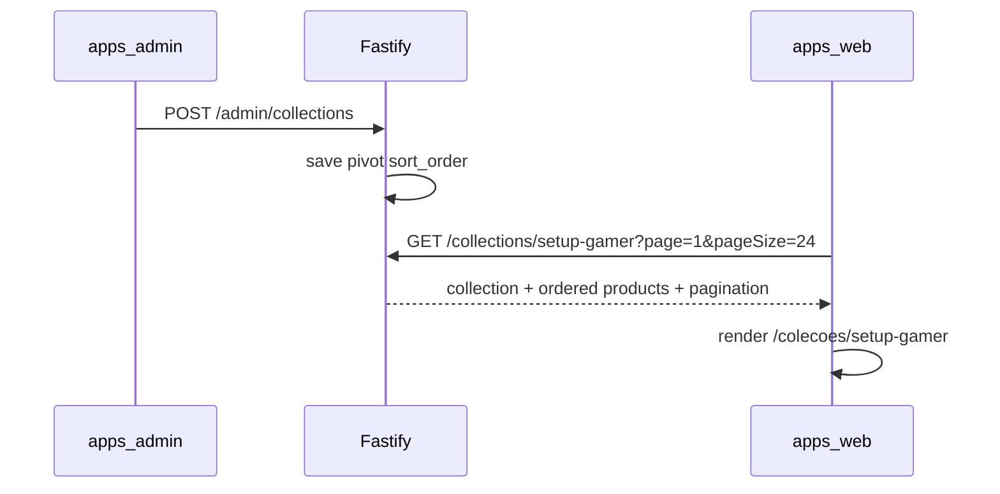

# Coleções curadas

Guia de compras temático com seleção manual de produtos, landing SEO em `/colecoes/[slug]` e bloco CMS na home.

Plano de referência: [`.cursor/plans/coleções_curadas_gold_77f63d0e.plan.md`](../.cursor/plans/coleções_curadas_gold_77f63d0e.plan.md)

## O quê foi entregue

- CRUD admin em `/colecoes` (listagem + sheet lateral)
- API pública `GET /collections` (picker CMS) e `GET /collections/:slug` (DTO apresentado)
- API admin `/admin/collections` (list, get, create, patch, delete)
- Landing pública `/colecoes/[slug]` com header editorial, grid numerado e JSON-LD
- Bloco CMS `curated_collection` com hidratação `renderedCollections` (carrossel de coleções)
- Form CMS `CuratedCollectionForm` (multi-select de coleções + autoplay)
- Telemetria `ClickOrigin.COLLECTION` (`coleção`) e UTM via query em `/go/:slug`
- Migração `0009_curated_collections_constraints.sql` (`created_at`, `updated_at`, unique pivot)
- **`CollectionProductCard`** no bloco home — card editorial full-bleed (imagem + overlay + CTA pill)
- **Formulário admin evoluído** — sheet com seções, tooltips (`CollectionFieldHint`), upload de capa gerenciado + URL externa opcional

## Admin — formulário (`/colecoes`)

O painel lateral (`CollectionFormSheet`) segue o padrão `cms-props-sheet` (header fixo, corpo scrollável, footer fixo):

| Seção               | Campos                                                                                 |
| ------------------- | -------------------------------------------------------------------------------------- |
| Identificação       | Título*, descrição editorial*, slug (colapsável — "Personalizar slug")                 |
| Capa                | Upload com recorte 4:3 (1200×900) via `CollectionCoverField` ou URL externa colapsável |
| Campanha e rastreio | Origem da campanha (preenche UTMs sugeridas), fonte/meio/campanha UTM, texto do CTA\*  |
| Produtos            | `ProductMultiSelect` com busca, ordem ↑↓ e mínimo 1 produto\*                          |

Tooltips: ícone `CircleHelp` ao lado dos labels (`title` nativo). Validação client-side antes do submit.

**Capa:** exibida no carrossel da home (`CuratedCollectionSlide`); **não** na landing `/colecoes/[slug]`.

Componentes reutilizáveis de imagem (também usados no perfil):

- `apps/admin/src/components/admin/AdminImageFilePicker.tsx`
- `apps/admin/src/components/admin/AdminImageCropDialog.tsx`
- `apps/admin/src/lib/admin-image-crop.ts`

Upload de capa: `POST /admin/media/images` (multipart, campo `image`) → `{ url }` gravada em `coverImageUrl` ao salvar a coleção.

| Contexto                          | Componente                                         | Conteúdo                                                                       |
| --------------------------------- | -------------------------------------------------- | ------------------------------------------------------------------------------ |
| Bloco `curated_collection` (home) | `CollectionProductCard` + `CuratedCollectionSlide` | Carrossel de coleções; cada slide com capa, 2 produtos overlay, CTA da coleção |
| Página `/colecoes/[slug]`         | `ProductCard`                                      | Grid paginado (24/página) com preço, análise e wishlist                        |

### Props do bloco CMS

```ts
{
  collectionSlugs: string[]; // 1–8 slugs, ordem editorial
  autoplay?: boolean;      // default true
  intervalMs?: number;     // default 8000
}
```

Legado `collectionSlug` + `layout` ainda são aceitos na validação Zod (migrados para `collectionSlugs`).

## Fora de escopo

- Batch wishlist "Adicionar todos à lista"
- Redirect 301 de `/c/*` legado
- Drag-and-drop no admin (reorder via botões ↑↓)

## Fluxo



## Arquivos-chave

| Camada         | Path                                                                                            |
| -------------- | ----------------------------------------------------------------------------------------------- |
| Domain         | `packages/domain/src/repositories/CuratedCollectionRepository.ts`                               |
| Application    | `packages/application/src/use-cases/admin-collection/`, `admin-media/UploadAdminImage.ts`       |
| Infrastructure | `packages/infrastructure/src/persistence/repositories/drizzle-curated-collection.repository.ts` |
| API            | `apps/api/src/adapters/http/routes/admin-collection-routes.ts`                                  |
| Admin          | `apps/admin/src/components/collections/`                                                        |
| Web landing    | `apps/web/src/app/colecoes/[slug]/page.tsx`                                                     |
| Web bloco      | `apps/web/src/components/blocks/CuratedCollectionBlock.tsx`                                     |
| Slide          | `apps/web/src/components/blocks/CuratedCollectionSlide.tsx`                                     |
| Card home      | `apps/web/src/components/product/CollectionProductCard.tsx`                                     |

## API

| Método   | Rota                     | Auth                                   |
| -------- | ------------------------ | -------------------------------------- |
| `GET`    | `/collections`           | —                                      |
| `GET`    | `/collections/:slug`     | —                                      |
| `GET`    | `/admin/collections`     | JWT                                    |
| `GET`    | `/admin/collections/:id` | JWT                                    |
| `POST`   | `/admin/collections`     | JWT                                    |
| `PATCH`  | `/admin/collections/:id` | JWT                                    |
| `DELETE` | `/admin/collections/:id` | JWT                                    |
| `POST`   | `/admin/media/images`    | JWT (upload genérico de imagens admin) |

BFF admin: `POST /api/admin/media/images` (proxy multipart).

Cache: `vitrine:collection:slug:{slug}` (TTL 600s). Invalidação em writes admin.

## Paginação pública

| Rota                 | Tamanho | Query     |
| -------------------- | ------- | --------- |
| `/colecoes/[slug]`   | 24      | `?page=2` |
| `/categorias/[slug]` | 24      | `?page=2` |

Numeração editorial nas coleções continua entre páginas (ex.: página 2 começa no item 25). Páginas > 1 recebem `noindex` via `buildFacetedListingMetadata`.

## Como testar

```bash
# Migrar + seed
pnpm --filter @ecommerce-amazon/infrastructure db:migrate
pnpm --filter @ecommerce-amazon/infrastructure db:seed

# API + web + admin
pnpm dev
```

1. Admin → **Coleções** → criar/editar coleção com produtos ordenados
2. Testar upload de capa (escolher arquivo → recortar 4:3 → salvar coleção)
3. Abrir `/colecoes/setup-gamer-iniciante` — grid numerado, paginação (`?page=2`) e disclaimer afiliado
4. CMS → adicionar bloco **Coleção Curada** na home — preview + CTA "Ver coleção"
5. Clicar CTA marketplace — `POST /events/click` com `origin: coleção`

## Próximos passos

- CTA batch wishlist na landing
- Redirect opcional `/c/[slug]` → `/colecoes/[slug]`
- Status draft/publish por coleção
