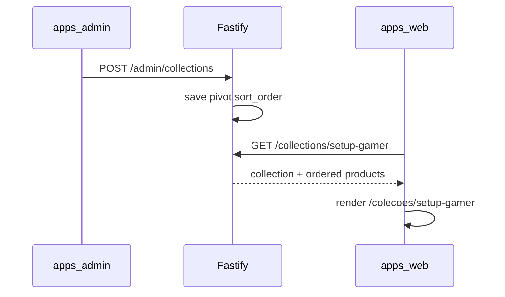

# Coleções curadas

Guia de compras temático com seleção manual de produtos, landing SEO em `/colecoes/[slug]` e bloco CMS na home.

Plano de referência: [`.cursor/plans/coleções_curadas_gold_77f63d0e.plan.md`](../.cursor/plans/coleções_curadas_gold_77f63d0e.plan.md)

## O quê foi entregue

- CRUD admin em `/colecoes` (listagem + sheet lateral)
- API pública `GET /collections` (picker CMS) e `GET /collections/:slug` (DTO apresentado)
- API admin `/admin/collections` (list, get, create, patch, delete)
- Landing pública `/colecoes/[slug]` com header editorial, grid numerado e JSON-LD
- Bloco CMS `curated_collection` com hidratação `renderedData` + `renderedCollection`
- Form CMS `CuratedCollectionForm` (select de coleção + layout grid/carousel)
- Telemetria `ClickOrigin.COLLECTION` (`coleção`) e UTM via query em `/go/:slug`
- Migração `0009_curated_collections_constraints.sql` (`created_at`, `updated_at`, unique pivot)

## Fora de escopo

- Batch wishlist "Adicionar todos à lista"
- Redirect 301 de `/c/*` legado
- Drag-and-drop no admin (reorder via botões ↑↓)

## Fluxo



## Arquivos-chave

| Camada | Path |
|--------|------|
| Domain | `packages/domain/src/repositories/CuratedCollectionRepository.ts` |
| Application | `packages/application/src/use-cases/admin-collection/` |
| Infrastructure | `packages/infrastructure/src/persistence/repositories/drizzle-curated-collection.repository.ts` |
| API | `apps/api/src/adapters/http/routes/admin-collection-routes.ts` |
| Admin | `apps/admin/src/components/collections/` |
| Web landing | `apps/web/src/app/colecoes/[slug]/page.tsx` |
| Web bloco | `apps/web/src/components/blocks/CuratedCollectionBlock.tsx` |

## API

| Método | Rota | Auth |
|--------|------|------|
| `GET` | `/collections` | — |
| `GET` | `/collections/:slug` | — |
| `GET` | `/admin/collections` | JWT |
| `GET` | `/admin/collections/:id` | JWT |
| `POST` | `/admin/collections` | JWT |
| `PATCH` | `/admin/collections/:id` | JWT |
| `DELETE` | `/admin/collections/:id` | JWT |

Cache: `vitrine:collection:slug:{slug}` (TTL 600s). Invalidação em writes admin.

## Como testar

```bash
# Migrar + seed
pnpm --filter @ecommerce-amazon/infrastructure db:migrate
pnpm --filter @ecommerce-amazon/infrastructure db:seed

# API + web + admin
pnpm dev
```

1. Admin → **Coleções** → criar/editar coleção com produtos ordenados
2. Abrir `/colecoes/setup-gamer-iniciante` — grid numerado e disclaimer afiliado
3. CMS → adicionar bloco **Coleção Curada** na home — preview + CTA "Ver coleção"
4. Clicar CTA marketplace — `POST /events/click` com `origin: coleção`

## Próximos passos

- CTA batch wishlist na landing
- Redirect opcional `/c/[slug]` → `/colecoes/[slug]`
- Status draft/publish por coleção
