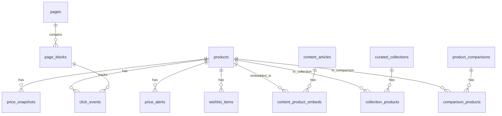

# Schema de banco de dados (Drizzle / PostgreSQL)

Fonte: [`packages/infrastructure/src/persistence/drizzle/schema/index.ts`](../packages/infrastructure/src/persistence/drizzle/schema/index.ts).

Migrations: `packages/infrastructure/src/persistence/drizzle/migrations/`

```bash
npm run db:generate   # gerar migration após alterar schema
npm run db:migrate    # aplicar
npm run db:seed       # dados de desenvolvimento
```

## Diagrama ER (simplificado)



## Enums PostgreSQL

| Enum DB | Valores TypeScript (`packages/domain`) |
|---------|----------------------------------------|
| `marketplace` | `amazon_br`, `shopee_br`, `mercadolivre_br` |
| `availability` | `in_stock`, `out_of_stock`, `unknown` |
| `alert_status` | `pending`, `active`, `triggered`, `expired` |
| `article_type` | `guide`, `review`, `comparison`, `lookbook_social` |
| `article_status` | `draft`, `published` |
| `coupon_status` | `active`, `expired`, `unverified` |
| `discount_type` | `percent`, `fixed` |
| `snapshot_source` | `worker_cron`, `manual_override` |
| `sync_job_type` | `full_sync`, `price_refresh`, `hygiene`, `link_validation`, `coupon_verify` |
| `sync_job_status` | `running`, `completed`, `failed` |
| `page_status` | `draft`, `published` |
| `block_visibility` | `all`, `desktop`, `mobile` |
| `block_type` | ver tabela CMS abaixo |

## Tabelas

### CMS — `pages` / `page_blocks`

Migration: `0001_cms_pages.sql`.

| Tabela | Colunas principais | Índices |
|--------|-------------------|---------|
| `pages` | `id`, `slug`, `title`, `status`, `seo_title`, `seo_description`, `published_at`, `updated_at` | UNIQUE `(slug, status)` |
| `page_blocks` | `id`, `page_id` FK, `type`, `sort_order`, `props` JSONB, `visibility` | INDEX `(page_id, sort_order)` |

Regra de negócio: apenas um layout `published` por `slug` (índice composto).

`block_type` valores: `hero_carousel`, `featured_product`, `product_grid`, `category_pills`, `hero_split`, `curated_collection`, `coupon_strip`, `rich_text`, `banner`, `spacer`, `dynamic_product_grid`.

### Catálogo — `products`

| Coluna | Tipo | Notas |
|--------|------|-------|
| `id` | uuid PK | |
| `marketplace` | enum | `amazon_br` \| `shopee_br` \| `mercadolivre_br` |
| `external_id` | text | ID no marketplace |
| `slug` | text | URL-friendly, UNIQUE |
| `title_clean` | text | Título higienizado (Pipeline C) |
| `title_raw` | text | Título original da fonte |
| `short_description` | text | |
| `long_description_html` | text | |
| `price_amount` | decimal(12,2) | |
| `price_strikethrough` | decimal(12,2) | opcional |
| `currency` | text | default `BRL` |
| `stale_price` | boolean | `true` se >24h sem refresh |
| `price_updated_at` | timestamptz | SLA 24h |
| `affiliate_deep_link` | text | HTTPS com tag afiliado |
| `images` | jsonb `string[]` | |
| `specs_normalized` | jsonb `Record<string,string>` | |
| `editorial_score` | int | curadoria / sort |
| `availability` | enum | |
| `rating` | decimal(3,2) | |
| `review_count` | int | |
| `category_vertical` | text | ex.: `home-office`, `games` |
| `tags` | jsonb `string[]` | |
| `meta_title`, `meta_description` | text | SEO |
| `canonical_url` | varchar(512) | nullable; sobrescrita manual Admin |
| `pros`, `cons` | jsonb `string[]` | editorial |
| `visible` | boolean | default `true`; oculta da home quando `false`; admin lista todos |
| `created_at` | timestamptz | |

Índices: UNIQUE `slug`; UNIQUE `(marketplace, external_id)`; INDEX `(stale_price, price_updated_at)`; INDEX `(visible)`.

### Preços — `price_snapshots`

Histórico diário para gráficos e SEO (faixa 30d).

| Coluna | Tipo |
|--------|------|
| `product_id` | uuid FK → products |
| `amount` | decimal(12,2) |
| `currency` | text |
| `source` | enum `worker_cron` \| `manual_override` |
| `captured_at` | timestamptz |

INDEX `(product_id, captured_at)`.

### Alertas — `price_alerts`

| Coluna | Tipo |
|--------|------|
| `product_id` | uuid FK |
| `email` | text |
| `target_price` | decimal |
| `status` | enum `pending` → `active` → `triggered` \| `expired` |
| `confirm_token` | text | double opt-in |
| `created_at`, `triggered_at` | timestamptz |

### Wishlist — `wishlist_items`

Sessão anônima via `session_id` (cookie web).

| Coluna | Tipo |
|--------|------|
| `session_id` | text |
| `product_id` | uuid FK |
| `marketplace` | enum |
| `sort_order` | int |
| `added_at` | timestamptz |

### Conteúdo — `content_articles` / `content_product_embeds`

| Tabela | Colunas |
|--------|---------|
| `content_articles` | `slug` UNIQUE, `title`, `body`, `type`, `status`, `seo` jsonb, `published_at` |
| `content_product_embeds` | `article_id`, `product_id`, `position`, `variant` (`inline` \| `highlight` \| `comparison`) |

### Coleções — `curated_collections` / `collection_products`

| Tabela | Colunas |
|--------|---------|
| `curated_collections` | `slug` UNIQUE, `title`, `description`, `cover_image_url`, `campaign_origin`, `utm_defaults` jsonb, `cta_text` |
| `collection_products` | `collection_id`, `product_id`, `sort_order` |

### Comparador — `product_comparisons` / `comparison_products`

| Tabela | Colunas |
|--------|---------|
| `product_comparisons` | `share_token` UNIQUE, `session_id`, `editorial_intro`, `created_at` |
| `comparison_products` | `comparison_id`, `product_id`, `sort_order` |

### Cupons — `coupons`

| Coluna | Notas |
|--------|-------|
| `marketplace`, `code`, `description` | |
| `discount_value`, `discount_type` | percent ou fixed |
| `valid_from`, `valid_until` | |
| `status` | `unverified` até Pipeline D |
| `source_url` | origem verificável |
| `last_verified_at` | exibir público só se <24h |

### Telemetria — `click_events`

| Coluna | Valores / notas |
|--------|-----------------|
| `product_id`, `origin`, `session_id`, `occurred_at` | `origin`: `listagem`, `detalhe`, `embed`, `comparador`, `cupons` |
| `block_id` | uuid FK → `page_blocks.id`, ON DELETE SET NULL; rastreamento analítico CMS |

INDEX `(block_id)`.

### Ops — `sync_job_logs` / `affiliate_accounts` / `operators`

| Tabela | Uso |
|--------|-----|
| `sync_job_logs` | auditoria pipelines worker |
| `affiliate_accounts` | tag afiliado por marketplace; `status` inclui `pending_manual_validation` |
| `operators` | operadores CMS; enum `operator_status` (`active`, `disabled`); email único |

Migration: [`0004_operators.sql`](../packages/infrastructure/src/persistence/drizzle/migrations/0004_operators.sql).

## Seed de desenvolvimento

Arquivo: [`packages/infrastructure/src/persistence/drizzle/seed.ts`](../packages/infrastructure/src/persistence/drizzle/seed.ts).

| Entidade | ID fixo (exemplo) | Slug / identificador |
|----------|-------------------|----------------------|
| Produto Amazon | `a1111111-...` | `cadeira-ergonomica-home-office` |
| Produto Shopee | `a2222222-...` | `headset-gamer-7-1` |
| Artigo | `b1111111-...` | `guia-cadeira-ergonomica` |
| Coleção | `c1111111-...` | `setup-gamer-iniciante` |
| Cupom | `d1111111-...` | `VITRINE10` |
| Page home | `f1111111-...` | `home` |
| Blocos CMS | `f2111111-...` … `f6111111-...` | ver [cms-home-phase1.md](./cms-home-phase1.md) |
| Operador admin | `90111111-...` | email em `ADMIN_SEED_EMAIL` |

Produção: seed ignorado salvo `SEED_FORCE=true`.

## Convenções

- IDs: uuid v4 (`gen_random_uuid()`)
- Timestamps: `timestamptz`
- Dinheiro: `decimal(12,2)` no DB; `number` nos DTOs da API
- JSONB para props CMS, SEO, specs, tags — validados por Zod na aplicação
