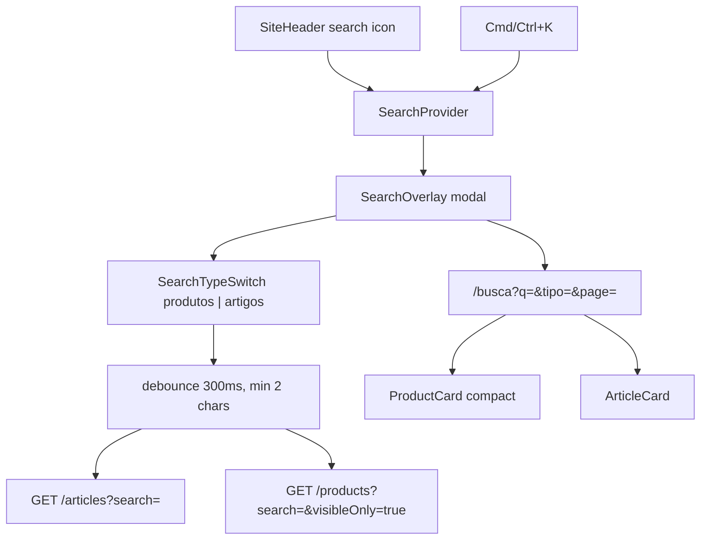

# Busca no header — vitrine (`apps/web`)

## O quê

Busca funcional no header da vitrine pública:

- Ícone de busca abre overlay modal com typeahead
- Atalho `Cmd/Ctrl+K` abre/fecha o overlay
- Preview com switch **Produtos / Artigos** (default: produtos), badges com total encontrado
- Página `/busca?q=termo` paginada (`page`, `tipo=produtos|artigos`)
- Parâmetro `search` exposto em `GET /products` (repositório já suportava `ilike`)

**Fora do escopo:** command palette estilo cmdk, endpoint federado `GET /search`, tracking de placement `search`.

## Por quê

O header Gold ([`.cursor/plans/header_gold_hub_1c20ae2f.plan.md`](../.cursor/plans/header_gold_hub_1c20ae2f.plan.md)) deixou o ícone como placeholder. A busca unificada melhora descoberta de produtos (vitrine) e artigos (hub editorial), alinhada ao PRD de conversão + conteúdo.

## Como funciona

### Conformidade

- Preço stale: `PriceDisplay` oculta valor numérico no preview; `ProductCard` na `/busca` segue regras existentes (sem badges de urgência stale)
- Busca pública de produtos força `visibleOnly: true` quando `search` está presente

## Arquivos-chave

| Camada          | Arquivo                                                                                                                                                                                                                                                                                                                                                                                              |
| --------------- | ---------------------------------------------------------------------------------------------------------------------------------------------------------------------------------------------------------------------------------------------------------------------------------------------------------------------------------------------------------------------------------------------------- |
| API             | [`ListProducts.ts`](../packages/application/src/use-cases/product/ListProducts.ts), [`schemas.ts`](../apps/api/src/adapters/dtos/request/schemas.ts), [`routes/index.ts`](../apps/api/src/adapters/http/routes/index.ts)                                                                                                                                                                             |
| Web — estado/UI | [`SearchProvider.tsx`](../apps/web/src/components/search/SearchProvider.tsx), [`SearchOverlay.tsx`](../apps/web/src/components/search/SearchOverlay.tsx), [`SearchTypeSwitch.tsx`](../apps/web/src/components/search/SearchTypeSwitch.tsx), [`SearchResultsView.tsx`](../apps/web/src/components/search/SearchResultsView.tsx), [`SiteHeader.tsx`](../apps/web/src/components/layout/SiteHeader.tsx) |
| Web — dados     | [`lib/api/search.ts`](../apps/web/src/lib/api/search.ts)                                                                                                                                                                                                                                                                                                                                             |
| Web — página    | [`app/busca/page.tsx`](../apps/web/src/app/busca/page.tsx)                                                                                                                                                                                                                                                                                                                                           |
| SEO             | [`site-json-ld.ts`](../packages/shared/src/seo/site-json-ld.ts) — `SearchAction` → `/busca?q=`                                                                                                                                                                                                                                                                                                       |

## API / contratos

### `GET /products` (público)

Novo query param opcional:

| Param    | Tipo             | Descrição                                             |
| -------- | ---------------- | ----------------------------------------------------- |
| `search` | string (max 100) | Filtra por `titleClean`, `titleRaw`, `slug` (`ilike`) |

Quando `search` é informado, a rota aplica `visibleOnly: true` por padrão.

### `GET /articles?search=` (existente)

Reutilizado sem alteração.

## Como rodar / testar

1. Subir API e web (`docs/dev-setup.md`)
2. Clicar no ícone de busca no header → overlay com foco no input
3. `Cmd/Ctrl+K` → abre/fecha overlay
4. Digitar termo (≥2 chars) → preview de produtos e artigos
5. Enter ou **Ver todos os produtos/artigos** → `/busca?q=termo` (ou `&tipo=artigos`)
6. Paginar resultados em `/busca?q=termo&page=2` (produtos) ou `&tipo=artigos&page=2`
7. API: `curl "http://localhost:3001/products?search=monitor&visibleOnly=true"`

## Próximos passos (não implementados)

- Placement de analytics `search` no enum de cliques
- Busca por categorias/coleções no overlay
- Endpoint federado `GET /search` se o volume de entidades crescer
