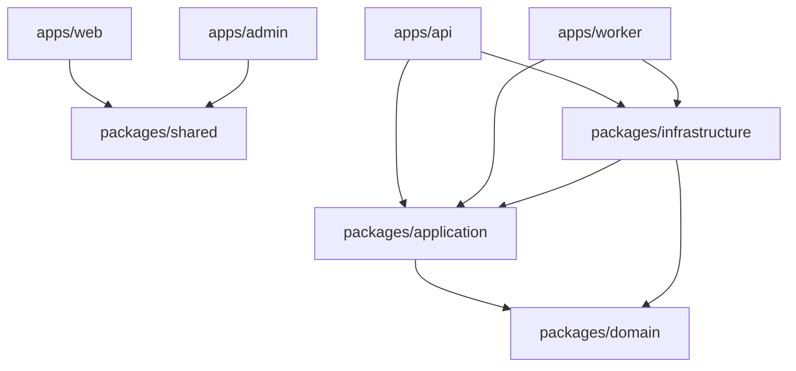

# Contexto LLM — Visão, arquitetura e monorepo

> **Propósito:** documento sintético para análise por outra LLM. Descreve o que o projeto **é**, como está organizado e quais invariantes nunca violar. Detalhes de domínio/API/features estão nos companion docs `llm-context-02` e `llm-context-03`.

## O que é este projeto

**ecommerce-amazon** é uma plataforma proprietária de afiliação vertical (Amazon BR + Shopee BR + Mercado Livre BR em preparação) com duas pernas:

| Perna                   | Função                                                       | Monetização                     |
| ----------------------- | ------------------------------------------------------------ | ------------------------------- |
| **Vitrine Inteligente** | Catálogo local curado, preços monitorados, wishlist, alertas | Links de afiliado transparentes |
| **Hub de Conteúdo**     | Artigos editoriais, coleções curadas, comparador, cupons     | Embeds de produto + tráfego SEO |

**Não é** clone de marketplace — é curadoria editorial + dados locais enriquecidos. Site só com listagem espelhada = "site fantasma" (conteúdo duplicado, sem SEO).

**Documentos fonte (especificação, não necessariamente implementado):**

- `.cursor/plans/prd_plataforma_afiliação_de44933f.plan.md` — negócio, workers, UX, entidades
- `.cursor/plans/prd_growth_aquisicao_trafego.plan.md` — SEO, conteúdo, anti-duplicação
- `.cursor/plans/arquitetura_tecnica_node.plan.md` — Clean Architecture, filas, cache

**Regras ativas para agentes:** `.cursor/rules/` (00–11) + `AGENTS.md`.

---

## Stack

| Tecnologia                     | Uso                                         |
| ------------------------------ | ------------------------------------------- |
| Node.js 20 + TypeScript strict | Runtime e linguagem                         |
| npm workspaces + Turbo         | Monorepo                                    |
| PostgreSQL 16                  | Catálogo, CMS, conteúdo                     |
| Redis 7                        | Cache read-aside + filas BullMQ             |
| Fastify                        | API REST (`apps/api`)                       |
| Drizzle ORM                    | Persistência                                |
| Zod                            | Validação na borda HTTP, env, schemas CMS   |
| Next.js 15                     | Vitrine (`apps/web`) + Admin (`apps/admin`) |
| BullMQ                         | Workers assíncronos (`apps/worker`)         |
| Vitest                         | Testes unit + integration                   |

---

## Monorepo — estrutura e portas

```
ecommerce-amazon/
├── apps/
│   ├── api/          # REST read-heavy, porta 3000
│   ├── web/          # Vitrine Next.js, porta 3001
│   ├── admin/        # Painel CMS operador, porta 3002
│   └── worker/       # BullMQ + fetchers externos (único processo com acesso marketplace)
├── packages/
│   ├── domain/       # Entidades, VOs, enums, ports — ZERO imports de framework
│   ├── application/  # Use cases (1 classe = 1 caso de uso)
│   ├── infrastructure/ # Drizzle, Redis, repositórios, filas, email
│   └── shared/       # Env Zod, schemas CMS, CORS, SEO helpers, parsers marketplace
├── docs/             # O que FOI implementado (este arquivo faz parte)
└── .cursor/plans/    # Especificação/roadmap — pode divergir do código
```

**Ordem de build:** `domain` → `shared` → `application` → `infrastructure` → apps.

**Comandos essenciais:**

```bash
npm run infra:up      # Postgres + Redis (Podman/Docker)
npm run db:setup      # migrate + seed
npm run dev:api       # :3000
npm run dev:web       # :3001
npm run dev:admin     # :3002
npm run dev:worker    # BullMQ
npm run build         # build completo
npm run test          # Vitest
```

**Env críticas:** `.env` na raiz (copiar de `.env.example`). `JWT_SECRET` deve ser **idêntico** na API e no admin. Ver `docs/dev-setup.md`.

---

## Clean Architecture — camadas e dependências



| Camada                    | Pode importar                               | NÃO pode importar               |
| ------------------------- | ------------------------------------------- | ------------------------------- |
| `domain`                  | —                                           | Fastify, Drizzle, BullMQ, React |
| `application`             | `domain`, `shared`                          | Fastify, Drizzle                |
| `infrastructure`          | `domain`, `application`, `shared`           | `apps/*`                        |
| `apps/api`, `apps/worker` | application, infrastructure, shared, domain | SQL direto                      |
| `apps/web`, `apps/admin`  | `domain` (enums), `shared` (schemas)        | `infrastructure`, DB            |

### Fluxo HTTP típico

```
Route Fastify
  → Zod parse (apps/api/adapters/dtos/request/schemas.ts)
  → Use Case (packages/application)
  → CacheStore get/set (opcional)
  → Repository port (packages/domain)
  → Drizzle repository (packages/infrastructure)
  → Presenter → JSON
```

### Injeção de dependências

- **API:** `ApiContainer` em `packages/infrastructure`
- **Worker:** `WorkerContainer` — idem + filas BullMQ, fetchers, email

Use cases recebem **ports** (interfaces), nunca implementações concretas.

---

## Invariantes de negócio (nunca violar)

### Regra de ouro de dados

Request HTTP do visitante **nunca** chama API/scraper Amazon/Shopee/Shopee. Leitura = catálogo local; escrita externa = apenas `apps/worker`.

### SLA de preço (24h)

- Produto ativo deve ter refresh tentado antes de `price_updated_at` > 24h
- Após 24h sem refresh: `stale_price = true` → API retorna `amount: null`, `isStale: true`
- UI: ocultar preço numérico, manter CTA; sem badges de urgência/queda
- Alertas **não disparam** com preço stale

### Pipelines worker (PRD Core)

| Pipeline | Fila            | Função                                               | Pausável por budget?                 |
| -------- | --------------- | ---------------------------------------------------- | ------------------------------------ |
| A        | `catalog_sync`  | Metadados não-preço (6h ativos, 2h wishlist/alertas) | Sim (cold >30d)                      |
| B        | `price_refresh` | Preços (4h hot, 12h demais)                          | **Nunca** em produtos com tráfego 7d |
| C        | `hygiene`       | Títulos, specs, slugs — diário                       | —                                    |
| D        | `coupon_verify` | Cupons — 6h destaque, 12h demais                     | —                                    |

Filas adicionais: `domain_events` (PriceDropped), `email_delivery`.

### Afiliado e compliance

- CTA transparente: "Ver preço na Amazon/Shopee" — nunca "Comprar agora" genérico
- Disclaimer visível em toda página com CTA comercial
- Links com tag válida; `rel="noopener sponsored"`
- Mascaramento via `/go/{slug}` (307 para URL afiliado)
- Gate manual: conta `pending_manual_validation` bloqueia redirect e escala

### Dark patterns proibidos

Countdown falso, "X pessoas comprando", preço inflado fictício, estoque inventado, cupom não verificado (<24h) na listagem pública.

### LGPD

Double opt-in alertas (máx. 10/email, cooldown 24h), banner cookies wishlist anônima, endpoint de exclusão (planejado).

### Código

- Identificadores, arquivos, comentários: **inglês**
- Copy de UI/emails: **pt-BR**
- ESLint + Prettier obrigatórios

---

## Cache Redis (leitura)

Padrão **cache-aside** nos use cases de leitura.

| Recurso                              | Chave exemplo                               | TTL     |
| ------------------------------------ | ------------------------------------------- | ------- |
| Page layout (base, sem renderedData) | `vitrine:page:slug:{slug}`                  | 300s    |
| Listagem produtos                    | versionada por `cache:version:product:{id}` | ~5 min  |
| Detalhe produto                      | idem                                        | ~10 min |
| Artigo público                       | por slug                                    | 15 min  |
| Auto-links SEO                       | global                                      | 1 h     |

Após write no worker/admin CMS: `CacheInvalidator` incrementa version stamp — não faz scan de chaves. Blocos dinâmicos (`renderedData`, `renderedBentoHubMix`) são hidratados **após** cache hit e **não** vão para Redis.

---

## Eventos de domínio

- `PriceDropped` — emitido por `Product.updatePrice()` quando preço cai
- Publicado via `EventBus` → fila `domain_events` (BullMQ)
- Handler assíncrono dispara alertas/email — **não** inline no processor de preço

---

## Apps — responsabilidades

| App           | Função principal                                                                | Doc detalhada                        |
| ------------- | ------------------------------------------------------------------------------- | ------------------------------------ |
| `apps/api`    | REST: catálogo, CMS público, wishlist, alertas, eventos, rotas `/admin/*`       | `docs/api-rest.md`                   |
| `apps/web`    | Vitrine SSR/ISR: home CMS, produtos, categorias, artigos, coleções              | `docs/cms-home-phase1.md` + features |
| `apps/admin`  | Painel operador: login JWT, blocos CMS, produtos, artigos, categorias, coleções | `docs/admin-app-phase1.md`           |
| `apps/worker` | Sync marketplace, preços, hygiene, cupons                                       | `docs/worker-pipelines.md`           |

---

## Estado geral de implementação (resumo)

| Área                                                             | Status                 |
| ---------------------------------------------------------------- | ---------------------- |
| Scaffold Clean Architecture + DB schema completo                 | ✅                     |
| API REST MVP (público + admin parcial)                           | ✅ parcial             |
| Worker + filas BullMQ                                            | ✅ scaffold            |
| Home CMS-driven + blocos dinâmicos                               | ✅                     |
| Admin: auth, produtos, artigos, categorias, coleções, blocos CMS | ✅                     |
| Vitrine: `/produtos`, `/categorias`, `/artigos`, `/colecoes`     | ✅                     |
| go-redirect-seo + JSON-LD + interlinkagem                        | ✅                     |
| Alertas email produção, comparador web, central cupons web       | ❌ pendente            |
| Draft/preview/publish CMS                                        | ❌ pendente            |
| PA-API Amazon homologada (sync automático)                       | ❌ modo híbrido manual |

Lista completa de planos executados: `docs/llm-context-03-implemented-features.md` § Planos.

---

## Mapa de documentação existente

| Tipo                   | Onde                                                |
| ---------------------- | --------------------------------------------------- |
| Índice geral           | `docs/README.md`                                    |
| Setup local            | `docs/dev-setup.md`                                 |
| Arquitetura            | `docs/architecture.md`                              |
| Domínio                | `docs/domain-model.md`                              |
| Banco                  | `docs/database-schema.md`                           |
| API                    | `docs/api-rest.md`                                  |
| Worker                 | `docs/worker-pipelines.md`                          |
| Features por módulo    | `docs/*-phase*.md`, `docs/go-redirect-seo.md`, etc. |
| Planos (spec)          | `docs/plans-index.md` → `.cursor/plans/`            |
| Contexto LLM (síntese) | `docs/llm-context-01` (este), `02`, `03`            |
