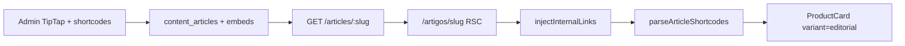

# Contexto LLM — Features implementadas, API e planos

> **Propósito:** inventário do que **já foi codificado**, rotas web/API, fases do CMS e admin, e status dos planos `.cursor/plans/`. Use com `llm-context-01` (visão) e `llm-context-02` (domínio/schema).

---

## Rotas web implementadas (`apps/web`)

| Rota | Função | Doc |
|------|--------|-----|
| `/` | Home CMS-driven via `PageRenderer` + `GET /pages/home` | `cms-home-phase1.md` |
| `/produtos/[slug]` | Detalhe produto, JSON-LD, canonical, wishlist, CTA `/go` | `go-redirect-seo.md` |
| `/categorias/[slug]` | Listagem SEO com sidebar árvore, breadcrumbs, grid | `categories-hierarchy.md` |
| `/artigos/[slug]` | Artigo editorial: prose, auto-links, embeds ProductCard | `articles-public-rendering.md` |
| `/artigos/categoria/[slug]` | Listagem artigos por categoria editorial | `articles-taxonomy-phase2.md` |
| `/colecoes/[slug]` | Landing coleção curada numerada + JSON-LD | `curated-collections.md` |
| `/go/[slug]` | Rewrite → API `GET /go/:slug` (307 afiliado) | `go-redirect-seo.md` |

**Admin:** `/auto-links` — CRUD keywords SEO (`auto-links-admin.md`)

**Pendentes no MVP:** `/comparador`, hub `/artigos` (índice), central `/cupons`, wishlist dedicada, alertas UI.

---

## CMS — evolução por fases

### Fase 1 — Home CMS sem Admin (`cms-home-phase1.md`) ✅

- Domain `PageLayout` + `PageBlock` + enums CMS
- `GET /pages/:slug` + cache Redis 5 min
- `apps/web`: `PageRenderer`, `BlockRegistry`, blocos estáticos e de catálogo
- Wishlist anônima (`x-session-id`), click tracking `POST /events/click`
- Seed layout `home` publicado

### Fase 2 — Blocos dinâmicos (`cms-dynamic-blocks-phase2.md`) ✅

- `BlockType.DYNAMIC_PRODUCT_GRID` com BFF hydration (`renderedData`)
- Filtros: `minDiscountPercentage`, sorts `created_at`, `price_asc`, `price_desc`, `discount_percent_desc`
- `freshPriceOnly` para carrossel de ofertas
- Use cases admin: `SavePageBlock`, `DeletePageBlock`, `UpdatePageBlocksOrder`
- `PageCacheInvalidator` após mutações

### Layout Home — Ofertas Relâmpago (`cms-flash-deals-home.md`) ✅

Ordem seed: Hero Carousel → Dynamic Grid (ofertas ≥30%) → Category Bento → Product Grid → Curated Collection.

### Bloco Category Bento Grid (`cms-category-bento-grid.md`) ✅

Grade assimétrica 4 colunas; tiles small/large; ação: link, filtro categoria ou nenhuma.

### Bloco Bento Hub Mix (`cms-bento-hub-mix.md`) ✅

Grid 3 slots: (1) coleção ou artigo hero 2×2, (2) produto oferta 1×1, (3) top-3 categoria ou produtos manuais. Hidratação `renderedBentoHubMix`.

### Admin CMS — editor de blocos (`admin-cms-blocks-phase2.md`) ✅

- Rotas REST `/admin/pages/*` (CRUD blocos, reorder)
- UI `CMSBlockOrderManager` em `/paginas/[slug]`
- Formulários amigáveis fase 1: hero carousel, category pills, product grid, featured product, dynamic grid, banner, rich text, spacer, category bento, bento hub mix
- **Pendente:** draft/publish, drag-and-drop, forms fase 2 (`hero_split`, `curated_collection`, `coupon_strip`)

---

## Admin — fases implementadas

### Fase 1 — Estrutura (`admin-app-phase1.md`) ✅

| Entrega | Detalhe |
|---------|---------|
| App `apps/admin` | Next.js 15, porta 3002 |
| Auth JWT | `operators` table, cookie `vitrine_admin_token` 8h |
| Shell | Sidebar, breadcrumbs, toast |
| Rotas | Dashboard, Páginas, Produtos, Artigos, Coleções, Cupons (stub), Config (stub) |

### Produtos — modo híbrido manual (`admin-products-phase1.md`) ✅

| Entrega | Detalhe |
|---------|---------|
| Listagem + create + edit | `/produtos`, `/produtos/novo`, `/produtos/[slug]` |
| Parser URL | Amazon/Shopee/ML → `marketplace` + `externalId` |
| Switch preço | `stale_price` ↔ "Exibir valor numérico" |
| 3 abas | Link & Essenciais · Análise Editorial · SEO Avançado |
| API | `GET/POST/PATCH /admin/products` |
| `visible` | Oculta da home sem remover página produto |

### Artigos editoriais (`admin-articles-phase1.md`) ✅

| Entrega | Detalhe |
|---------|---------|
| CRUD completo | `/artigos`, `/artigos/novo`, `/artigos/[id]` |
| TipTap WYSIWYG | Comando `/produto`, shortcodes `[[product:slug]]` |
| Modo HTML | Toolbar + textarea monoespaçada |
| Sync embeds | `content_product_embeds` extraído do body |
| API | `/admin/articles` CRUD |

### Taxonomia artigos fase 2 (`articles-taxonomy-phase2.md`) ✅

| Entrega | Detalhe |
|---------|---------|
| `article_categories` | CRUD em `/artigos/categorias` |
| Perfil autor | `operators.avatar_url`, `bio`, `role` |
| API pública | `author`, `category`, `relatedArticles` (máx. 3) em `GET /articles/:slug` |

### Coleções curadas (`curated-collections.md`) ✅

| Entrega | Detalhe |
|---------|---------|
| CRUD admin | `/colecoes` com sheet lateral |
| Landing pública | `/colecoes/[slug]` |
| Bloco CMS | `curated_collection` com carrossel `CollectionProductCard` |
| API | `GET /collections`, `GET /collections/:slug`, `/admin/collections` CRUD |

### Categorias hierárquicas (`categories-hierarchy.md`) ✅

| Entrega | Detalhe |
|---------|---------|
| Árvore `categories` | `parent_id`, SEO, IDs marketplace |
| Admin | `/categorias` com árvore visual |
| API pública | `GET /categories`, `GET /categories/:slug` |
| API admin | CRUD + reorder `/admin/categories` |
| Vitrine | Pills cascata home, sidebar categoria, header flyout/drawer |
| Produto | `CategoryCascadeSelect` → folha obrigatória |

### Auto-Links SEO (`auto-links-admin.md`) ✅

| Entrega | Detalhe |
|---------|---------|
| API admin | `GET/POST/PATCH/DELETE /admin/auto-links` |
| UI admin | `/auto-links` — listagem, busca, CRUD Sheet, toggle `is_active` |
| Parser | `injectInternalLinks` com priority, maxMatches, zonas protegidas |
| Cache | Redis `vitrine:seo:auto-links` + invalidação nas mutações |
| Vitrine | Injeção runtime em `ArticleBody` (HTML do artigo intacto no DB) |

---

## Artigos — pipeline completo



**Ordem de renderização obrigatória (web):**
1. `GET /articles/:slug` → body cru + metadados
2. `GET /seo/auto-links` → keywords dinâmicas (cache 1h)
3. `GET /products/:slug` por shortcode → pros/cons
4. `injectInternalLinks(body, autoLinks)` — só na vitrine
5. `parseArticleShortcodes` → segmentos HTML + embeds
6. `<article class="prose">` com `aside.not-prose` por embed

**Arquivos-chave:** `apps/web/src/app/artigos/[slug]/page.tsx`, `ArticleBody.tsx`, `ArticleProductEmbed.tsx`, `packages/shared/src/content/article-shortcodes.ts`.

---

## go-redirect-seo (`go-redirect-seo.md`) ✅

| Feature | Implementação |
|---------|---------------|
| `GET /go/:slug` | 307 para URL afiliado; telemetria `redirect_go` |
| Rewrite Next | `/go/:slug` → `API_INTERNAL_URL` |
| `goUrl` nos DTOs | Substitui exposição direta de `affiliateUrl` |
| Gate afiliado | `pending_manual_validation` → 307 `/` |
| JSON-LD Product | `/produtos/[slug]`; sem `offers` se stale |
| Canonical | `resolveProductCanonicalUrl`: DB override ou `/produtos/{slug}` |
| Interlinkagem | `SEO_KEYWORD_MAP` + tabela `auto_links`; primeira ocorrência por keyword |

**SEO analytics (`seo_e_click_analytics` plan):** `block_id` em `click_events` para rastrear bloco CMS de origem.

---

## Header vitrine (`header_gold_hub` plan) ✅

- Hub único **Categorias** (não um link por raiz)
- Desktop: `CategoryCatalogFlyout` (2 colunas)
- Mobile: `CategoryCatalogDrawer` (accordion)
- Links editoriais fixos: Artigos, Cupons, Sobre
- Reutiliza `GET /categories` existente

---

## Product Card CRO (`product_card_cro_gold` plan) ✅

Variantes: listagem, detalhe, editorial (embed artigo), coleção home. Cenários A/B de CTA conforme preço stale. Badge editorial ≥80 score. Disclaimer afiliado.

---

## API REST — mapa consolidado

Base dev: `http://localhost:3000`. Validação Zod na borda. Sessão: header `x-session-id`.

### Público — leitura

| Método | Rota | Use case / notas |
|--------|------|------------------|
| GET | `/health` | Health check |
| GET | `/categories` | Árvore com productCount |
| GET | `/categories/:slug` | Detalhe SEO + breadcrumbs |
| GET | `/pages/:slug` | Layout CMS publicado (+ renderedData) |
| GET | `/products` | Listagem paginada; query: page, pageSize, category, marketplace, sort |
| GET | `/products/:slug` | Detalhe produto |
| GET | `/products/:id/price-history` | Snapshots; query `days` |
| GET | `/go/:slug` | 307 redirect afiliado |
| GET | `/articles` | Lista por categoria editorial |
| GET | `/articles/:slug` | Artigo publicado |
| GET | `/seo/auto-links` | Keywords interlinkagem |
| GET | `/collections` | Picker CMS |
| GET | `/collections/:slug` | Coleção + produtos |
| GET | `/coupons` | Cupons ativos verificados |
| GET | `/comparisons/:shareToken` | Comparador |

### Público — escrita

| Método | Rota | Notas |
|--------|------|-------|
| POST | `/price-alerts` | Double opt-in; 201 |
| POST | `/price-alerts/confirm/:token` | Ativa alerta |
| GET | `/wishlist` | Enriquecido com produto |
| POST | `/wishlist` | Body `{ productId }` |
| DELETE | `/wishlist/:id` | 204 |
| POST | `/wishlist/checkout-batch` | URL batch checkout |
| POST | `/comparisons` | 2–3 produtos; intro ≥150 chars |
| POST | `/events/click` | 204; origens: listagem, detalhe, embed, comparador, cupons, redirect_go |

### Admin — auth

| Método | Rota | Notas |
|--------|------|-------|
| POST | `/admin/auth/login` | `{ email, password }` → JWT |
| GET | `/admin/auth/me` | Bearer JWT |
| POST | `/admin/auth/logout` | 204 |

### Admin — CMS páginas

| Método | Rota |
|--------|------|
| GET | `/admin/pages` |
| GET | `/admin/pages/:slug` |
| POST | `/admin/pages/:slug/blocks` |
| PATCH | `/admin/pages/:slug/blocks/:id` |
| DELETE | `/admin/pages/:slug/blocks/:id` |
| PATCH | `/admin/pages/:slug/blocks/reorder` |

### Admin — catálogo e conteúdo

| Grupo | Rotas |
|-------|-------|
| Produtos | `GET/POST /admin/products`, `GET/PATCH /admin/products/:slug` |
| Categorias produto | `GET/POST/PATCH/DELETE /admin/categories`, `PATCH /admin/categories/reorder` |
| Artigos | `GET/POST/PATCH/DELETE /admin/articles` |
| Categorias artigo | `GET/POST/PATCH/DELETE /admin/article-categories` |
| Coleções | `GET/POST/PATCH/DELETE /admin/collections` |
| Auto-links | `GET/POST/PATCH/DELETE /admin/auto-links` |

**Rotas planejadas NÃO implementadas:**
- `DELETE /price-alerts/:token`
- `GET /coupons/:marketplace`
- `POST /admin/pages/:slug/publish`

Contrato completo: `docs/api-rest.md`.

---

## Worker (`worker-pipelines.md`)

**Único processo com acesso marketplace.**

| Fila | Cron | Pipeline |
|------|------|----------|
| `price_refresh` | 4h | B — preços (nunca pausar hot) |
| `catalog_sync` | 6h | A — metadados |
| `hygiene` | diário 02:00 | C — títulos/specs |
| `coupon_verify` | 6h | D — cupons |
| `domain_events` | — | PriceDropped → alertas |
| `email_delivery` | — | Confirmação alertas |

Fetchers: Amazon, Shopee, Mercado Livre (stub). Rate limiter Redis por marketplace.

**Modo atual de cadastro:** operador admin cria produtos manualmente; workers enriquecem registros existentes por `external_id`.

---

## Planos executados (`.cursor/plans/` — todos completed)

| Plano | Entrega principal |
|-------|-------------------|
| `arquitetura_tecnica_node` | Scaffold Clean Architecture completo |
| `ui_home_vitrine` | CMS Home fase 1 |
| `cms_blocos_dinâmicos` | Dynamic product grid + BFF |
| `cms_admin_block_editor` | Editor blocos admin fase 2 |
| `cms_forms_fase_1` | Formulários amigáveis blocos |
| `cms_props_ux_form` | UX forms CMS |
| `admin_app_estrutura_inicial` | App admin + auth |
| `admin_product_management` | CRUD produtos híbrido |
| `artigos_editoriais_mvp` | CRUD artigos TipTap |
| `editor_toolbar_html` | Toolbar + modo HTML artigos |
| `artigos_taxonomia_autores` | Categorias artigo + autor |
| `article_editorial_embed` | Embed ProductCard editorial |
| `categorias_hierárquicas_seo` | Árvore categorias produto |
| `vitrine_subcategorias_ux` | Pills cascata + sidebar |
| `header_gold_hub` | Header hub categorias |
| `coleções_curadas_gold` | Coleções CRUD + landing |
| `bento_hub_mix_cms` | Bloco bento hub 3 slots |
| `go_redirect_e_seo` | /go + JSON-LD + interlinkagem |
| `seo_e_click_analytics` | canonical_url + block_id cliques |
| `product_card_cro_gold` | ProductCard variantes CRO |

## Planos de referência (não necessariamente 100% implementados)

| Plano | Status geral |
|-------|--------------|
| `prd_plataforma_afiliação` | Parcial — backend core ✅; várias páginas web ✅; alertas email, comparador web ❌ |
| `prd_growth_aquisicao_trafego` | Parcial — entidades/API ✅; índice artigos, calendário editorial ❌ |
| `ui_ux_home_vitrine` | Referência visual (wireframe ESTORE) |

---

## MVP — o que ainda falta (PRD Core)

| Item | Prioridade |
|------|------------|
| Página comparador web (`/comparador/[token]`) | Alta |
| Central de cupons web | Alta |
| Hub `/artigos` (índice + filtros) | Alta |
| Alertas email em produção (Resend) | Alta |
| `DELETE /price-alerts/:token` (LGPD) | Média |
| Draft/preview/publish CMS | Média |
| Admin CRUD `auto_links` | Média | ✅ API + UI `/auto-links` |
| Gate manual conta afiliado antes de escala | Negócio |
| PA-API Amazon homologada | Infra |
| Worker auto-mapeamento browse node → categoria | Worker |
| Login social, app nativo, checkout in-platform | Fora MVP |

---

## Arquivos-chave por área (quick reference)

```
# API
apps/api/src/adapters/http/routes/index.ts          # rotas públicas
apps/api/src/adapters/http/routes/admin-routes.ts   # auth
apps/api/src/adapters/http/routes/admin-cms-routes.ts
apps/api/src/adapters/http/routes/admin-product-routes.ts
apps/api/src/adapters/http/routes/admin-article-routes.ts
apps/api/src/adapters/http/routes/admin-category-routes.ts
apps/api/src/adapters/http/routes/admin-collection-routes.ts
apps/api/src/adapters/presenters/product.presenter.ts

# Web vitrine
apps/web/src/app/page.tsx                           # Home CMS
apps/web/src/components/cms/PageRenderer.tsx
apps/web/src/components/cms/BlockRegistry.tsx
apps/web/src/components/layout/SiteHeader.tsx
apps/web/src/components/product/ProductCard.tsx

# Admin
apps/admin/src/components/cms/CMSBlockOrderManager.tsx
apps/admin/src/components/products/ProductForm.tsx
apps/admin/src/components/articles/ArticleForm.tsx
apps/admin/src/components/categories/               # árvore categorias

# Domain + Application
packages/domain/src/entities/
packages/domain/src/repositories/
packages/application/src/use-cases/

# Infra
packages/infrastructure/src/persistence/drizzle/schema/
packages/infrastructure/src/persistence/repositories/
packages/infrastructure/src/messaging/queues.ts

# Shared schemas
packages/shared/src/cms/block-schemas.ts
packages/shared/src/admin/
packages/shared/src/seo/
```

---

## Como usar estes docs com outra LLM

1. **Contexto inicial:** carregar `llm-context-01` (visão + invariantes) + `llm-context-02` (domínio) se a tarefa tocar schema/API.
2. **Implementação de feature:** carregar `llm-context-03` (este) + doc específica em `docs/<feature>.md`.
3. **Especificação futura:** consultar `.cursor/plans/` — pode divergir do código; `docs/` reflete o implementado.
4. **Regras de comportamento:** `.cursor/rules/` (especialmente `01-business-compliance`, `02-clean-architecture`, `06-ux-conversion`).
