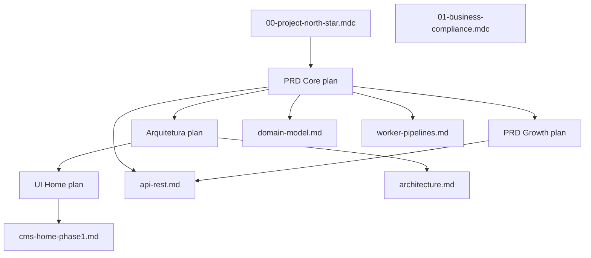

# Índice dos planos (`.cursor/plans/`)

Os planos são a **fonte de especificação**. A documentação em `docs/` descreve o que **já foi implementado** e referencia estes arquivos.

## Visão geral

| Plano | Arquivo | Foco | Status implementação |
|-------|---------|------|----------------------|
| PRD Core | [prd_plataforma_afiliação_de44933f.plan.md](../.cursor/plans/prd_plataforma_afiliação_de44933f.plan.md) | Negócio, workers, UX, retenção, entidades | Parcial — backend core + seed; web fase 1 (home) |
| PRD Growth | [prd_growth_aquisicao_trafego.plan.md](../.cursor/plans/prd_growth_aquisicao_trafego.plan.md) | SEO, conteúdo, social, páginas-ímã | Parcial — entidades/API seed; páginas web pendentes |
| Arquitetura Técnica | [arquitetura_tecnica_node.plan.md](../.cursor/plans/arquitetura_tecnica_node.plan.md) | Clean Architecture, filas, cache, testes | Implementado (scaffold + camadas) |
| UI Home Vitrine | [ui_home_vitrine.plan.md](../.cursor/plans/ui_home_vitrine.plan.md) | CMS Home fase 1, blocos, seed ESTORE | **Concluído** — ver [cms-home-phase1.md](./cms-home-phase1.md) |
| UI/UX Home (wireframe) | [ui_ux_home_vitrine_287e750c.plan.md](../.cursor/plans/ui_ux_home_vitrine_287e750c.plan.md) | Referência visual ESTORE | Referência de design; não é spec técnica |

## PRD Core — Plataforma de Afiliação

**O quê:** especificação funcional da vitrine inteligente + hub de conteúdo.

**Seções principais:**

1. **Entidades de domínio** — `Product`, `PriceSnapshot`, `PriceAlert`, `WishlistItem`, artigos, coleções, cupons, comparações, eventos de clique
2. **SLA de preço (24h)** — `stale_price`, ocultar preço, sem alertas/urgência
3. **Pipelines worker** — A catalog_sync, B price_refresh, C hygiene, D coupon_verify
4. **API interna** — rotas MVP (produtos, alertas, wishlist, artigos, coleções, cupons, comparador, eventos)
5. **UX conversão** — CTA transparente, disclaimer, batch checkout, wishlist anônima
6. **LGPD** — double opt-in alertas, exclusão, cookies wishlist

**Implementado hoje:**

- Schema PostgreSQL completo → [database-schema.md](./database-schema.md)
- Domain + use cases + API REST → [domain-model.md](./domain-model.md), [api-rest.md](./api-rest.md)
- Worker + filas → [worker-pipelines.md](./worker-pipelines.md)
- Seed de desenvolvimento (2 produtos, artigo, coleção, cupom, home CMS)

**Pendente (MVP do plano):**

- Páginas web: `/produtos/[slug]`, `/c/[slug]`, artigos, cupons, comparador
- `apps/admin` CMS
- Alertas email em produção
- Gate manual de contas afiliado antes de escala

## PRD Growth — Aquisição de Tráfego

**O quê:** como alimentar a vitrine com tráfego (anti-duplicação, SEO, social).

**Pilares:**

1. **Hub de conteúdo** — guias, reviews, comparativos, lookbooks; embeds dinâmicos do catálogo local
2. **Páginas-ímã** — comparador 2–3 produtos, central de cupons, coleções curadas com UTM
3. **Canais sociais** — Pinterest/TikTok/Instagram → slugs `/c/[slug]` memoráveis
4. **Anti-duplicação** — ≥800 palavras, intro ≥150 no comparador, dados exclusivos locais

**Regra Cursor associada:** [`.cursor/rules/07-growth-seo-content.mdc`](../.cursor/rules/07-growth-seo-content.mdc)

**Implementado hoje:**

- Entidades `ContentArticle`, `CuratedCollection`, `Coupon`, `ProductComparison`
- Rotas API: `GET /articles/:slug`, `GET /collections/:slug`, `GET /coupons`, `GET|POST /comparisons`
- Seed: artigo `guia-cadeira-ergonomica`, coleção `setup-gamer-iniciante`, cupom `VITRINE10`

**Pendente:**

- Front-end das páginas de conteúdo e growth
- Calendário editorial operacional
- Indexação massiva (bloqueada até conta afiliado `active`)

## Arquitetura Técnica Node.js

**O quê:** como organizar o monorepo em Clean Architecture.

**Decisões fixas:**

```
apps/api      → HTTP, Zod na borda, presenters
apps/worker   → BullMQ, único processo com fetch externo
packages/domain        → centro, zero imports de framework
packages/application   → use cases
packages/infrastructure → Drizzle, Redis, adapters
packages/shared        → env, schemas CMS, CORS
```

**Diagrama e detalhes:** [architecture.md](./architecture.md)

**Todos do plano:** scaffold, domain, infra, worker, cache, API, eventos, testes — **marcados completed** no frontmatter do plano.

## UI Home Vitrine (fase 1)

**O quê:** Home 100% CMS-driven sem Admin UI.

**Entregas (todas completed no plano):**

- `PageLayout` + `PageBlock` + `BlockType`
- `GET /pages/:slug` + cache Redis 5 min
- `apps/web`: PageRenderer, BlockRegistry, blocos, wishlist, click tracking
- Gaps API: categories, wishlist enriquecido, sort, CORS

**Doc implementada:** [cms-home-phase1.md](./cms-home-phase1.md)

**Fase posterior (cancelled no plano, não implementar sem decisão):**

- `apps/admin` — CRUD, drag-and-drop, publish/draft
- Rotas `POST/PATCH /admin/pages/*`

## Relação entre documentos



## Quando consultar qual plano

| Tarefa | Consultar |
|--------|-----------|
| Nova entidade ou regra de negócio | PRD Core §1–4 |
| Nova rota API | PRD Core §5 + [api-rest.md](./api-rest.md) + `03-api-rest.mdc` |
| Novo job/fila worker | PRD Core pipelines + [worker-pipelines.md](./worker-pipelines.md) |
| Novo bloco CMS | UI Home plan + [cms-home-phase1.md](./cms-home-phase1.md) |
| Artigo, cupom, coleção, SEO | PRD Growth + `07-growth-seo-content.mdc` |
| Estrutura de pastas / DI | Arquitetura plan + [architecture.md](./architecture.md) |
