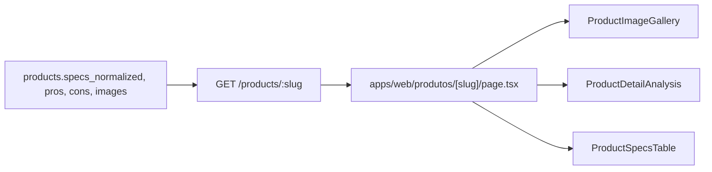

# Página pública de detalhe de produto

Evolução da rota `/produtos/[slug]` para layout rico de análise editorial, consumindo dados já persistidos no catálogo local (`images`, `pros`, `cons`, `specs_normalized`, `rating`).

## Escopo entregue

- **Hero:** galeria multi-imagem com miniaturas selecionáveis, rating, preço (incl. alerta stale), disclaimer afiliado e CTA com tracking `origin=detalhe`
- **Análise do Especialista:** grid de prós e contras completos (sem truncamento dos cards)
- **Ficha técnica:** tabela a partir de `specs` (`specs_normalized` no banco)
- **Descrição longa:** bloco HTML editorial existente, abaixo das seções de análise

## Fora de escopo (fase seguinte)

- Gráfico de histórico de preço (`GET /products/:id/price-history`)
- Wishlist no hero da página de detalhe

## Fluxo de dados



Nenhuma alteração de API foi necessária: o presenter [`product.presenter.ts`](../apps/api/src/adapters/presenters/product.presenter.ts) já expõe `specs`, `pros`, `cons` e `images` no DTO público.

## Arquivos-chave

| Arquivo | Função |
|---------|--------|
| [`apps/web/src/app/produtos/[slug]/page.tsx`](../apps/web/src/app/produtos/[slug]/page.tsx) | Server Component da rota |
| [`apps/web/src/components/product/ProductImageGallery.tsx`](../apps/web/src/components/product/ProductImageGallery.tsx) | Galeria client-side com thumbs |
| [`apps/web/src/components/product/ProductDetailAnalysis.tsx`](../apps/web/src/components/product/ProductDetailAnalysis.tsx) | Seção prós/contras |
| [`apps/web/src/components/product/ProductSpecsTable.tsx`](../apps/web/src/components/product/ProductSpecsTable.tsx) | Ficha técnica |
| [`apps/web/src/lib/format-spec-key.ts`](../apps/web/src/lib/format-spec-key.ts) | Formatação de chaves (compartilhado com comparador) |
| [`apps/web/src/components/product/ProductRating.tsx`](../apps/web/src/components/product/ProductRating.tsx) | Estrelas + contagem |
| [`apps/web/src/components/product/PriceDisplay.tsx`](../apps/web/src/components/product/PriceDisplay.tsx) | Preço fresh / alerta stale |
| [`apps/web/src/components/product/AffiliateGoLink.tsx`](../apps/web/src/components/product/AffiliateGoLink.tsx) | CTA `/go` com telemetria |

## Conformidade

- Preço stale: valor oculto, alerta "Consultar preço atualizado" (sem badges de urgência)
- CTA transparente: "Ver preço na {Amazon\|Shopee}"
- Links: `rel="noopener sponsored"`, nova aba
- Disclaimer afiliado visível acima do CTA

## Como testar

1. Subir API + web conforme [`dev-setup.md`](./dev-setup.md)
2. No admin (`/produtos/[slug]`), preencher aba **Análise Editorial**: prós, contras e especificações
3. Garantir produto com múltiplas URLs em `images` (JSONB)
4. Abrir `/produtos/{slug}` e verificar:
   - Troca de miniaturas na galeria
   - Seções omitidas quando prós/contras/specs vazios
   - Rating oculto quando ausente no catálogo
   - CTA registrando clique com origem `detalhe`

```bash
pnpm --filter @ecommerce-amazon/web lint
pnpm --filter @ecommerce-amazon/web build
```

## Próximos passos

- Gráfico de histórico de preço no hero (referência UX em `.cursor/rules/06-ux-conversion.mdc`)
- Bloco "Por que recomendamos" editorial acima da dobra quando `editorialScore` estiver disponível na vitrine
