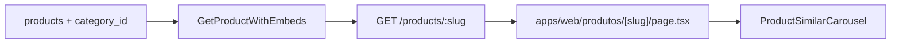

# Página pública de detalhe de produto

Evolução da rota `/produtos/[slug]` para layout rico de análise editorial e recirculação de catálogo, consumindo dados do catálogo local.

## Escopo entregue

- **Hero:** galeria multi-imagem com miniaturas selecionáveis, rating, preço (incl. alerta stale), disclaimer afiliado e CTA com tracking `origin=detalhe`
- **Análise do Especialista:** grid de prós e contras completos (sem truncamento dos cards)
- **Ficha técnica:** tabela a partir de `specs` (`specs_normalized` no banco)
- **Descrição longa:** bloco HTML editorial existente
- **Carrossel de similares:** produtos visíveis da mesma `category_id`, ordenados por preço ASC, excluindo o produto atual (até 12 itens)

## Fora de escopo (fase seguinte)

- Gráfico de histórico de preço (`GET /products/:id/price-history`)
- Wishlist no hero da página de detalhe

## Fluxo de dados



O payload de detalhe inclui `similarProducts: ProductListItem[]` (cards leves). Query no repositório:

- `category_id = produto.categoryId`
- `visible = true`
- `id != produto.id`
- `ORDER BY price_amount ASC LIMIT 12`

Produtos sem categoria retornam `similarProducts: []` e a seção não renderiza.

## Arquivos-chave

| Arquivo | Função |
|---------|--------|
| [`apps/web/src/app/produtos/[slug]/page.tsx`](../apps/web/src/app/produtos/[slug]/page.tsx) | Server Component da rota |
| [`apps/web/src/components/product/ProductSimilarCarousel.tsx`](../apps/web/src/components/product/ProductSimilarCarousel.tsx) | Carrossel snap-x nativo |
| [`packages/application/src/use-cases/product/GetProductWithEmbeds.ts`](../packages/application/src/use-cases/product/GetProductWithEmbeds.ts) | Orquestra produto + similares |
| [`packages/infrastructure/.../drizzle-product.repository.ts`](../packages/infrastructure/src/persistence/repositories/drizzle-product.repository.ts) | `findSimilarPublishedByCategory` |
| [`packages/shared/src/admin/product-schemas.ts`](../packages/shared/src/admin/product-schemas.ts) | `productPublicDetailSchema.similarProducts` |
| [`apps/web/src/components/product/ProductImageGallery.tsx`](../apps/web/src/components/product/ProductImageGallery.tsx) | Galeria client-side com thumbs |
| [`apps/web/src/components/product/ProductDetailAnalysis.tsx`](../apps/web/src/components/product/ProductDetailAnalysis.tsx) | Seção prós/contras |
| [`apps/web/src/components/product/ProductSpecsTable.tsx`](../apps/web/src/components/product/ProductSpecsTable.tsx) | Ficha técnica |

## Ordem das seções na página

1. Hero (galeria + conversão)
2. Análise do Especialista
3. Ficha técnica
4. Descrição longa
5. Produtos similares (carrossel)
6. Disclaimer legal

## Conformidade

- Preço stale: valor oculto, alerta "Consultar preço atualizado" (sem badges de urgência)
- CTA transparente: "Ver preço na {Amazon\|Shopee}"
- Links: `rel="noopener sponsored"`, nova aba
- Disclaimer afiliado visível acima do CTA
- Similares incluem produtos com preço stale (cards tratam via `PriceDisplay`)

## Como testar

1. Subir API + web conforme [`dev-setup.md`](./dev-setup.md)
2. Garantir produto com `category_id` e ≥2 produtos visíveis na mesma categoria
3. Abrir `/produtos/{slug}` e verificar:
   - Carrossel no rodapé, produto atual ausente da lista
   - Snap horizontal no mobile
   - Link "Ver todos em {categoria}" quando categoria presente
   - Seção omitida sem similares ou sem categoria

```bash
pnpm --filter @ecommerce-amazon/application test GetProductWithEmbeds
pnpm --filter @ecommerce-amazon/web lint
pnpm --filter @ecommerce-amazon/web build
```

## Próximos passos

- Gráfico de histórico de preço no hero (referência UX em `.cursor/rules/06-ux-conversion.mdc`)
- Bloco "Por que recomendamos" editorial acima da dobra quando `editorialScore` estiver disponível na vitrine
