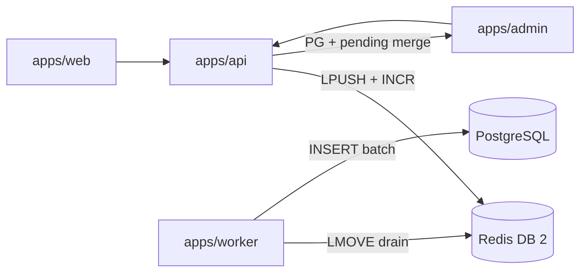

# Buffer Redis para Telemetria

Plano de referência: [`.cursor/plans/redis_telemetry_buffer_55eefdfb.plan.md`](../.cursor/plans/redis_telemetry_buffer_55eefdfb.plan.md)

Relacionado: [admin-dashboard-attribution-phase2.md](./admin-dashboard-attribution-phase2.md) (atribuição first-party), [worker-pipelines.md](./worker-pipelines.md).

## O que foi entregue

Desacoplamento dos writes de telemetria (cliques de afiliado + engajamento editorial) do PostgreSQL:

1. **API** grava eventos no Redis (`LPUSH` + contadores pending por dimensão).
2. **Worker** (`telemetry_flush`, cron 5 min) faz bulk insert no PostgreSQL.
3. **Dashboard admin** lê dados híbridos: agregações PG + contadores pending (quase tempo real, sem double-count).

## Fluxo



## Chaves Redis (DB `REDIS_TELEMETRY_DB`, default 2)

| Chave | Tipo | Uso |
|-------|------|-----|
| `telemetry:buffer:clicks` | LIST | JSON de cliques aguardando flush |
| `telemetry:buffer:clicks:processing` | LIST | Batch em processamento (at-least-once) |
| `telemetry:buffer:engagement` | LIST | JSON de engajamento aguardando flush |
| `telemetry:buffer:engagement:processing` | LIST | Batch em processamento |
| `telemetry:pending:events:day:{date}:total` | STRING | Total pending (badge admin) |
| `telemetry:pending:clicks:day:{date}:*` | STRING | Contadores por origin/placement/block/page |
| `telemetry:pending:engagement:day:{date}:*` | STRING | Contadores por tipo e artigo |
| `telemetry:pending:pagepaths` | HASH | Map hash → pagePath para leitura |

Contadores pending são decrementados **somente** após INSERT bem-sucedido no PostgreSQL.

## Variáveis de ambiente

| Variável | Default | Descrição |
|----------|---------|-----------|
| `REDIS_TELEMETRY_DB` | `2` | DB Redis dedicado ao buffer |
| `TELEMETRY_BUFFER_ENABLED` | `true` | `false` = INSERT direto no PG (dev/test) |
| `TELEMETRY_FLUSH_BATCH_SIZE` | `5000` | Eventos por batch no worker |
| `TELEMETRY_FLUSH_CRON` | `*/5 * * * *` | Cron BullMQ para flush |
| `TELEMETRY_BUFFER_MAX_LEN` | `100000` | Cap por lista Redis |

## Arquivos-chave

| Camada | Arquivo |
|--------|---------|
| Port | `packages/domain/src/repositories/TelemetryBufferStore.ts` |
| Buffer Redis | `packages/infrastructure/src/telemetry/redis-telemetry-buffer.store.ts` |
| Repos buffered | `packages/infrastructure/src/telemetry/redis-buffered-event.repositories.ts` |
| Merge admin | `packages/infrastructure/src/persistence/repositories/composite-analytics.repository.ts` |
| Flush UC | `packages/application/src/use-cases/events/FlushTelemetryBuffer.ts` |
| Worker fila | `apps/worker` → `telemetry_flush` |
| DI API | `packages/infrastructure/src/di/api-container.ts` |

## Como testar

```bash
docker compose up -d postgres redis
npm run db:migrate -w @ecommerce-amazon/infrastructure
npm run dev -w @ecommerce-amazon/api
npm run dev -w @ecommerce-amazon/worker
npm run dev -w @ecommerce-amazon/web
npm run dev -w @ecommerce-amazon/admin
```

1. Navegar na vitrine e gerar cliques (`/go/...`) + views de artigo.
2. Verificar dashboard admin — KPIs incluem pending (`pendingEventCount` + badge).
3. Aguardar flush (~5 min) ou disparar job manualmente na fila `telemetry_flush`.
4. Confirmar linhas em `click_events` / `content_engagement_events`.

Testes unitários:

```bash
npm run test -w @ecommerce-amazon/application -- FlushTelemetryBuffer
npm run test -w @ecommerce-amazon/infrastructure -- telemetry
```

## Runbook

| Situação | Ação |
|----------|------|
| Worker parado | Eventos acumulam no Redis; dashboard ainda mostra pending. Subir worker. |
| Top produtos/marketplace defasados vs KPI total | Agregações PG sem merge do buffer (corrigido via composite analytics) | Aguardar flush ou verificar worker |
| Cliques somem após flush | `origin=redirect_go` — link `/go` sem atribuição | Usar `AffiliateGoLink` com `origin` + `placement` |
| Redis cheio | Verificar `TELEMETRY_BUFFER_MAX_LEN`; aumentar frequência de flush ou cap. |
| Dev sem worker | `TELEMETRY_BUFFER_ENABLED=false` no `.env` |
| Perda Redis | Processing list + requeue; eventos em processing são reenfileirados em falha PG |

## Lag esperado

- **Dashboard (KPIs híbridos):** quase tempo real via contadores pending.
- **Consolidação PG:** ~5 min (configurável via `TELEMETRY_FLUSH_CRON`).
- **JOINs complexos** (`by-block` com metadata CMS): metadata completa após flush; pending mostra UUID + count.

## Fora de escopo

- Redis Streams / consumer groups
- Rate limiting dedicado em `/events/engagement`
- Fallback automático PG quando Redis cai
