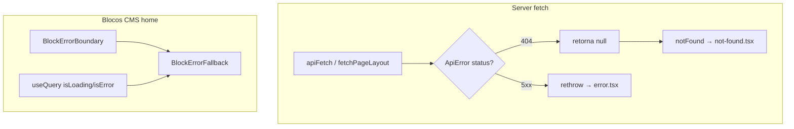

# Tratativa de erros — vitrine (`apps/web`)

## O quê

Páginas especializadas de erro em pt-BR (404 e 500), distinção entre recurso inexistente e falha de API nas rotas de detalhe, e isolamento de falhas em blocos CMS da home para evitar loading infinito ou quebra da página inteira.

**Fora do escopo desta entrega:** wishlist error states, `loading.tsx` por rota, observabilidade (Sentry), páginas de erro no `apps/admin`.

## Por quê

A vitrine usava as telas padrão do Next.js (inglês) e tratava qualquer falha de API como 404. Blocos client-side com React Query ignoravam `isError`, causando skeleton eterno ou vazio silencioso.

## Como funciona



### Camada API

| Arquivo | Função |
|---------|--------|
| [`apps/web/src/lib/api/client.ts`](../apps/web/src/lib/api/client.ts) | `ApiError`, `isNotFoundError`, throws tipados com status HTTP |
| [`apps/web/src/lib/api/safe-fetch.ts`](../apps/web/src/lib/api/safe-fetch.ts) | `fetchOrNotFound` (404 → null, 5xx → throw), `fetchPageLayoutOrNull` |

### Páginas Next.js

| Arquivo | Quando aparece |
|---------|----------------|
| [`apps/web/src/app/not-found.tsx`](../apps/web/src/app/not-found.tsx) | `notFound()` ou URL inexistente |
| [`apps/web/src/app/error.tsx`](../apps/web/src/app/error.tsx) | Erro de render/fetch não tratado em rotas filhas |
| [`apps/web/src/app/global-error.tsx`](../apps/web/src/app/global-error.tsx) | Falha no `layout.tsx` raiz |

Componentes compartilhados em [`apps/web/src/components/errors/`](../apps/web/src/components/errors/).

### Rotas de detalhe (404 vs 5xx)

Páginas que usam `fetchOrNotFound`:

- `/produtos/[slug]`
- `/artigos/[slug]`
- `/colecoes/[slug]` (via `fetchCuratedCollection`)
- `/categorias/[slug]` (categoria)

- **404 da API** → `null` → `notFound()` → `not-found.tsx`
- **5xx / rede** → throw → `error.tsx` com botão "Tentar novamente"

`/categorias/[slug]`: se a categoria existe mas a listagem de produtos falha, renderiza `CategoryProductsError` (fallback inline com retry via `router.refresh()`).

### Home CMS

[`PageRenderer`](../apps/web/src/components/cms/PageRenderer.tsx):

- `safeParse` em props de blocos ocultos (não derruba a home)
- Cada bloco envolvido em `BlockErrorBoundary`

Blocos client com React Query:

| Bloco | Comportamento em erro |
|-------|----------------------|
| `FeaturedProductBlock` | `BlockErrorFallback` + retry |
| `ProductGridBlock` | `BlockErrorFallback` + retry; título/CTA permanecem |
| `CategoryPillsRow` | Pill "Todos" + aviso discreto |
| `BentoHubMixGrid` | `BlockUnavailableFallback` em slots SSR vazios (não skeleton) |

React Query defaults em [`providers.tsx`](../apps/web/src/app/providers.tsx): `retry: 1`, `refetchOnWindowFocus: false`.

## Como testar localmente

```bash
# Build e lint
cd apps/web && npm run lint && npm run build

# 404 — slug inexistente
curl -I http://localhost:3001/produtos/slug-inexistente

# 500 — parar API e acessar /artigos no browser
# Deve exibir error.tsx em pt-BR com "Tentar novamente"

# Home — com API ativa, blocos carregam normalmente
# Simular falha: bloquear /products no DevTools → ProductGridBlock mostra fallback
```

## Próximos passos (não implementados)

- Error states na wishlist (`WishlistProvider`)
- `loading.tsx` por segmento de rota
- Integração com observabilidade (Sentry)
- Páginas de erro no painel admin
