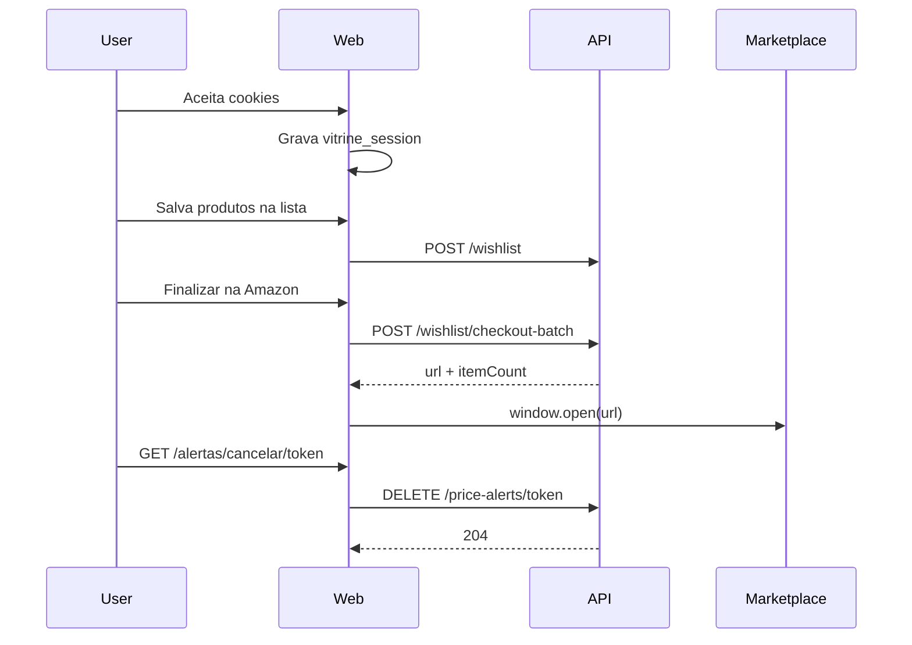

# Wishlist, batch checkout e LGPD (retenção)

Plano de referência: retenção MVP do [PRD Core](../.cursor/plans/prd_plataforma_afiliação_de44933f.plan.md) §3.2–3.3 e §4.5.

## O que foi entregue

### Batch checkout na wishlist

- API existente: `POST /wishlist/checkout-batch` com body `{ marketplace }`.
- UI no drawer [`WishlistDrawer.tsx`](../apps/web/src/components/wishlist/WishlistDrawer.tsx):
  - CTA por marketplace: **“Finalizar na Amazon/Shopee (N itens)”**
  - **Amazon:** abre URL do carrinho afiliado em nova aba.
  - **Shopee / Mercado Livre:** URLs separadas por `|` — abre uma aba por produto (intervalo 500ms) com aviso ao usuário.
- Gate afiliado no use case [`BuildBatchCheckoutRedirect`](../packages/application/src/use-cases/wishlist/BuildBatchCheckoutRedirect.ts): conta `pending_manual_validation` ou `suspended` retorna 400.

### LGPD — alertas de preço

- `DELETE /price-alerts/:token` — cancela alerta pelo `confirmToken` (status → `expired`; idempotente se já expirado/disparado).
- Página pública: `/alertas/cancelar/[token]` — chama a API e exibe confirmação ou erro amigável (`noindex`).
- E-mails de alerta disparado incluem link **“Cancelar este alerta”** ([`ProcessTriggeredAlerts`](../packages/application/src/use-cases/alert/ProcessTriggeredAlerts.ts)).

### LGPD — cookies e wishlist

- Banner de consentimento ([`CookieConsentProvider`](../apps/web/src/components/legal/CookieConsentProvider.tsx)) antes de gravar cookie `vitrine_session`.
- Cookie de consentimento: `vitrine_cookie_consent=accepted` (12 meses).
- `DELETE /wishlist` — remove todos os itens da sessão (`x-session-id`).
- Botão **“Apagar minha lista”** no drawer: chama `DELETE /wishlist`, limpa cookie de sessão e reinicia identificador.

## Fluxo (resumo)



## API

| Método   | Rota                       | Notas                                                  |
| -------- | -------------------------- | ------------------------------------------------------ |
| `POST`   | `/wishlist/checkout-batch` | Body: `{ marketplace }`; response `{ url, itemCount }` |
| `DELETE` | `/wishlist`                | Header `x-session-id`; limpa lista da sessão           |
| `DELETE` | `/price-alerts/:token`     | Cancelamento LGPD; 204                                 |

Contrato completo: [api-rest.md](./api-rest.md).

## Arquivos-chave

| Camada      | Arquivos                                                                                                 |
| ----------- | -------------------------------------------------------------------------------------------------------- |
| Domain      | `PriceAlert.cancel()`, `WishlistRepository.removeAllBySessionId`                                         |
| Application | `CancelPriceAlert`, `ClearWishlist`, `BuildBatchCheckoutRedirect`                                        |
| API         | `apps/api/src/adapters/http/routes/index.ts`                                                             |
| Web         | `CookieConsentProvider`, `WishlistProvider`, `WishlistDrawer`, `session.ts`, `/alertas/cancelar/[token]` |
| Shared      | `packages/shared/src/legal/cookie-consent.ts`                                                            |

## Como testar localmente

```bash
npm run infra:up
npm run dev:api
npm run dev:web
```

1. Abrir vitrine → banner de cookies → **Aceitar**.
2. Salvar 2+ produtos Amazon na lista → abrir drawer → **Finalizar na Amazon (N itens)**.
3. **Apagar minha lista** → drawer vazio.
4. Cancelar alerta: `curl -X DELETE http://localhost:3000/price-alerts/{confirmToken}` ou visitar `/alertas/cancelar/{confirmToken}`.

Testes unitários:

```bash
npx vitest run packages/application/src/use-cases/alert/CancelPriceAlert.test.ts \
  packages/application/src/use-cases/wishlist/ClearWishlist.test.ts \
  packages/application/src/use-cases/wishlist/BuildBatchCheckoutRedirect.test.ts
```

## Fora de escopo desta entrega

- Formulário de criação de alerta na vitrine
- E-mail de confirmação (double opt-in) via fila `email_delivery`
- GA4 / Consent Mode analítico
- Telemetria de cliques no batch checkout via `/go/`

## Próximos passos

- UI de alerta de preço na página de produto
- Enfileirar e-mail de confirmação ao criar alerta
- Itens `delisted` cinza no drawer com auto-remove
