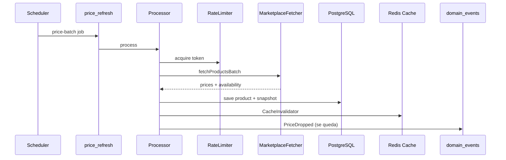

# Worker — pipelines e filas

Implementação: [`apps/worker`](../apps/worker). Regras: [`.cursor/rules/04-worker-queues.mdc`](../.cursor/rules/04-worker-queues.mdc).

**Único processo autorizado** a chamar APIs/scrapers Amazon e Shopee.

## Filas BullMQ

Definição: [`packages/infrastructure/src/messaging/queues.ts`](../packages/infrastructure/src/messaging/queues.ts)

| Fila | Constante | Pipeline PRD | Prioridade |
|------|-----------|--------------|------------|
| `catalog_sync` | `QUEUE_NAMES.CATALOG_SYNC` | A — metadados não-preço | Pausável por budget |
| `price_refresh` | `QUEUE_NAMES.PRICE_REFRESH` | B — preços | **Nunca pausar** em hot traffic |
| `hygiene` | `QUEUE_NAMES.HYGIENE` | C — títulos, specs, slugs | Baixa |
| `coupon_verify` | `QUEUE_NAMES.COUPON_VERIFY` | D — cupons | Média |
| `domain_events` | `QUEUE_NAMES.DOMAIN_EVENTS` | Eventos `PriceDropped` | — |
| `email_delivery` | `QUEUE_NAMES.EMAIL_DELIVERY` | Confirmação alertas, notificações | — |
| `telemetry_flush` | `QUEUE_NAMES.TELEMETRY_FLUSH` | Bulk insert telemetria Redis → PG | Baixa |

Redis DB: filas em `REDIS_QUEUE_DB` (default 1); cache em `REDIS_CACHE_DB` (default 0); buffer telemetria em `REDIS_TELEMETRY_DB` (default 2). Ver [telemetry-redis-buffer.md](./telemetry-redis-buffer.md).

## Job options padrão

- 5 tentativas
- Backoff exponencial, delay base 30s
- `removeOnComplete`: 1000 jobs
- `removeOnFail`: 5000 jobs

## Schedulers (cron)

Arquivo: [`apps/worker/src/schedulers/index.ts`](../apps/worker/src/schedulers/index.ts)

| Job | Pattern | Fila |
|-----|---------|------|
| `schedule-price-refresh` | `0 */4 * * *` (4h) | `price_refresh` |
| `schedule-catalog-sync` | `0 */6 * * *` (6h) | `catalog_sync` |
| `schedule-hygiene` | `0 2 * * *` (diário 02:00) | `hygiene` |
| `schedule-coupon-verify` | `0 */6 * * *` (6h) | `coupon_verify` |
| `flush-telemetry-buffer` | `TELEMETRY_FLUSH_CRON` (default `*/5 * * * *`) | `telemetry_flush` |

Na inicialização também enfileira batches de preço para produtos due (`findDueForPriceRefresh`, limit 500), agrupados por marketplace em lotes de 15 `external_id`.

**JobId determinístico (preço):** `price_refresh:{marketplace}:{hourKey}:{offset}`

## Fluxo Pipeline B (preços)



1. Rate limiter Redis por marketplace (`rate:amazon`, `rate:shopee`)
2. `MarketplaceCredentialResolver` — cache Redis `vitrine:marketplace-credentials:{marketplace}` → decrypt DB (ver [admin-marketplace-credentials.md](./admin-marketplace-credentials.md))
3. `MarketplaceFetcher.fetchProductsBatch(externalIds)` — Amazon PA-API / Shopee Open API quando credenciais configuradas
4. `Product.updatePrice()` no domain
4. Unit of work: produto + `price_snapshots`
5. `CacheInvalidator.invalidateProducts([ids])`
6. Eventos → fila `domain_events` (email **não** inline)

## SLA de preço (24h)

Regra de negócio ([`01-business-compliance.mdc`](../.cursor/rules/01-business-compliance.mdc)):

- Produto ativo deve ter refresh tentado antes de `price_updated_at` > 24h
- Após 24h: `stale_price = true` — API retorna `amount: null`, `isStale: true`
- Pipeline B **nunca pausa** por budget em produtos com tráfego 7d
- Pipeline A pode pausar produtos cold (>30d sem view) se budget API estourado

## Pipeline A — catalog_sync

Metadados não-preço: imagens, rating, availability, títulos raw.

- 6h produtos ativos
- 2h produtos em wishlist/alertas ativos (prioridade)

Use case: `SyncCatalogBatch`.

## Pipeline C — hygiene

Diário: normalização de títulos (`title_clean`), specs, slugs.

Use case: `RunHygienePipeline`.

## Pipeline D — coupon_verify

- 6h cupons em destaque
- 12h demais
- Atualiza `last_verified_at` e `status`

Use case: `VerifyCouponsBatch`.

Cupons com verificação >24h **não** devem aparecer na listagem pública.

## Domain events

`BullMQEventBus` publica em `domain_events`:

```typescript
// packages/infrastructure/src/messaging/queues.ts
class BullMQEventBus implements EventBus {
  async publish(event: DomainEvent): Promise<void> {
    await this.domainEventsQueue.add(message.type, message);
  }
}
```

Handler de `PriceDropped`:

- Verifica alertas `active`
- Só dispara se preço **não** stale
- Cooldown 24h mesmo produto
- Email via fila `email_delivery`

Use case: `ProcessTriggeredAlerts`.

## Rate limit e retry

| Erro | Comportamento |
|------|---------------|
| `MarketplaceRateLimitError` | delay 5 min, re-enqueue |
| Falha genérica | backoff exponencial (5 tentativas) |
| Concurrency `price_refresh` | ≤ 3 workers |

Token bucket Redis por marketplace.

## Processors

Registro: [`apps/worker/src/processors/index.ts`](../apps/worker/src/processors/index.ts).

Cada processor:

1. Deserializa `MarketplaceJobData` ou `SchedulerTriggerJobData`
2. Delega ao use case em `packages/application`
3. Log em `sync_job_logs` (sucesso/falha, `items_processed`, `errors`)

## Sync job logs

Tabela `sync_job_logs` — auditoria operacional:

| Campo | Tipo |
|-------|------|
| `job_type` | enum sync_job_type |
| `status` | running \| completed \| failed |
| `items_processed` | int |
| `errors` | jsonb array |
| `started_at`, `finished_at` | timestamptz |

## Como rodar

```bash
npm run infra:up    # Redis obrigatório
npm run dev:worker
```

Worker e API compartilham PostgreSQL e Redis; processos independentes.

## Use cases exclusivos do worker

Exportados em [`packages/application/src/index.ts`](../packages/application/src/index.ts):

| Use case | Pipeline |
|----------|----------|
| `UpdatePricesBatch` | B |
| `SyncCatalogBatch` | A |
| `RunHygienePipeline` | C |
| `VerifyCouponsBatch` | D |
| `ProcessTriggeredAlerts` | domain_events |

## Gate afiliado

Conta `affiliate_accounts.status = pending_manual_validation` bloqueia escala (indexação massiva, alertas email, batch checkout em volume). Ver PRD Core e seed (`SHOPEE` = `pending`).
